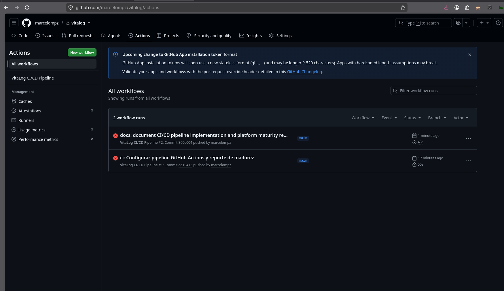

# 📚 Wiki - Documentación y Manuales

Bienvenido a la wiki central de documentación para todos los proyectos.

---

## 📖 Proyectos

### [OrderFlow](./orderflow/README.md)
{width="100"}

**Sistema Multi-Tenant de Gestión de Pedidos**

- **Tipo:** SaaS E-commerce + POS + Bookings
- **Stack:** Node.js + NestJS + React + PostgreSQL
- **Usuarios:** Administradores, Vendedores, Clientes

**Documentación:**
- [Guía de Administración](./orderflow/guia-admin.md)
- [Guía de Vendedores](./orderflow/guia-vendedores.md)
- [Configurar mi Tenant](./orderflow/configurar-tenant.md)
- [FAQ](./orderflow/faq.md)

---

### [VitaLog](./vitalog/README.md)
{width="100"}

**Plataforma de Monitoreo de Salud Mental**

- **Tipo:** HealthTech + Biometría + Screening
- **Stack:** FastAPI + SQLAlchemy + React + React Native + PostgreSQL
- **Usuarios:** Terapeutas, Pacientes, Administradores

**Documentación:**
- [Guía para Terapeutas](./vitalog/guia-terapeutas.md)
- [Guía para Pacientes](./vitalog/guia-pacientes.md)
- [FAQ](./vitalog/faq.md)

---

### [AIEER](./aieer/README.md)
{width="100"}

**[Descripción del proyecto]**

- **Tipo:** [EduTech / Otro]
- **Stack:** [Tecnologías utilizadas]
- **Usuarios:** [Tipos de usuarios]

**Documentación:**
- [Manual de Usuario](./aieer/manual-usuario.md)
- [FAQ](./aieer/faq.md)

---

## 🆘 Soporte

¿Necesitás ayuda?

- 📧 **Email:** [tu-email@ejemplo.com]
- 💬 **Slack/Discord:** [link al canal]
- 🐛 **Reportar un bug:** [GitHub Issues de cada proyecto]
- 💡 **Solicitar feature:** [GitHub Issues de cada proyecto]

---

## 📋 Para Desarrolladores

Si sos desarrollador y querés contribuir, mirá la documentación técnica en cada repo:

- [OrderFlow Docs](https://github.com/marcelompz/orderflow/tree/main/docs)
- [VitaLog Docs](https://github.com/marcelompz/vitalog/tree/main/docs)
- [AIEER Docs](https://github.com/marcelompz/aieer/tree/main/docs)

---

## 🚀 Quick Links

| Acción | OrderFlow | VitaLog | AIEER |
|--------|-----------|---------|-------|
| **Acceder** | [admin.orderflow.app](https://admin.orderflow.app) | [vitalog.app](https://vitalog.app) | [aieer.app](https://aieer.app) |
| **Docs Técnicas** | [/docs](https://github.com/marcelompz/orderflow/docs) | [/docs](https://github.com/marcelompz/vitalog/docs) | [/docs](https://github.com/marcelompz/aieer/docs) |
| **Reportar Bug** | [Issues](https://github.com/marcelompz/orderflow/issues) | [Issues](https://github.com/marcelompz/vitalog/issues) | [Issues](https://github.com/marcelompz/aieer/issues) |

---

## 🌐 Idiomas / Languages

- 🇪🇸 **Español:** Estás acá (README.md)
- 🇺🇸 **English:** [View English version](./index.en.md)

---

*Última actualización: 2026-06-21*
