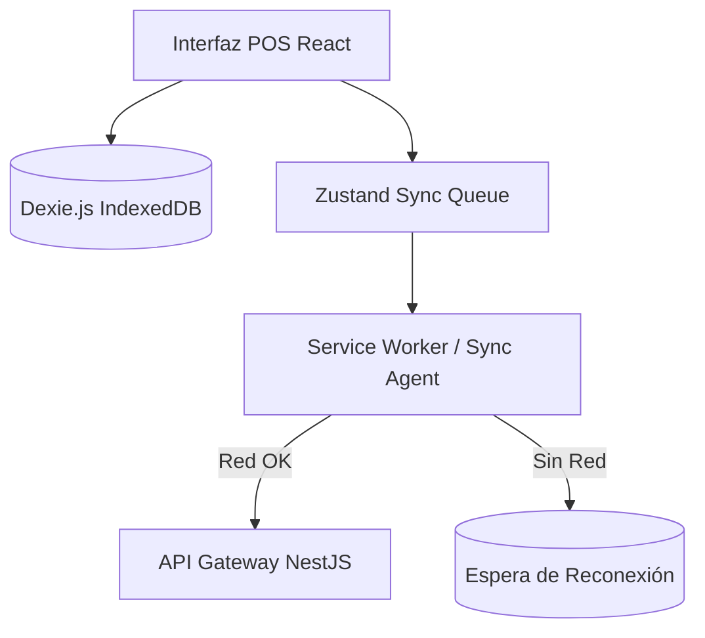

# Arquitectura del Módulo POS / KDS

Este documento detalla el diseño, la arquitectura técnica y el plan de implementación para el módulo integrado de **Punto de Venta (POS)** y **Pantalla de Cocina (KDS - Kitchen Display System)** de la plataforma OrderFlow.

---

## 1. Objetivos del Sistema

* **Cero Latencia en Cocina:** Transmisión de comandas del POS al KDS en menos de 100ms.
* **Resiliencia Operativa (Offline-First):** Capacidad de seguir facturando y operando el POS en el local físico aunque se corte la conexión a internet.
* **Diseño Ergonómico:** UI optimizada para pantallas táctiles (POS) y visualización rápida en ambientes de alta temperatura y velocidad (KDS).
* **Integración de Hardware Nativo:** Soporte directo para impresoras térmicas de tickets y lectores de códigos de barras.

---

## 2. Sincronización Híbrida y Offline-First (POS)

El POS web opera bajo una filosofía offline-first para evitar que caídas de internet paralicen las ventas del comercio.

### 2.1 Dexie.js (IndexedDB)
* **Base de Datos Local:** Se utiliza `Dexie.js` como wrapper de IndexedDB para almacenar localmente el catálogo de productos, clientes, configuraciones de branding y modificadores del tenant.
* **Sincronización Inicial:** Al iniciar sesión o abrir la caja, se descargan los datos estáticos desde la API y se cachean localmente.

### 2.2 Cola de Pedidos y Sincronización
* **Zustand Queue:** Los pedidos generados se encolan inmediatamente en el estado local persistido.
* **Agente de Sincronización:** Un proceso en segundo plano (Service Worker o hook de red) monitorea la conexión. En cuanto se detecta estado online, los pedidos encolados se transmiten uno a uno al backend mediante peticiones HTTP POST robustas con reintentos automáticos.

---

## 3. Comunicación en Tiempo Real (KDS)

Para garantizar la transmisión instantánea de comandas a la cocina, se utiliza una arquitectura orientada a eventos mediante WebSockets.

### 3.1 Stack de Tiempo Real
* **Backend:** NestJS WebSockets Gateway basado en **Socket.io**.
* **Frontend:** `socket.io-client` integrado en la UI del KDS.

### 3.2 Protocolo de Eventos (Eventos Core)

| Evento | Dirección | Origen | Propósito |
|---|---|---|---|
| `order:create` | Enviar | POS | Registra un nuevo pedido y comanda. |
| `order:new` | Recibir | KDS | Notifica a la pantalla de cocina una comanda entrante. |
| `order:status_update` | Enviar | KDS | Actualiza el estado del pedido (ej. Preparando -> Listo). |
| `order:ready` | Recibir | POS / Mesero | Notifica que el pedido está listo para ser retirado/entregado. |

---

## 4. Diseño de Interfaz de Usuario (UI/UX)

### 4.1 Punto de Venta (POS)
* **Layout a 3 Columnas:**
  1. **Columna Izquierda (Categorías & Búsqueda):** Selector rápido de familias de productos.
  2. **Columna Central (Catálogo de Items):** Grid de productos con botones grandes (mínimo 48px de área de click) e imágenes.
  3. **Columna Derecha (Carrito Activo & Totales):** Resumen de la venta actual, campos de descuento, cliente seleccionado y botones de pago.
* **Modificadores Contextuales:** Ventana emergente (modal) al hacer click en un producto para configurar extras o especificaciones (ej. términos de cocción, adiciones de ingredientes).

### 4.2 Pantalla de Cocina (KDS)
* **Vista en Mosaico (Tiled Dashboard):** Tarjetas que representan cada orden con su lista de productos, tiempo transcurrido y notas especiales.
* **Semáforo de Alertas por Colores:**
  * 🟩 **Verde (Estado Normal):** De 0 a 10 minutos de espera.
  * 🟨 **Amarillo (Alerta de Demora):** De 10 a 20 minutos de espera.
  * 🟥 **Rojo (Atraso Crítico):** Más de 20 minutos de espera. Genera parpadeo sutil para llamar la atención del personal.

---

## 5. Empaquetado de Escritorio e Integración de Hardware (Tauri)

El POS se compilará como aplicación nativa de escritorio para asegurar la comunicación con periféricos.

* **Tauri (Rust Core):** Encapsula el frontend web en un binario nativo liviano de bajo consumo.
* **Impresión Térmica Directa (ESC/POS):** Utiliza los comandos directos ESC/POS vía puertos Seriales/USB locales (a través de la API serial nativa expuesta por el núcleo Rust de Tauri) para imprimir los tickets de cocina y facturas al instante sin pasar por la interfaz de impresión del sistema operativo.
* **Lector de Código de Barras:** Escucha nativa de eventos de teclado (emulación de teclado del escáner).

---

## 6. Fases de Implementación en el Roadmap

* **Fase 1 (v0.4.0):** Extensión del Schema de Base de Datos (Prisma) y desarrollo del Websocket Gateway en NestJS.
* **Fase 2 (v0.5.0):** Interfaz del POS Web con almacenamiento local en IndexedDB (Dexie.js).
* **Fase 3 (v0.6.0):** Pantalla del KDS con alertas visuales de tiempo real.
* **Fase 4 (v1.0.0):** Integración nativa de escritorio con Tauri e impresión directa de tickets.
