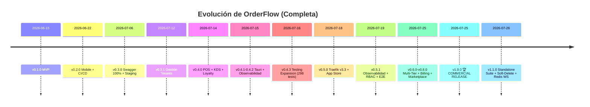
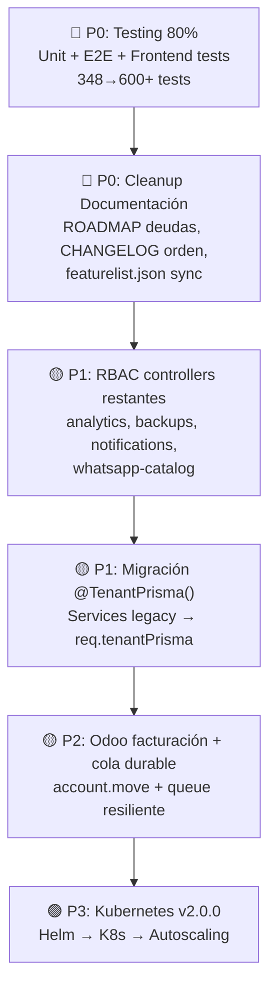

# Análisis del Estado del Arte — OrderFlow v1.1.0 (Actualización)

**Fecha:** 2026-07-27 · **Versión actual:** `1.1.0` · **Siguiente target:** `v1.2.0-dev` → `v2.0.0`  
**Análisis anterior:** [v0.5.0 (2026-07-19)](file:///home/marcelompz/.gemini/antigravity-ide/brain/ddabe7e5-bdcb-4a78-9f71-f52f62e631c6/estado_del_arte_analisis.md)

---

## 1. Panorama General

OrderFlow alcanzó su **v1.0.0 Commercial Release** el 25 de julio de 2026 y está ahora en **v1.1.0** con microservicios standalone, soft-delete de tenants y WebSockets escalables con Redis. En ~42 días (15 Jun → 27 Jul) pasó de un MVP básico (v0.1.0) a una **plataforma SaaS comercial completa** con 38 modelos Prisma, billing, marketplace, 6 microservicios standalone y estructura Kubernetes preparada.

En los **8 días desde el análisis anterior** (v0.5.0 → v1.1.0) se completaron **6 releases** (v0.5.1, v0.6.0, v0.7.0, v0.8.0, v1.0.0, v1.1.0) — un ritmo de casi un release diario.

---

## 2. Comparativa v0.5.0 → v1.1.0 — Cierre de Gaps

La siguiente tabla muestra cómo se cerraron los gaps críticos identificados en el análisis anterior:

| Gap identificado (v0.5.0) | Estado en v0.5.0 | Estado en v1.1.0 | Resultado |
|----------------------------|------------------|-------------------|-----------|
| **Billing SaaS** | ❌ 0 código | ✅ `BillingModule` completo (Stripe + MercadoPago + webhooks + MRR/ARR + suspensión automática) | **CERRADO** |
| **Portal cliente** | ❌ 0 código | ✅ `subscription.tsx` (upgrade/downgrade, selección DB tier) | **CERRADO** |
| **Métricas MRR/ARR** | ❌ 0 código | ✅ `GET /api/v1/billing/metrics/mrr` | **CERRADO** |
| **Marketplace/Plugin SDK** | ❌ 0 código | ✅ `MarketplaceModule` (register/install/catálogo) | **CERRADO** |
| **RBAC granular** | ⚠️ Solo ProductsController | ✅ 15/18 controllers protegidos | **~85% CERRADO** |
| **Rate limit por tenant** | ⚠️ Parcial | ✅ `TenantThrottlerGuard` completo | **CERRADO** |
| **Multi-Tier Isolation** | ⚠️ Schema pendiente | ✅ `TenantConnectionManager` + `@TenantPrisma()` + provisioning script | **CERRADO** |
| **Microservicios Standalone** | ⏳ Diseño | ✅ 6 microservicios production-ready | **CERRADO** |
| **White-label** | ⚠️ Parcial | ✅ Completo (dominio custom, favicon, título, branding removal) | **CERRADO** |
| **i18n** | ❌ 0 código | ✅ ES/EN/PT con `react-i18next` | **CERRADO** |
| **Soft-Delete Tenants** | ❌ Hard delete | ✅ Soft-delete + retención 30 días + restore endpoint | **CERRADO** |
| **WebSockets escalables** | ⚠️ In-memory | ✅ `RedisIoAdapter` con PubSub para réplicas horizontales | **CERRADO** |
| **Testing 80%** | ~30-35% | ~40-45% (348 tests / 45 suites) | **PARCIAL** |
| **Frontend unit tests** | 0 tests | 2 archivos test | **MÍNIMO** |
| **Odoo: variantes/inventario** | ❌ | ✅ Completado (SKU + Barcode + `qty_available`) | **CERRADO** |
| **Odoo: facturación** | ❌ | ❌ Sin cambio | **PENDIENTE** |
| **Odoo: cola durable** | ❌ | ❌ Sin cambio | **PENDIENTE** |
| **Kubernetes** | ⏳ Futuro | 🟡 Estructura Helm lista (`k8s/helm/`) | **PREPARADO** |

---

## 3. Matriz de Madurez — Recalculada v1.1.0

| Área | Eval v0.5.0 | Eval v1.1.0 | Δ | Justificación |
|------|-------------|-------------|---|---------------|
| **Arquitectura** | 9.0/10 | **9.5/10** | +0.5 | Multi-Tier Isolation operativo. `@TenantPrisma()` + `TenantConnectionManager` + provisioning automático. Solo falta migración gradual de services legacy. |
| **Desarrollo del producto** | 8.5/10 | **9.5/10** | +1.0 | De 13 a 16+ módulos. Billing, Marketplace, Analytics y 6 microservicios standalone. Ecosistema excepcionalmente completo. |
| **DevOps e infra** | 9.0/10 | **9.5/10** | +0.5 | Redis 7 integrado, WebSockets escalables con PubSub, estructura K8s/Helm preparada, k6 en CI/CD. |
| **Documentación** | 8.5/10 | **8.5/10** | = | ~50 docs en `/docs/`. Inconsistencias heredadas parcialmente resueltas. ROADMAP actualizado pero secciones contradictorias entre v0.6.0/v0.7.0 tasks y hitos cumplidos. |
| **Testing** | 6.5/10 | **7.0/10** | +0.5 | 348 tests / 45 suites (vs 305/41). Mejora, pero cobertura real sigue ~40-45%. Frontend unit tests siguen casi inexistentes (2 archivos). |
| **Integraciones** | 7.5/10 | **8.5/10** | +1.0 | Odoo variantes + inventario completados. Conectores MIDA/SAP declarados como implementados. Falta facturación y cola durable. |
| **Producto comercial** | 6.0/10 | **9.0/10** | +3.0 | **Salto más grande.** Billing completo, portal self-service, planes SaaS, MRR/ARR, marketplace. Ya es un SaaS operativo comercialmente. |
| **Escalabilidad** | 7.5/10 | **8.5/10** | +1.0 | Rate limit por tenant, Redis PubSub para WS horizontales, DB-per-tenant operativo, estructura K8s lista. Falta autoscaling real. |
| **Operación SaaS** | 6.5/10 | **9.0/10** | +2.5 | Billing + portal cliente + soft-delete + suspensión automática por impago. Ya es self-service. |

### Madurez general recalculada: **~8.8/10** (vs 7.7/10 anterior)

> [!TIP]
> **+1.1 puntos de madurez en 8 días.** El cierre del gap de billing fue el cambio más impactante, elevando "Producto comercial" de 6.0 a 9.0 y "Operación SaaS" de 6.5 a 9.0.

---

## 4. Lo que está BIEN (Fortalezas Confirmadas y Nuevas)

### ✅ Arquitectura modular sólida (reforzada)
- **38 modelos Prisma** (vs 36 anterior) — nuevos: `softDeleted`/`deletedAt` en Tenant, billing-related
- Multi-Tier Isolation operativo con `TenantConnectionManager` + `@TenantPrisma()`
- 6 microservicios standalone con `@orderflow/auth-shared`

### ✅ Ecosistema de producto completo
- 16+ módulos production-ready (13 core + Billing + Marketplace + Analytics)
- 6 microservicios standalone vendibles por separado:
  - `giveaways-standalone` (:3020)
  - `whatsapp-catalog-standalone` (:3021)
  - `biolinks-standalone` (:3022)
  - `bookings-standalone` (:3023)
  - `quotations-standalone` (:3024)
  - `loyalty-standalone` (:3025)

### ✅ Billing SaaS operativo (NUEVO — cierra gap #1)
- `BillingModule` con Stripe + Mercado Pago
- 4 planes: FREE, STARTER, PRO, ENTERPRISE
- Suspensión automática por impago (`TenantThrottlerGuard`)
- Portal self-service (`subscription.tsx`)
- Métricas MRR/ARR para SuperAdmin

### ✅ Seguridad mejorada significativamente
- RBAC granular en **15 de 18 controllers** (83%):
  - ✅ Con RBAC: billing, biolinks, bookings, contacts, customers, giveaways, integrations, loyalty, marketplace, orders, product-imports, products, quotations, system-modules, users
  - ❌ Sin RBAC: analytics, auth, tenants (algunos son intencionales — auth/tenants tienen su propio auth flow)

### ✅ Soft-Delete de Tenants (NUEVO)
- Modelo de retención 30 días
- `DELETE` → soft-delete, `POST /restore` → restaurar, `DELETE /hard-delete` → SuperAdmin only

### ✅ WebSockets escalables (NUEVO)
- `RedisIoAdapter` con `@socket.io/redis-adapter`
- PubSub entre réplicas para KDS/POS sincronizado

### ✅ Velocidad de iteración excepcional
- **14 releases en 42 días** desde MVP
- 6 releases en los últimos 8 días (v0.5.1 → v1.1.0)

---

## 5. Gaps Remanentes — Lo que falta para v2.0.0

### 🟡 Gap 1: Testing (Impacto: ALTO para confianza enterprise)

| Tipo | v0.5.0 | v1.1.0 actual | Target |
|------|--------|---------------|--------|
| Unit tests backend | 305 tests / 41 suites | **348 tests / 45 suites** | 80%+ cobertura |
| Unit tests frontend | **0 tests** | **2 archivos** | Componentes críticos |
| E2E Playwright | 14 tests (1 archivo) | 14 tests (1 archivo) | Flujos completos |
| k6 en CI | Ad-hoc | **Integrado en GitHub Actions** ✅ | Continuo |
| Cobertura real estimada | ~30-35% | **~40-45%** | 80% |

> [!WARNING]
> El testing sigue siendo el **gap más importante**. Aunque hubo mejora (305→348 tests), la cobertura real probablemente no supera el 45%. Los frontend unit tests son prácticamente inexistentes (2 archivos). Para un SaaS comercial v1.0, esto es un riesgo.

### 🟡 Gap 2: RBAC — Últimos controllers sin proteger

| Controller | RBAC | Justificación |
|------------|------|---------------|
| `analytics` | ❌ | Debería tener `analytics:read` |
| `auth` | ❌ | Intencional (endpoints de login son públicos/pre-auth) |
| `backups` | ❌ | Debería tener `backups:manage` (solo SuperAdmin) |
| `health` | ❌ | Intencional (health checks son públicos) |
| `metrics` | ❌ | Debería tener `metrics:read` (solo SuperAdmin) |
| `notifications` | ❌ | Debería tener `notifications:manage` |
| `tenants` | ❌ | Parcialmente intencional (tiene `assertCanManageTenant` propio) |
| `whatsapp-catalog` | ❌ | Debería tener `whatsapp-catalog:read/manage` |

> De estos 8, **4 son intencionales** (auth, health, metrics, tenants) y **4 deberían protegerse** (analytics, backups, notifications, whatsapp-catalog).

### 🟡 Gap 3: Integración Odoo — Últimos pendientes

| Aspecto | Estado v1.1.0 |
|---------|---------------|
| Clientes push/pull | ✅ Funcional |
| Productos push/pull | ✅ Funcional |
| Pedidos push/pull | ✅ Funcional |
| Variantes de producto | ✅ Completado |
| Inventario (`stock.quant`) | ✅ Completado |
| **Facturación (`account.move`)** | ❌ No implementado |
| **Cola durable / reintentos** | ❌ Threads daemon, webhook se pierde si falla |

### 🟢 Gap 4: Kubernetes & Autoscaling (v2.0.0)

| Componente | Estado |
|------------|--------|
| Estructura Helm charts | 🟡 Lista (directorio `k8s/`) |
| Autoscaling por servicio | ⏳ Futuro |
| DB-per-tenant con PG Operator | ⏳ Futuro (manual actual: `provision-dedicated-db.sh`) |
| Redis Cluster/Sentinel | ⏳ Futuro (Redis 7 single-node actual) |
| Service Mesh | ⏳ Futuro |

---

## 6. Inconsistencias Detectadas (Actualización)

| Inconsistencia | Estado | Notas |
|----------------|--------|-------|
| **CHANGELOG desordenado**: v0.4.0 después de v0.3.0, v0.3.1 después de v0.4.0 | ⚠️ **Persiste** | Sigue sin corregirse |
| **Rol `OWNER`** mencionado en [ROADMAP.md L41](file:///opt/orderflow/ROADMAP.md#L41) pero no existe en `schema.prisma` | ⚠️ **Persiste** | Ahora está documentado en `00-contexto-agentes.md` como nota, pero ROADMAP sigue referenciándolo |
| **ROADMAP secciones contradictorias**: Sprint actual (L259) menciona tareas "pendientes" que ya están completadas (L307-311) | 🔴 **Nuevo** | `packages/auth-shared`, `giveaways-standalone`, `whatsapp-catalog-standalone` listados como `[ ]` pendientes pero ya existen y funcionan |
| **Métricas desactualizadas en ROADMAP** (L319): "305 passing / 41 suites" | 🔴 **Nuevo** | Actual: 348 tests / 45 suites |
| **ROADMAP v0.6.0/v0.7.0 targets**: Features listadas como "pendientes" (Multi-Tier, Billing) que ya están en v1.0.0/v1.1.0 | 🔴 **Nuevo** | Desincronización entre el roadmap y la realidad. El ROADMAP tiene hitos ya cumplidos marcados como ⏳ en la sección de deudas técnicas |
| **`featurelist.json` versión**: Dice `1.0.0` pero VERSION es `1.1.0` | ⚠️ **Nuevo** | Minor inconsistencia |
| **Deudas técnicas ROADMAP (L372-398)**: "Billing SaaS" y "Marketplace / Plugin SDK" aparecen como ⏳ Pendiente | 🔴 **Nuevo** | Ya fueron completados en v0.7.0-v1.0.0 |

> [!IMPORTANT]
> La inconsistencia más impactante es la sección de **Deudas Técnicas** del ROADMAP, que lista como pendientes varias features que ya existen (Billing, Marketplace, Microservicios standalone, Multi-Tier). Esto puede confundir a nuevos contribuidores.

---

## 7. Roadmap: Viabilidad de los Targets (Actualizada)

| Hito | Target original | Estado real | Viabilidad |
|------|----------------|-------------|------------|
| **v0.6.0** | Sep 2026 | ⚠️ Parcialmente superado — muchas features de v0.6.0 ya están en v1.0.0 | La meta de "Testing 80%" sigue sin cumplirse |
| **v0.7.0** | Nov 2026 | ✅ Superado — Multi-Tier + Microservicios ya en v0.7.0 (Jul 25) | Cumplido 4 meses antes |
| **v1.0.0** | Oct 2026 | ✅ **Released Jul 25** — 3 meses antes del target original | 🏆 Logrado |
| **v1.1.0** | — | ✅ Released Jul 26 | Soft-delete + WS Redis + WA Catalog standalone |
| **v1.2.0-dev** | Ago 2026 | 🚧 En proceso | Migración 100% `@TenantPrisma()` |
| **v2.0.0** | 2027+ | ⏳ Futuro | Kubernetes + autoscaling |

> [!TIP]
> **El proyecto está significativamente adelantado respecto al roadmap original.** v1.0.0 se entregó ~3 meses antes. El foco debería ser ahora **consolidar calidad** (testing, documentación consistency) antes de v2.0.0.

---

## 8. Priorización Sugerida para v1.2.0 → v2.0.0

---

## 9. Conclusión

OrderFlow completó un **salto cualitativo excepcional** en 8 días — de una plataforma sólida pero sin billing (v0.5.0, madurez 7.7/10) a un **SaaS comercial completo** (v1.1.0, madurez 8.8/10). Los 3 gaps más críticos del análisis anterior (billing, marketplace, microservicios) están **completamente cerrados**.

**La plataforma ahora es un SaaS operativo commercially viable** — con billing automatizado, portal self-service, marketplace de plugins y 6 microservicios vendibles individualmente.

| Dimensión | v0.5.0 (Jul 19) | v1.1.0 (Jul 27) |
|-----------|-----------------|------------------|
| ¿Se puede usar en producción? | ✅ Para tenants manuales | ✅ **Para cualquier cliente** |
| ¿Es un SaaS self-service? | ❌ No (faltaba billing) | ✅ **Sí (billing + portal + planes)** |
| ¿Está listo para escala? | ⚠️ Limitaciones | ✅ **Sí (Redis PubSub + Multi-Tier + K8s prep)** |
| ¿Documentación útil? | ✅ Con inconsistencias | ✅ Con inconsistencias **a limpiar** |
| ¿Confianza en estabilidad? | ⚠️ Testing insuficiente | ⚠️ **Testing mejorado pero insuficiente para enterprise** |
| ¿Producto comercial viable? | ❌ No | ✅ **Sí** |
| Madurez general | **7.7/10** | **8.8/10** |

> [!IMPORTANT]
> **Foco recomendado para los próximos sprints:** La prioridad #1 debería ser **testing** (pasar de ~45% a 80% de cobertura) y **limpieza de documentación** (ROADMAP, CHANGELOG, featurelist.json). El producto ya es excelente; ahora necesita la confianza que da una suite de tests sólida y una documentación coherente.
