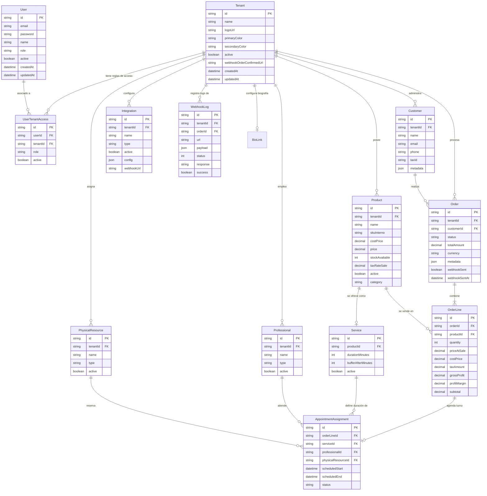
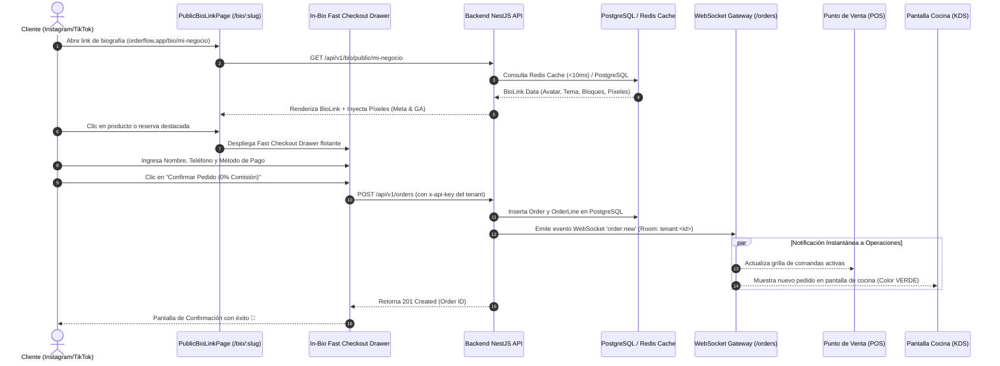

# 📊 Documentación de Diagramas UML del Sistema

[🏠 Atrás (README)](../README.md) | [🚀 Inicio Rápido](01-quickstart.md) | [🏗️ Arquitectura](02-architecture.md) | [🏢 Multi-Tenant Demo](03-multi-tenant-demo.md) | [🔐 JWT Auth](04-jwt-auth.md) | [📊 Testing Report](05-testing-report.md) | [🏪 POS & KDS](06-pos-kds.md) | [📊 Diagramas UML](07-uml-diagrams.md) | [🎖️ Loyalty Module](08-loyalty.md)

---

Este documento recopila el diseño de arquitectura lógica y física de **OrderFlow**, modelado a través de diagramas nativos en **Mermaid.js**.

---

## 1. MER (Modelo Entidad Relación)
El siguiente diagrama describe el diseño de la base de datos relacional (PostgreSQL) gestionado mediante **Prisma**. El sistema utiliza un esquema de particionamiento lógico para garantizar el multi-tenancy.



---

## 2. Diagrama de Casos de Uso
Este diagrama representa las interacciones de los distintos actores del sistema (**Super Admin**, **Administrador / Cajero**, **Mozo / Profesional** y **Cliente final**) con los módulos del SaaS.

```mermaid
graph TD
  subgraph Actores
    SA[Super Administrador]
    AD[Administrador / Cajero]
    MZ[Mozo / Profesional]
    CO[Cocinero / Personal de Cocina]
    CL[Cliente Final]
  end

  subgraph Casos de Uso - Plataforma
    UC1(Gestionar Tenants y API Keys)
    UC2(Monitorear Health Checks)
    UC3(Instalar Módulos en App Store)
    UC4(Gestionar Catálogo de Productos)
    UC5(Administrar Usuarios y Roles)
  end

  subgraph Casos de Uso - Operativos
    UC6(Crear Comanda de Mesa)
    UC7(Visualizar Comandas Pendientes en KDS)
    UC8(Iniciar Preparación de Platos)
    UC9(Finalizar Preparación / Marcar Listo)
    UC10(Recibir Notificación de Plato Listo)
    UC11(Entregar Pedido a Mesa)
    UC12(Cobrar Mesa y Registrar Pago)
    UC13(Reservar Turnos)
    UC14(Realizar Pedido E-commerce)
  end

  %% Relaciones Super Admin
  SA --> UC1
  SA --> UC2

  %% Relaciones Admin / Cajero
  AD --> UC3
  AD --> UC4
  AD --> UC5
  AD --> UC12

  %% Relaciones Mozo
  MZ --> UC6
  MZ --> UC10
  MZ --> UC11

  %% Relaciones Cocinero
  CO --> UC7
  CO --> UC8
  CO --> UC9

  %% Relaciones Cliente
  CL --> UC13
  CL --> UC14
```



---

## 3. Flujograma: Ciclo de Vida del Pedido (POS + KDS + ERP)
El siguiente diagrama detalla la lógica secuencial y el flujo de datos desde la toma del pedido hasta la facturación y sincronización final con Odoo.

```mermaid
flowchart TD
  Start([Inicio del Pedido]) --> OpenCart[Mozo selecciona Mesa y carga ítems]
  OpenCart --> SendOrder[Guardar Comanda en POS]
  
  SendOrder --> CreateDraft[Backend crea orden en estado DRAFT]
  CreateDraft --> EmitWS1[Emitir evento WebSocket 'order:new' al KDS]
  
  subgraph Preparacion en Cocina - KDS
    EmitWS1 --> DisplayKDS[Comanda aparece en pantalla KDS en VERDE]
    DisplayKDS --> WaitPrep{¿Comenzar cocción?}
    
    WaitPrep -- Sí --> StatusPrep[PATCH /orders/:id/status -> PREPARING]
    StatusPrep --> WS2[Emitir WebSocket 'order:status_updated']
    WS2 --> AlertColor[KDS cambia color a NARANJA / Temporizador activo]
    
    AlertColor --> FinishPrep[PATCH /orders/:id/status -> READY]
    FinishPrep --> WS3[Emitir WebSocket 'order:status_updated']
    WS3 --> ReadyColor[KDS cambia a VERDE listo para retirar]
  end

  ReadyColor --> Deliver[Mozo entrega la comida a la mesa]
  Deliver --> RequestBill[Mesa solicita la cuenta]
  
  subgraph Facturacion y Cobro - Caja
    RequestBill --> OpenCashier[Cajero abre mesa activa en POS]
    OpenCashier --> AdjustItems[Aplica descuentos o añade ítems extras]
    AdjustItems --> SelectPayment[Registra método de pago: Cash, Card, Transfer]
    SelectPayment --> ConfirmPayment[PATCH /orders/:id/confirm]
  end

  ConfirmPayment --> WriteDB[Backend actualiza a CONFIRMED y descuenta stock]
  WriteDB --> RegisterEntry[Registra entrada en el módulo de integración Caja]
  
  subgraph Sincronizacion ERP
    RegisterEntry --> CheckWebhook{¿Tiene Webhook configurado?}
    CheckWebhook -- Sí --> SendWebhook[POST webhookOrderConfirmedUrl]
    SendWebhook --> LogLog[Registrar log en WebhookLog]
  end

  CheckWebhook -- No --> End([Pedido Completado y Mesa Liberada])
  LogLog --> End
```



---

## 10. Diagramas del Módulo OrderFlow Bio-Links (directorio transaccional)

### A. Diagrama de Clases UML del Módulo Bio-Links

```mermaid
classDiagram
    class BioLink {
        +String id
        +String tenantId
        +String slug
        +String title
        +String bio
        +String avatarUrl
        +String themeColor
        +String textColor
        +String buttonStyle
        +String metaPixelId
        +String gaMeasurementId
        +String tiktokPixelId
        +Json blocks
        +Boolean showBranding
        +Boolean isActive
        +DateTime createdAt
        +DateTime updatedAt
    }

    class BioLinksController {
        +getPublicBySlug(slug: String)
        +getConfig(req: Request)
        +updateConfig(dto: CreateBioLinkDto, req: Request)
    }

    class BioLinksService {
        +getByTenantId(tenantId: String)
        +upsertBioLink(tenantId: String, dto: CreateBioLinkDto)
        +getPublicBySlug(slug: String)
    }

    class PublicBioLinkPage {
        +slug: String
        +fetchPublicBio()
        +handleBlockClick(block)
        +handleFastCheckoutSubmit()
    }

    BioLinksController --> BioLinksService : inyecta
    BioLinksService --> BioLink : gestiona la entidad
    PublicBioLinkPage ..> BioLinksController : consume /api/v1/bio/public/:slug
```

### B. Diagrama de Secuencia UML: In-Bio Fast Checkout & Sincronización en Tiempo Real POS/KDS



