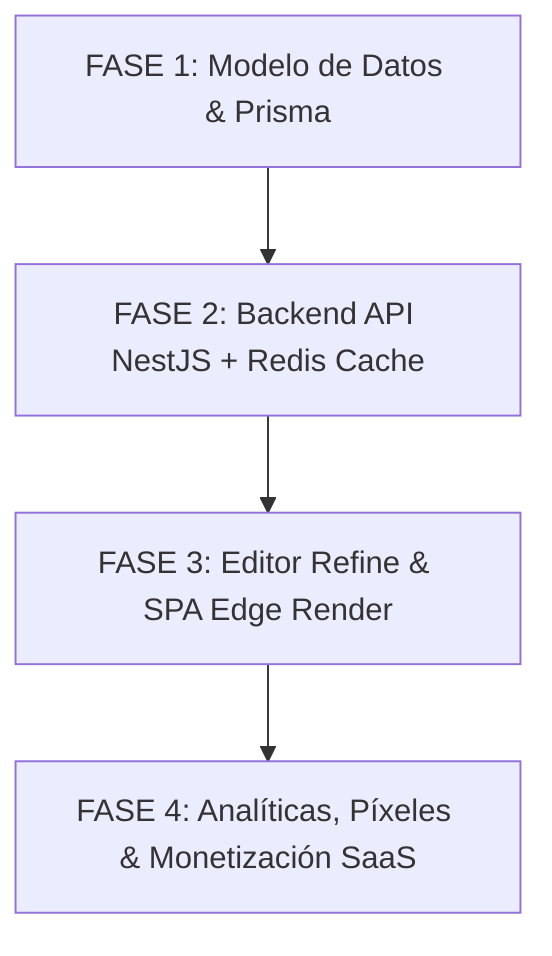

# ⚡ Plan de Incorporación: Módulo de Bio-Links Transaccionales (OrderFlow Bio-Links)

Este documento detalla el plan estratégico, arquitectónico y comercial para incorporar la vertical de **Bio-Links transaccionales** (directorio bio optimizado) dentro del ecosistema multi-tenant de **OrderFlow**.

---

## 📊 1. Análisis de Viabilidad y Comparativa Competitiva (OrderFlow vs. Competencia)

### 1.1 Evaluación de Viabilidad: **EXCELENTE (9.5/10)**
La incorporación de un servicio de Bio-Links en OrderFlow no solo es altamente viable, sino que representa una **extensión natural y estratégica de la propuesta de valor del producto**. OrderFlow ya cuenta con:
- Arquitectura multi-tenant madura (NestJS + Prisma + PostgreSQL).
- Motores transaccionales completos: Catálogo/Tienda (`orders`), Reservas de citas (`bookings`), Presupuestos (`quotations`), Sorteos (`giveaways`).
- Conexión en tiempo real a punto de venta (POS) y pantalla de cocina (KDS) vía WebSockets.
- Automatización de subdominios y certificados SSL dinámicos vía Cloudflare API.

### 1.2 Comparativa de Modelos Comerciales y Comisiones

| Criterio | Competencia Free | Competencia Starter ($8/mes) | Competencia Pro ($15/mes) | Competencia Premium ($35/mes) | **OrderFlow Bio-Links** (Incluido en Starter/Pro/Enterprise) |
|---|---|---|---|---|---|
| **Comisión por venta** | **12%** | **9%** | **9%** | **0%** | **0% NATIVA en todos los planes** |
| **Integración e-Commerce** | Externa o link simple | Externa o link simple | Integrada (básica) | Integrada | **Nativa (Stock + POS + KDS + Bookings)** |
| **Checkout In-Bio** | No | Limitado | Limitado | Sí | **Sí (Drawer móvil instantáneo sin salir de IG/TikTok)** |
| **Dominio Personalizado** | No | No | Sí | Sí | **Sí (Automático vía Cloudflare for SaaS)** |
| **Píxeles (Meta/Google)** | No | No | Sí | Sí | **Sí (Captura de audiencias desde plan Starter)** |
| **Eliminación de Branding**| No | No | Sí | Sí | **Configurable según plan OrderFlow** |

### 1.3 Ventaja Competitiva Directa
1. **Destrucción de la barrera de comisiones:** Un comercio que vende $2,000/mes a través de su Bio-Link en la competencia Free/Starter paga entre **$180 y $240/mes en comisiones de plataforma**. Con OrderFlow, la comisión por plataforma es del **0%**, haciendo que el costo de la suscripción de OrderFlow ($29, $79 o $199/mes) se pague solo inmediatamente.
2. **Experiencia Sin Fricción (In-Bio Commerce):** El usuario final no es redirigido a un sitio web pesado. Todo el proceso de compra, pago local y agendamiento ocurre dentro de un Drawer flotante súper rápido dentro del propio navegador in-app de Instagram/TikTok/WhatsApp.
3. **Sincronización Total de Operaciones:** Una compra realizada en la bio genera la comanda en el KDS de la cocina o en el POS de la tienda en tiempo real, deduciendo stock del inventario unificado.

---

## 🏗️ 2. Fases del Plan de Implementación



---

## 📁 Fase 1: Arquitectura de Base de Datos (PostgreSQL + Prisma)

Extendemos el esquema relacional de Prisma para agregar la entidad `BioLink` vinculada al `Tenant`.

```prisma
// prisma/schema.prisma

model BioLink {
  id              String         @id @default(uuid())
  tenantId        String         @unique @map("tenant_id")
  tenant          Tenant         @relation(fields: [tenantId], references: [id], onDelete: Cascade)
  
  // Personalización Estética
  slug            String         @unique // ej: "tunegocio" -> orderflow.app/bio/tunegocio o links.tunegocio.com
  title           String
  bio             String?
  avatarUrl       String?        @map("avatar_url")
  themeColor      String         @default("#3D2235") @map("theme_color")
  textColor       String         @default("#FFFFFF") @map("text_color")
  buttonStyle     String         @default("rounded") @map("button_style") // flat, rounded, outline, glass
  
  // Píxeles de Tracking & Marketing
  metaPixelId     String?        @map("meta_pixel_id")
  gaMeasurementId String?        @map("ga_measurement_id")
  tiktokPixelId   String?        @map("tiktok_pixel_id")

  // Estructura de Contenido Dinámico (Links, Productos, Reservas, Sorteos)
  blocks          Json           // Array de bloques: [{ id, type: "link|product|booking|giveaway|header|social", label, value, icon, isActive, order }]
  
  // Configuración Comercial y Estado
  showBranding    Boolean        @default(true) @map("show_branding")
  isActive        Boolean        @default(true) @map("is_active")
  
  createdAt       DateTime       @default(now()) @map("created_at")
  updatedAt       DateTime       @updatedAt @map("updated_at")

  @@index([tenantId])
  @@index([slug])
}
```

---

## ⚙️ Fase 2: Desarrollo Backend (NestJS + Redis)

### 2.1 Endpoint Público de Ultra Baja Latencia (<10ms)
- **Ruta:** `GET /api/v1/bio/public/:slug`
- **Estrategia de Caché:**
  1. Consulta a Redis (`biolink:slug`). Si existe retorno en <10ms.
  2. Si es *cache miss*, consulta PostgreSQL, setea caché en Redis (TTL 300s) y responde.
  3. Soporta dominios personalizados resolviendo el `slug` o CNAME vía cabeceras Host.

### 2.2 Invalidación Event-Driven de Caché
Al actualizar el diseño o los bloques en el panel de control, NestJS invalida inmediatamente la clave de caché.

```typescript
@OnEvent('biolink.updated')
async handleBioLinkUpdatedEvent(event: BioLinkUpdatedEvent) {
  await this.cacheManager.del(`biolink:${event.slug}`);
}
```

### 2.3 Registro de Analíticas de Clics Asíncrono
Cada interacción/clic se procesa de forma no bloqueante mediante colas Redis/BullMQ o eventos asíncronos en NestJS para registrar métricas de conversión por bloque (CTR, fuentes de tráfico, dispositivo) sin impactar la velocidad de carga.

---

## 🖥️ Fase 3: Frontend y Panel de Control

### A. Editor Administrativo en Refine.dev (`/admin/biolinks`)
- **Visual Live Preview:** Panel dividido con previsualización en vivo (mockup de smartphone) que reacciona en tiempo real a los cambios.
- **Drag & Drop Block Builder:** Reordenamiento interactivo de bloques.
- **Selectores Transaccionales Nativos:**
  - *Bloque Producto:* Picklist del catálogo de `products` con precio, foto y badge de stock.
  - *Bloque Reserva:* Picklist de servicios de `bookings` para agendamiento directo.
  - *Bloque Sorteo:* Enlace directo a campañas activas de `giveaways`.
  - *Bloque Enlace Externo:* Redes sociales, WhatsApp con mensaje predeterminado, sitio web.

### B. Renderizador Público de Biografías (SPA Ultra-Ligera)
- SPA minimalista construida con Vite + React (bundle size < 50KB).
- **Fast Checkout Drawer (Cajón de Compra In-Bio):**
  - Al hacer clic en un producto/reserva, se despliega un cajón inferior (bottom sheet) con el formulario de checkout.
  - Permite seleccionar variante, método de pago digital / transferencia, y datos de entrega.
  - Dispara la orden directa a `POST /api/v1/orders` e invalida/emite WebSocket a POS y KDS.

---

## 📈 Fase 4: Estrategia Comercial y Empaquetado SaaS

| Plan OrderFlow | Precio | Funcionalidad Bio-Link Incluida | Beneficio Clave vs Competencia |
|---|---|---|---|
| **Starter** | $29 / mes | • Subdominio `empresa.orderflow.app/bio`<br>• Enlaces ilimitados y productos básicos<br>• Marca de agua *"Powered by OrderFlow"*<br>• Píxeles de tracking incluidos | **0% de comisión en ventas** (vs 12%/9% de la competencia Free/Starter). |
| **Professional**| $79 / mes | • Eliminación de marca de agua<br>• Bloques transaccionales completos (Productos + Bookings + Sorteos)<br>• Personalización avanzada (Glassmorphism, colores de marca)<br>• Analíticas avanzadas de conversión y fuentes de tráfico | Automatización completa de ventas y reservas directamente desde Instagram/TikTok. |
| **Enterprise**  | $199 / mes| • Dominio personalizado propio (`links.mi-marca.com`) con SSL automático vía Cloudflare<br>• Soporte de alto tráfico con caché prioritaria en Edge<br>• Multi-locación / Multi-bio por tenant | Solución corporativa completa para marcas con múltiples sucursales o franquicias. |

---

## 🎯 Plan de Acción Inmediato para Desarrollo

- [ ] **Hito 1 (Prisma & DB):** Añadir modelo `BioLink` a `prisma/schema.prisma` y ejecutar `npx prisma db push`.
- [ ] **Hito 2 (NestJS Module):** Crear `backend/src/biolinks/` con `BioLinksController`, `BioLinksService` y caché en Redis.
- [ ] **Hito 3 (Refine Admin UI):** Crear `frontend/src/pages/admin/biolinks.tsx` con editor interactivo Drag & Drop y vista previa móvil en vivo.
- [ ] **Hito 4 (Página Pública / In-Bio Drawer):** Implementar vista pública `/bio/:slug` con Fast Checkout Drawer para compras y agendamientos sin fricción.
- [ ] **Hito 5 (Cloudflare & Dominios):** Integrar soporte de CNAME personalizado mediante `cloudflare-dns.service.ts` existente.
