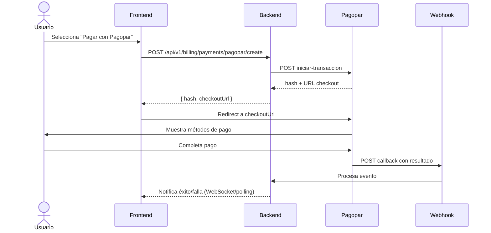

# Integración Pagopar - OrderFlow

> **Estado:** En progreso (FEAT-007)  
> **Versión:** 1.8.1+  
> **Fecha:** 2026-08-03  
> **Gateway:** Pagopar (Paraguay)

---

## 1. ¿Qué es Pagopar?

Pagopar es la pasarela de pagos dominante en Paraguay. Unifica todos los medios de pago del país en una sola integración:

| Medio | Detalle |
|-------|---------|
| Tarjetas | Visa, Mastercard, Maestro, Credicard, Única, Union Pay, Elo, JCB, Amex, Discover, Diners, Cabal, Panal |
| QR | QR Pagopar |
| Billeteras | Tigo Money, Personal Pay, Giros Claro, Wally, Zimple |
| Cobranzas | WEPA, Pago Express, Aquí Pago, Infenet |
| Bancos | Itaú, BBVA, Regional, GNB, Atlas, Amambay, Bancop, Itapúa |
| Internacional | PIX (Brasil) |

**Moneda:** PYG (Guaraní)  
**Checkout:** Hospedado por Pagopar (redirect + callback)  
**Webhooks:** Sí, con validación de token SHA1  

---

## 2. Arquitectura de Integración

### 2.1 Capas

```
Frontend (React/Expo)
    ↓
Backend NestJS (BillingModule + PagoparService)
    ↓
Pagopar API (https://api.pagopar.com)
    ↓
Webhook Callback → Backend → Actualizar orden/suscripción
```

### 2.2 Flujo de Pago



---

## 3. Modelo de Datos

### 3.1 Tabla `payment_transactions`

```prisma
model PaymentTransaction {
  id            String   @id @default(uuid())
  tenantId      String
  gateway       PaymentGateway  // PAGOPAR, STRIPE, MERCADOPAGO
  gatewayTxId   String?  // ID de transacción en Pagopar
  hash          String   @unique  // Hash de Pagopar para tracking
  token         String?  // Token de webhook para validación
  amount        Int      // Monto en PYG
  currency      String   @default("PYG")
  status        String   // pending, paid, rejected, cancelled, expired
  paymentMethod String?  // tarjeta, qr, billetera, etc.
  metadata      Json?    // Datos adicionales del comprador/items
  orderId       String?  // Relación con orden si aplica
  subscriptionId String?
  webhookReceivedAt DateTime?
  createdAt     DateTime @default(now())
  updatedAt     DateTime @updatedAt

  tenant        Tenant   @relation(fields: [tenantId], references: [id], onDelete: Cascade)

  @@index([tenantId, gateway, status])
  @@index([hash])
}
```

### 3.2 Enum `PaymentGateway` actualizado

```typescript
export enum PaymentGateway {
  STRIPE = 'STRIPE',
  MERCADOPAGO = 'MERCADOPAGO',
  PAGOPAR = 'PAGOPAR',
}
```

---

## 4. Backend - Servicios

### 4.1 `PagoparService` (`backend/src/billing/pagopar/pagopar.service.ts`)

**Responsabilidades:**
- Generar token SHA1 para autenticación
- Crear transacciones (`iniciar-transaccion`)
- Consultar estado de pago (`traer`)
- Validar webhooks
- Mapear errores de Pagopar a excepciones NestJS

**Métodos principales:**

```typescript
@Injectable()
export class PagoparService {
  constructor(
    private readonly http: HttpService,  // Axios
    private readonly configService: ConfigService,
  ) {}

  async createTransaction(tenantId: string, dto: CreatePagoparTransactionDto): Promise<PagoparTransactionResponse>
  async getPaymentStatus(hash: string): Promise<PagoparPaymentStatus>
  verifyWebhookToken(hash: string, token: string): boolean
  private generateToken(privateKey: string, operation: string): string
  private signPayload(privateKey: string, payload: any): string
}
```

### 4.2 `PaymentTransactionsService` (`backend/src/billing/payment-transactions.service.ts`)

**Responsabilidades:**
- CRUD de `PaymentTransaction`
- Registrar intentos de pago
- Actualizar estado por webhook
- Historial de pagos por tenant

### 4.3 Actualizaciones en `BillingService`

```typescript
// En processWebhookEvent:
} else if (dto.gateway === PaymentGateway.PAGOPAR) {
  const resultado = dto.event?.resultado?.[0];
  const hash = resultado?.hash_pedido;
  const status = resultado?.resultado; // pagado, no_pagado
  
  if (status === 'pagado') {
    paymentStatus = 'ACTIVE';
    // Mapear monto a plan según tabla de precios
  } else if (status === 'no_pagado') {
    paymentStatus = 'PAST_DUE';
  }
}
```

---

## 5. Backend - Controladores

### 5.1 `PagoparController` (`backend/src/billing/pagopar/pagopar.controller.ts`)

```typescript
@Controller('billing/payments/pagopar')
@UseGuards(JwtAuthGuard, TenantGuard)
export class PagoparController {
  @Post('create')
  @HttpCode(200)
  async createTransaction(@Request() req, @Body() dto: CreatePagoparTransactionDto) {
    const tenantId = req.tenantId;
    return this.pagoparService.createTransaction(tenantId, dto);
  }

  @Get('status/:hash')
  async getStatus(@Param('hash') hash: string) {
    return this.pagoparService.getPaymentStatus(hash);
  }

  @Post('webhook')
  @HttpCode(200)
  async webhook(@Body() dto: ProcessWebhookDto) {
    // Validar token
    const isValid = this.pagoparService.verifyWebhookToken(
      dto.hash,
      dto.token
    );
    if (!isValid) {
      throw new BadRequestException('Invalid webhook token');
    }
    return this.billingService.processWebhookEvent({
      gateway: PaymentGateway.PAGOPAR,
      event: dto,
    });
  }
}
```

**Nota:** El webhook de Pagopar usa `hash_pedido` y `token` en el body. El endpoint recibe:
```json
{
  "hash": "abc123...",
  "token": "sha1hash..."
}
```

---

## 6. Frontend

### 6.1 Checkout de Suscripción

**Ubicación:** `frontend/src/pages/admin/subscription.tsx`

**Cambios:**
- Agregar botón "Pagar con Pagopar" en el modal de pago
- Al hacer clic:
  1. Llama a `POST /api/v1/billing/payments/pagopar/create`
  2. Recibe `{ hash, checkoutUrl }`
  3. Abre `checkoutUrl` en nueva pestaña/modal
  4. Polling de estado cada 3s hasta `paid` o `cancelled`

```typescript
const handlePagoparPayment = async () => {
  setLoading(true);
  try {
    const response = await api.post('/billing/payments/pagopar/create', {
      amount: plan.priceMonthUsd * 4500, // Convertir a PYG (tasa aprox)
      description: `Suscripción ${plan.name} - OrderFlow`,
      buyer: {
        nombre_apellido: user.name,
        email: user.email,
        celular: user.phone || '',
      },
      items: [
        {
          descripcion: `Plan ${plan.name} (mensual)`,
          cantidad: 1,
          monto: plan.priceMonthUsd * 4500,
        }
      ]
    });
    
    window.open(response.data.checkoutUrl, '_blank');
    
    // Polling de estado
    const interval = setInterval(async () => {
      const status = await api.get(`/billing/payments/pagopar/status/${response.data.hash}`);
      if (status.data.resultado === 'pagado' || status.data.resultado === 'no_pagado') {
        clearInterval(interval);
        setLoading(false);
        message.success(status.data.resultado === 'pagado' ? 'Pago exitoso!' : 'Pago rechazado');
        // Actualizar UI
      }
    }, 3000);
  } catch (error) {
    message.error('Error al iniciar pago con Pagopar');
    setLoading(false);
  }
};
```

### 6.2 Catálogo WhatsApp / Checkout

**Ubicación:** `frontend/src/pages/whatsapp-catalog.tsx`

**Cambios:**
- Agregar opción "Pagar con Pagopar" en checkout
- Flujo similar al de suscripciones pero con items del carrito

---

## 7. Configuración

### 7.1 Variables de Entorno

```bash
# .env.production / .env.staging
PAGOPAR_PUBLIC_KEY=your_public_key
PAGOPAR_PRIVATE_KEY=your_private_key
PAGOPAR_URL=https://api.pagopar.com
PAGOPAR_TIMEOUT=30
```

### 7.2 Configuración por Tenant

Cada tenant puede configurar sus propias claves de Pagopar en `Tenant.config`:

```json
{
  "paymentGateways": {
    "pagopar": {
      "enabled": true,
      "publicKey": "...",
      "privateKey": "...",
      "testMode": false
    }
  }
}
```

---

## 8. Seguridad

- **Validación de webhook:** SHA1 con private key
- **HTTPS obligatorio** en producción
- **Rate limiting** en endpoints de creación de transacciones
- **No exponer private key** en frontend
- **Logs de auditoría** de todos los intentos de pago

---

## 9. Pruebas

### 9.1 Unit Tests

```typescript
describe('PagoparService', () => {
  it('should generate valid SHA1 token', () => {
    const token = pagoparService.generateToken('private_key', 'iniciar-transaccion');
    expect(token).toBe('a1b2c3d4...');
  });

  it('should create transaction with correct payload', async () => {
    const response = await pagoparService.createTransaction('tenant-1', mockDto);
    expect(response.hash).toBeDefined();
    expect(response.checkoutUrl).toContain('pagopar.com');
  });

  it('should verify webhook token correctly', () => {
    const isValid = pagoparService.verifyWebhookToken('hash', 'valid_token');
    expect(isValid).toBe(true);
  });
});
```

### 9.2 E2E

- Agregar `https://provecchio.com/admin/subscription` a `qa_e2e_check.py`
- Verificar botón Pagopar visible y funcional

---

## 10. Cronograma

| Fecha | Hito |
|-------|------|
| 2026-08-03 | Documentación + diseño completado |
| 2026-08-04 | Prisma: agregar `PaymentTransaction` |
| 2026-08-05 | Backend: `PagoparService` + `PagoparController` |
| 2026-08-06 | Backend: integración en `BillingService` |
| 2026-08-07 | Frontend: checkout Pagopar en suscripciones |
| 2026-08-08 | Testing + deploy a staging |
| 2026-08-09 | Validación E2E + producción |

---

## 11. Referencias

- [Documentación oficial Pagopar](https://cdn.pagopar.com/assets/documentos/Documentacion_Pagopar.pdf)
- [SDK Python pagopar-sdk](https://github.com/devpbeat/pagopar-sdk)
- [django-pagobc](https://github.com/nicoaguilerapy/django-pagobc)
- [laravel-pagobc](https://github.com/krugerdavid/laravel-pagobc)
