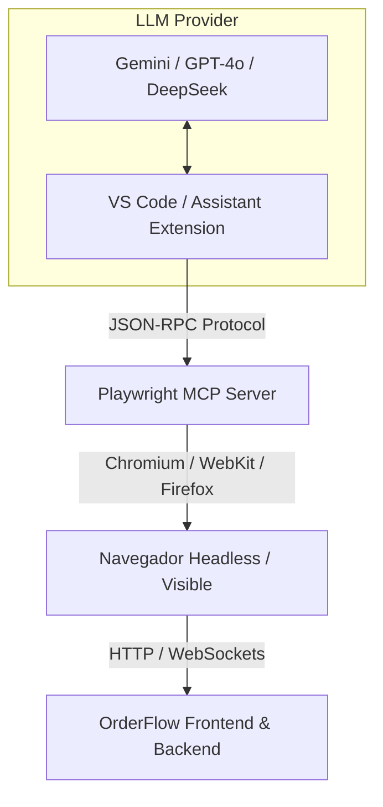

# 🤖 Guía de Integración: Playwright MCP (Model Context Protocol) en VS Code

**Fecha:** 2026-08-11  
**Área:** DevOps / QA Automation / IA Tooling  
**Estado:** 💡 **Propuesta de Implementación / Guía Técnica**  

---

## 🎯 1. Objetivo

Permitir a los desarrolladores del equipo controlar navegadores web de forma automatizada mediante **Playwright** e interactuar con la aplicación **OrderFlow** (tanto en local `localhost` como en staging/producción) usando asistentes de IA en VS Code (**Cline**, **Roo Code**, **Continue.dev**, **Antigravity CLI**, etc.) independientemente del proveedor de LLM (Gemini, OpenAI GPT-4o, DeepSeek, etc.).

---

## 🏗️ 2. Arquitectura de Integración (MCP + Playwright)

El **Model Context Protocol (MCP)** es un estándar abierto desarrollado para exponer herramientas del entorno de desarrollo a los modelos de lenguaje.



### Principales Ventajas
- **Sin ataduras a un único proveedor:** Funciona con cualquier modelo compatible con llamadas a herramientas (Tool Calling / Function Calling).
- **Snapshot de Accesibilidad:** Trabaja sobre el *Accessibility Tree* del DOM (rápido, determinista y liviano) sin requerir modelos pesados de visión.
- **Navegación Interactiva:** La IA puede completar formularios, presionar botones, capturar errores de consola JS y verificar endpoints de red HTTP.

---

## ⚙️ 3. Pasos de Instalación y Configuración

### Requisitos Previos
- Node.js 18+ instalado.
- Extensión de VS Code compatible con MCP (ej: **Cline**, **Roo Code**, **Continue.dev**, **Antigravity CLI**).

### Configuración de MCP (`mcpSettings.json` / `cline_mcp_settings.json`)

Agrega el servidor `@playwright/mcp` a la configuración global o de espacio de trabajo de tu asistente MCP:

```json
{
  "mcpServers": {
    "playwright": {
      "command": "npx",
      "args": ["-y", "@playwright/mcp@latest"]
    }
  }
}
```

---

## 🚀 4. Casos de Uso y Prompts de Ejemplo

Una vez activo el MCP de Playwright en tu entorno, puedes ejecutar los siguientes flujos directamente desde el chat de tu IA:

### Caso 1: Pruebas Exploratorias de UI / E2E
> **Prompt:**  
> *"Navega a `http://localhost:3000/admin/products`, inicia sesión con `admin@pesallaccia.com`, agrega un nuevo producto llamado 'Pasta Artesanal' con precio 45000 y verifica que aparezca en la lista."*

### Caso 2: Diagnóstico y Debugging de Errores HTTP / Consola
> **Prompt:**  
> *"Abre `http://localhost:3000/social-catalog` en mobile viewport (iPhone 14) y revisa si hay excepciones JS en la consola o recursos con HTTP 404 / 502."*

### Caso 3: Generación Automática de Tests `.spec.ts`
> **Prompt:**  
> *"Navega al flujo de checkout de `http://localhost:3000/checkout`, simula la compra de un producto y genera un test de Playwright TypeScript estructurado bajo el patrón Page Object Model en `frontend/e2e/checkout.spec.ts`."*

---

## 🔒 5. Buenas Prácticas y Seguridad

1. **Entorno Controlado:** Al ejecutar pruebas con modificación de datos (Creación de órdenes/productos), asegúrate de apuntar a bases de datos de desarrollo o tenants de test (`tenant-test`).
2. **Resguardo de Credenciales:** Prohibido incluir contraseñas reales de producción en los prompts del asistente. Usar variables de entorno o credenciales de prueba.
3. **Sincronización con CI/CD:** Los tests generados por la IA utilizando el MCP deben validarse posteriormente corriendo `./scripts/init.sh` en el repositorio antes de hacer commit.

---

**Referencias del Proyecto:**
- [docs/guides/05-testing-report.md](05-testing-report.md) — Reportes de Testing en OrderFlow
- [docs/00-contexto-agentes.md](../00-contexto-agentes.md) — Barrera de Validación E2E (`qa_e2e_check.py`)
