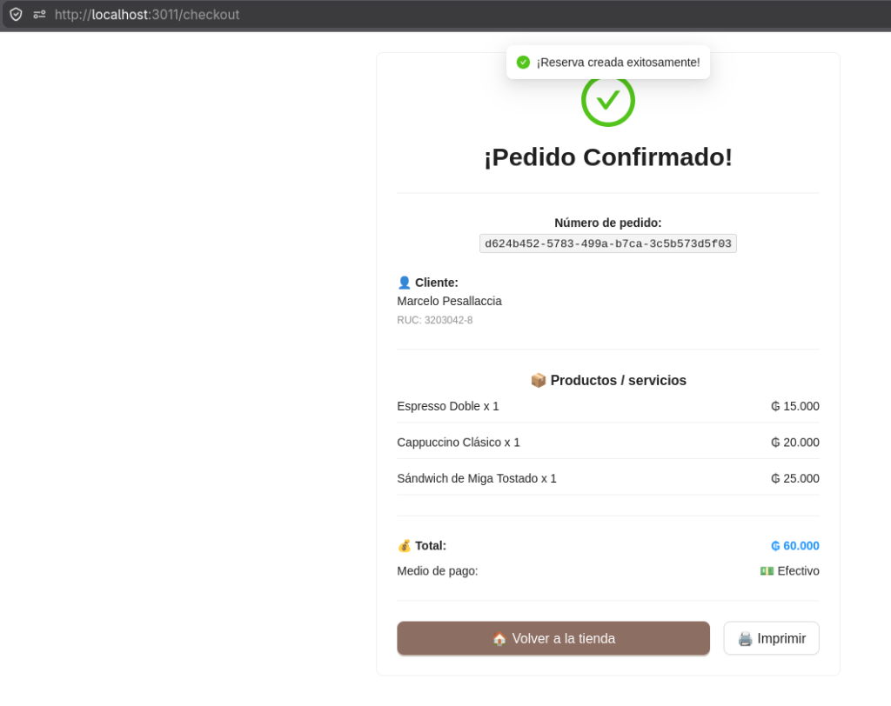
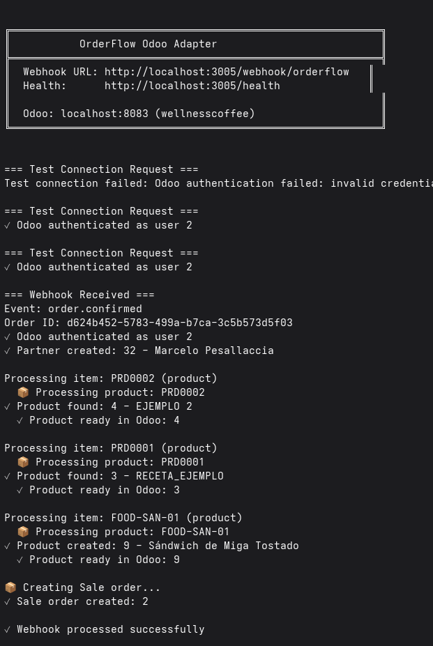
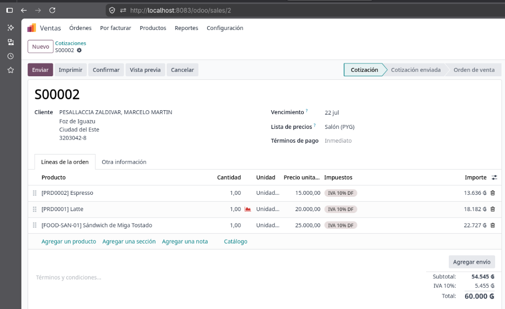

# OrderFlow - Odoo End-to-End Integration Proof
**Fecha:** 22 de Junio de 2026
**Tenant:** Wellness Coffee
**Entorno:** Odoo 19 CE (`wellnesscoffee`)

Este documento sirve como evidencia técnica de la correcta integración bidireccional entre la plataforma SaaS OrderFlow y Odoo ERP. Validando la **Fase 3** de la arquitectura técnica propuesta.

## Resumen de la Prueba E2E
El test End-to-End consistió en simular una compra real desde el portal público (Checkout) de OrderFlow y validar su ingesta automatizada, creación de contactos y registro contable en Odoo a través del servicio intermediario `odoo-adapter`.

### 1. Confirmación en el Frontend
El cliente realiza la confirmación de su carrito con los productos "Espresso Doble", "Cappuccino Clásico" y "Sándwich de Miga Tostado".

### 2. Procesamiento del Webhook (Odoo Adapter)
El backend de OrderFlow dispara inmediatamente un webhook asíncrono con el payload del pedido hacia el adaptador.
El `odoo-adapter` realiza las siguientes validaciones vía XML-RPC:
* **Autenticación:** Supera exitosamente la conexión al entorno específico mediante inyección de la cabecera `X-Odoo-Database`.
* **Sincronización de Cliente:** Verifica la existencia de "Marcelo Pesallaccia". Al no existir, crea el `Partner` (ID 32).
* **Mapeo de Productos:** 
  * Identifica los SKUs existentes (`PRD0002` y `PRD0001`) y los vincula a los IDs nativos de Odoo (4 y 3 respectivamente).
  * Detecta que el SKU `FOOD-SAN-01` no existe y lo inyecta automáticamente en el catálogo de Odoo (ID 9).
* **Creación de Orden:** Genera la Cotización (Sale Order) vinculando todos los recursos en una única transacción.

### 3. Evidencia en Odoo (Módulo de Ventas)
La cotización (Presupuesto `S00002`) es creada en estado *Draft* en el ERP, consolidando correctamente los precios, las descripciones y el enlace al cliente generado. La base de datos se mantiene limpia y libre de duplicados de catálogo.

## Conclusión
La arquitectura basada en Webhooks + Node.js Adapter + XML-RPC funciona perfectamente de manera agnóstica para múltiples tenants. La deuda técnica descrita para la sincronización ha sido validada y puesta a prueba satisfactoriamente.

## Resiliencia y Recuperación de Errores (Retry Mechanism)
El sistema está diseñado para tolerar fallos de red o caídas del sistema Odoo (ej. `XML-RPC fault`).
* **Desacoplamiento:** Cuando un cliente confirma un pedido, este se guarda primariamente en PostgreSQL (`orders`).
* **Auditoría:** Todo intento de envío de webhook queda guardado en la tabla `webhook_logs` detallando el error exacto y el código HTTP.
* **Cron Job Automático:** Se ha implementado un servicio programado (`WebhookCronService`) que se ejecuta **cada 5 minutos** mediante `@nestjs/schedule`. Este servicio busca automáticamente los pedidos cuyo `webhookSent` haya quedado en `false` debido a fallos previos, y vuelve a intentar el envío hacia el Odoo Adapter, asegurando así una consistencia eventual (Eventual Consistency) sin pérdida de datos.
