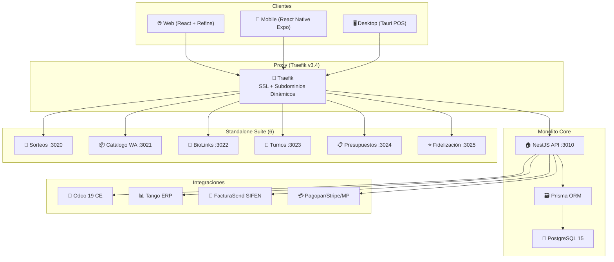

# 📊 Estado del Arte — OrderFlow v1.13.2

> **Fecha:** 2026-08-06 | **Versión Core:** `1.13.2` | **Última actividad:** 2026-08-05

---

## 🔢 Resumen Ejecutivo

| Métrica | Valor |
|---------|-------|
| **Versión** | `1.13.2` |
| **Features totales** | 47 |
| **Completadas** | 40 (85%) |
| **En progreso** | 2 (4%) |
| **Pendientes** | 5 (11%) |
| **Suites de test backend** | ~60 |
| **Microservicios standalone** | 6 production-ready |
| **Entornos operativos** | 3 (staging, production, provecchio) |

---

## ✅ Features Completadas (40/47)

### Core & Arquitectura
| ID | Feature | Módulo |
|----|---------|--------|
| FEAT-001 | Aislamiento Multi-Tier (Shared vs Dedicated DB) | `tenant-connection.manager.ts` |
| FEAT-002 | Webhooks de Suscripción Stripe / Mercado Pago | `billing` |
| FEAT-005 | JWT 24h & Redirección 401 | `auth` + `api.ts` |
| FEAT-007 | Pasarelas de Pago Independientes | `billing/gateways/*` |
| FEAT-013 | Integración Pagopar (Paraguay) | `billing/pagopar` |
| FEAT-021 | Soporte Multimoneda (PYG base) | `currency.service.ts` |
| FEAT-022 | Cotizaciones automáticas BCP/Cambios Chaco/Bonanza | `currency/` |
| FEAT-024 | OrderFlow como Tenant Enterprise (DB dedicada) | multi-tenant infra |
| FEAT-042 | Gestión de Contactos (Odoo res.partner parity) | `contacts` |

### Frontend & UX
| ID | Feature | Módulo |
|----|---------|--------|
| FEAT-004 | Landing Page con Planes y Setup FREE | `orderflow-landing.tsx` |
| FEAT-019 | Homepage Builder (plantillas, bloques dinámicos) | `homepage-builder.tsx` |
| FEAT-025 | UX/UI Mobile-First (Admin + Client) | `frontend/src/` |
| FEAT-034 | One-Page Checkout Express | `whatsapp-checkout.tsx` |
| FEAT-035 | Bottom Navigation Bar móvil | `MobileBottomNav.tsx` |
| FEAT-036 | Responsive Cards (tablas → tarjetas) | admin pages |
| FEAT-037 | SuperAdmin Tenant Switcher | `super-admin-dashboard.tsx` |
| FEAT-038 | Dashboard Multi-Columna | `dashboard.tsx` |
| FEAT-033 | Tests Frontend (Vitest + RTL) | `frontend/` |

### Catálogo & WhatsApp
| ID | Feature | Módulo |
|----|---------|--------|
| FEAT-008 | Variantes/Modificadores, GPS, Zonas, Plantillas WA | `whatsapp-catalog` |
| FEAT-014 | Customización catálogo WA por Tenant Admin | `whatsapp-catalog.tsx` |
| FEAT-015 | Endpoint público unificado `/public/catalog/products` | `public-catalog.controller.ts` |
| FEAT-041 | Maduración UX/UI mobile-first catálogo WA | `whatsapp-catalog.tsx` |
| FEAT-017 | Galería doTERRA + subdominios dinámicos | `seed-gaiaspa-doterra.ts` |

### Integraciones
| ID | Feature | Módulo |
|----|---------|--------|
| FEAT-009 | Subdominios dinámicos Traefik + Cloudflare DNS | `BrandingProvider.tsx` + `tenants` |
| FEAT-010 | WhatsApp + Google Calendar en Bookings | `bookings` + `integrations` |
| FEAT-016 | Migración NGINX → Traefik v3.3 en Provecchio | infra |
| FEAT-020 | Adaptador Tango ERP (sync bidireccional) | `integrations/tango` |
| FEAT-023 | FacturaSend SIFEN (DE vía Odoo y directo) | `integrations/facturasend/` |
| FEAT-031 | Odoo 19 CE sync account.move + cola durable | `odoo-adapter/` |
| FEAT-032 | FacturaSend completado (addon, adapter, webhook, cron) | `integrations/facturasend/` |

### Standalone Suite
| ID | Feature | Módulo |
|----|---------|--------|
| FEAT-003 | 6 Microservicios Standalone extraídos | `services/*-standalone` |

### Infraestructura & QA
| ID | Feature | Módulo |
|----|---------|--------|
| FEAT-006 | AGENTS.md v2.1+ & `init.sh` | `AGENTS.md` + `scripts/` |
| FEAT-018 | Suite E2E Playwright + Python en init.sh | `qa_e2e_check.py` |
| FEAT-026 | CONTRIBUTING.md & SECURITY.md | gobernanza |
| FEAT-027 | Escalabilidad Horizontal documentada | `docs/` |
| FEAT-028 | Backup & Restauración automatizada | `scripts/` |
| FEAT-029 | Prometheus + Grafana + Alertmanager | `docs/` |
| FEAT-030 | SLA por Plan Comercial | `docs/sla.md` |
| FEAT-039 | Cobertura Backend 80%+ (60 suites) | `backend/src/` |
| FEAT-040 | E2E Playwright FacturaSend | `frontend/e2e/` |

---

## 🔄 En Progreso (2/47)

| ID | Feature | Notas |
|----|---------|-------|
| FEAT-011 | Clúster Staging/Production con Replica Read-Only | Ampliación a servidor secundario |
| FEAT-012 | App Móvil React Native Expo (Client + POS) | Terminal POS nativa iOS/Android |

---

## 📋 Pendientes (5/47) — Milestone: v1.16.0

| ID | Feature | Bloqueado por |
|----|---------|---------------|
| FEAT-43 | Durable Event Queue (BullMQ/Redis) para webhooks | — |
| FEAT-44 | EventBus Extensible interno | FEAT-43 |
| FEAT-45 | Inventario Multidepósito (doble entrada) | FEAT-43 |
| FEAT-46 | Mapeador de Integraciones Configurable | FEAT-43 |
| FEAT-47 | Auditoría Transaccional Ampliada | — |

> [!IMPORTANT]
> Todas las features pendientes están agrupadas en **v1.16.0 (pre-K8s)** y provienen del análisis comparativo Odoo vs OrderFlow. La feature fundacional es **FEAT-43 (Durable Event Queue)** que desbloquea 3 de las otras 4.

---

## 🏗️ Arquitectura Actual

---

## 📈 Últimos Cambios (v1.13.x)

| Versión | Fecha | Highlights |
|---------|-------|------------|
| **1.13.2** | 2026-08-05 | Entrypoint usa `prisma migrate deploy`, health check via `docker exec`, fix migración stale |
| **1.13.1** | 2026-08-05 | `init.sh` con flags `--skip-e2e`/`--only-backend`, Jest `--maxWorkers=2`, cleanup Linktree, roadmap v1.16.0 |
| **1.13.0** | 2026-08-05 | Contactos Odoo-parity: taxId dedup, address propagation, displayName, ContactAddress/Category/BankAccount, deploy script fixes |

---

## 🎯 Siguiente Hito: v1.16.0 (pre-Kubernetes)

Todas las features pendientes apuntan a solidificar la arquitectura interna antes de la migración a Kubernetes (v2.0.0+):

1. **Durable Event Queue (BullMQ/Redis)** — base para reliability de webhooks
2. **EventBus Extensible** — desacoplamiento de módulos vía eventos
3. **Inventario Multidepósito** — control de stock con doble entrada
4. **Mapeador de Integraciones** — configuración visual de conectores ERP
5. **Auditoría Transaccional** — trazabilidad completa de operaciones

> [!NOTE]
> El proyecto tiene un **85% de features completadas**, con el core SaaS multi-tenant completamente operativo, 6 microservicios standalone en producción, y 3 entornos (staging, production, provecchio) desplegados. Las 2 features en progreso (clúster HA y app móvil) son esfuerzos continuos de infraestructura y producto móvil.
