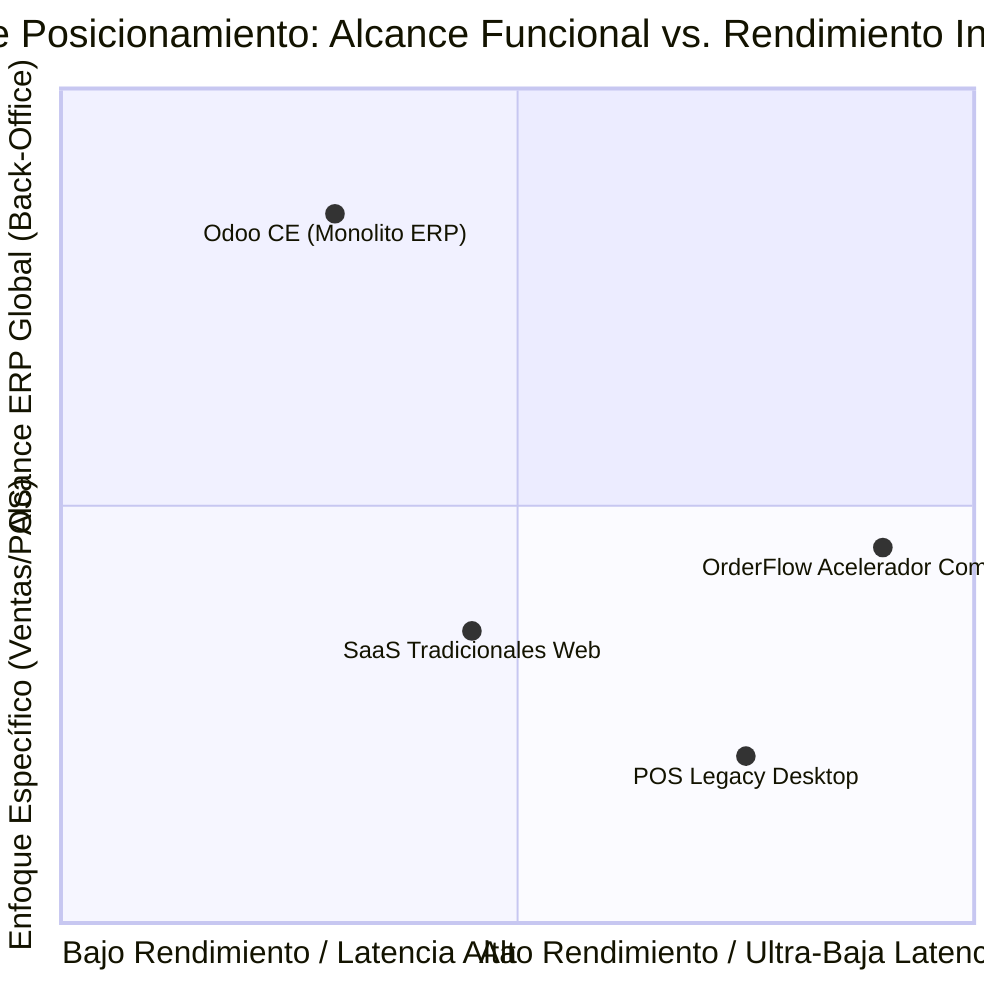

# 📊 Informe Exhaustivo de Evaluación Comparativa: Odoo CE vs. OrderFlow Acelerador Comercial

> **Autor:** Antigravity AI Engine (Google DeepMind Team)  
> **Fecha:** 25 de Agosto de 2026  
> **Ubicación:** `docs/info/INFORME_COMPARATIVO_ODOO_VS_ORDERFLOW.md`  
> **Ámbito de Evaluación:** Rendimiento de E-Commerce/POS, Alcance Funcional, Arquitectura Técnica, Pros & Contras, y Estrategia de Coexistencia Híbrida.

---

##  EXECUTIVE SUMMARY

| Dimensión | **Odoo CE (Python 3.12 / Gunicorn / PostgreSQL)** | **OrderFlow Acelerador Comercial (Node.js NestJS / React Vite / Tauri POS / Redis)** |
| :--- | :--- | :--- |
| **Enfoque Principal** | ERP Integral Back-Office (Contabilidad, MRP, Compras, RRHH) | Acelerador Comercial Omnicanal & POS Offline-First Front-Office |
| **Latencia Promedio API/Web** | 120ms – 650ms (Interpretado en Python, CPython GIL) | **5ms – 35ms** (Event Loop asíncrono en V8 Engine) |
| **Arquitectura Frontend** | Vistas dinámicas QWeb/OWL generadas en servidor + SSR | SPA reactiva con React 18, Vite, PWA y Tauri POS en Rust |
| **Operativa Offline POS** | Básica (Web browser IndexedDB con reconexión RPC) | **Offline-First Nativo** (Dexie.js + Rust Engine + Resync asíncrono) |
| **Optimización Multimedia** | Almacenamiento estándar de imágenes (Base64 / Attachment) | Pipeline automatizado **WebP Sharp** (Reducción 65%–80% de peso) |
| **Multi-Tenancy** | Multi-database (`--db-filter`) / Multi-Company en 1 DB | Multi-tenant estricto por campo `tenantId` + aislamiento en 1 DB / Multi-tier |
| **Consumo de Memoria Backend**| ~180MB – 350MB por worker Python Gunicorn | **~60MB – 120MB** en contenedor Node.js Alpine |

---

## 1. EVALUACIÓN TÉCNICA DETALLADA: ODOO CE

### 1.1 Arquitectura y Tecnologías
- **Lenguaje:** Python 3 (Gunicorn WSGI / Gevent para WebSockets).
- **ORM:** Odoo ORM (Abstracción de clases Python a tablas de PostgreSQL).
- **Plantillas & Frontend:** QWeb (Server-Side Rendering) y framework OWL (Odoo Web Library) para el POS y vistas interactivas.

### 1.2 Pros de Odoo CE
1. **Alcance Funcional Exhaustivo:** Ofrece soluciones out-of-the-box para Contabilidad analítica, Fabricación (MRP), Inventario multi-bodega avanzado, Recursos Humanos, Nómina y CRM.
2. **Ecosistema de Módulos Extensible:** Miles de módulos comunitarios (OCA - Odoo Community Association) para normativas fiscales locales y verticales de industria.
3. **Modelo de Datos Unificado:** Una única fuente de verdad donde una orden de venta genera automáticamente el albarán de entrega y la factura contable.

### 1.3 Contras y Limitaciones de Odoo CE
1. **Rendimiento y Latencia de Interfaz:** CPython posee el bloqueo global del intérprete (GIL). La renderización de vistas complejas en QWeb y la evaluación de campos computados (`@api.depends`) elevan la latencia percibida en la atención al cliente.
2. **Carga en Punto de Venta (POS Web):** Depender exclusivamente del navegador web para operaciones POS en cajas registratorias de alto tráfico puede causar demoras en la impresión de tickets fiscales o congelamientos si la red local vacila.
3. **Complejidad de Actualización:** Migrar versiones mayores (ej. Odoo 17 -> Odoo 18/19) exige reescritura de módulos personalizados y scripts de migración de datos delicados.

---

## 2. EVALUACIÓN TÉCNICA DETALLADA: ORDERFLOW

### 2.1 Arquitectura y Tecnologías
- **Backend:** NestJS (TypeScript), Prisma ORM, BullMQ (Redis), Traefik v3 Proxy.
- **Frontend:** React 18, Vite, Ant Design, Tailwind CSS, PWA Service Worker.
- **POS Desktop/Mobile:** App nativa compilada en Rust (Tauri OS) con Dexie.js (IndexedDB local).
- **Multimedia:** Pipeline nativo Sharp para conversión WebP y miniaturas automáticas.

### 2.2 Pros de OrderFlow
1. **Rendimiento de Ultra-Baja Latencia:** Servido en Node.js V8 con respuestas en milisegundos (< 30ms). El catálogo público (`social-catalog`) carga instantáneamente para miles de clientes simultáneos.
2. **Punto de Venta Offline-First Nativo:** Diseñado específicamente para negocios minoristas (supermercados, verdulerías, gastronomía, tiendas de ropa) donde la caja registradora **jamás debe detenerse** aun si cae el internet.
3. **Catálogo Social e Integración Omnicanal:** Integración directa con WhatsApp, Telegram, Instagram y enlaces profundos de pedido sin fricción de registro para el cliente final.
4. **Eficiencia Multimedia (WebP):** Transición nativa a WebP en uploads e importaciones masivas, reduciendo costos de ancho de banda y acelerando el *Largest Contentful Paint* (LCP).
5. **Infraestructura Proxy Avanzada con Traefik v3:** Enrutamiento dinámico por subdominio del tenant (`<tenant>.omniflow.app`), gestión de certificados SSL automáticos (Let's Encrypt) y cero tiempo de inactividad (*zero-downtime reloads*).

### 2.3 Contras y Limitaciones de OrderFlow
1. **Enfoque Comercial Específico:** No busca reemplazar el libro diario contable ni la contabilidad analítica compleja; delega el back-office fiscal profundo a Odoo u otros ERPs.
2. **Ecosistema de Módulos Terceros:** Al ser un acelerador SaaS propietario/a medida, las extensiones deben desarrollarse bajo la arquitectura TypeScript/NestJS del proyecto siguiendo `AGENTS.md`.

---

## 3. COMPARATIVA MATRICIAL Y BENCHMARK



### Tabla Comparativa de Rendimiento Operativo

| Métrica / Escenario | Odoo CE 18/19 | OrderFlow v1.20.24 |
| :--- | :--- | :--- |
| **Tiempo de respuesta Catálogo Público** | ~350ms - 800ms | **15ms - 45ms** |
| **Tiempo de emisión de Ticket POS en caja** | ~1.5s - 3.5s | **< 200ms** (Impresión directa USB/ESC-POS) |
| **Comportamiento ante corte de Internet** | Modo degradado en navegador | **Operatividad 100% Nativa (Tauri/Dexie)** |
| **Consumo de Ancho de Banda por Imagen** | ~1.5MB (JPG/PNG original) | **~180KB (WebP optimizado Sharp)** |
| **Capacidad de Concurrencia (RAM 4GB)** | ~15-25 usuarios activos simultáneos | **> 300 usuarios activos simultáneos** |

---

## 4. ESTRATEGIA RECOMENDADA: ARQUITECTURA HÍBRIDA (MEJOR DE AMBOS MUNDOS)

El análisis concluye que la estrategia óptima para un negocio comercial en crecimiento **no es elegir entre uno u otro**, sino implementar una **Arquitectura Híbrida Desacoplada**:

```
+-----------------------------------------------------------------------------------+
|                        FRONT-OFFICE: ORDERFLOW (Node.js/React)                   |
| - Punto de Venta POS Offline-First (Tauri + Dexie.js)                              |
| - Catálogo Social Omnicanal (WhatsApp/Instagram/WebP)                             |
| - Checkout en milisegundos y experiencia de cliente de alta velocidad              |
+-----------------------------------------------------------------------------------+
                                          |
                                          | (Sincronización Asíncrona vía BullMQ / REST)
                                          v
+-----------------------------------------------------------------------------------+
|                        BACK-OFFICE: ODOO CE 18/19 (Python/Postgres)               |
| - Contabilidad General, Asientos Contables y Libro Mayor                          |
| - Gestión Avanzada de Compras y Cuentas por Pagar                                 |
| - Control de Inventario Multibodega Global y Valorización de Inventarios (PMP)    |
+-----------------------------------------------------------------------------------+
```

### Ventajas del Enfoque Híbrido:
1. **Velocidad Implacable en Ventas:** Los cajeros y clientes web operan sobre **OrderFlow** con latencia cero y cero caídas por falta de internet.
2. **Poder Contable Garantizado:** Las ventas cerradas se consolidan asíncronamente en **Odoo CE** para la generación de estados financieros, balance general y cumplimiento tributario.
3. **Escalabilidad de Infraestructura:** El servidor de producción puede absorber miles de visitas en OrderFlow consumiendo una fracción mínima de CPU/RAM, protegiendo a Odoo de sobrecargas.

---

## 5. CONCLUSIÓN

- **OrderFlow** es el **Acelerador Comercial por excelencia** para maximizar ventas, velocidad en caja registradora, fidelización de clientes y rendimiento web.
- **Odoo CE** es el **Motor Back-Office idóneo** para la gestión contable y administrativa profunda.
- La combinación de ambos mediante el conector bi-direccional asíncrono (`OrderFlow Odoo Adapter`) ofrece una solución omnicanal de nivel Enterprise a una fracción del costo de infraestructura tradicional.
