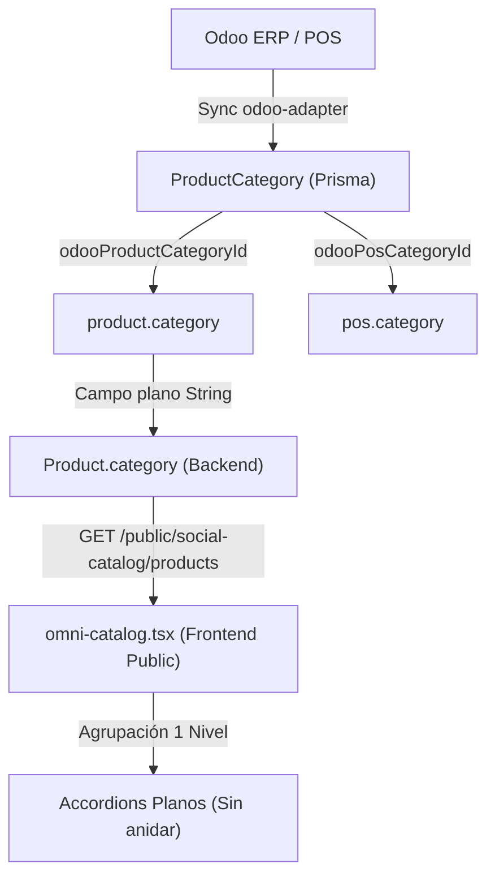
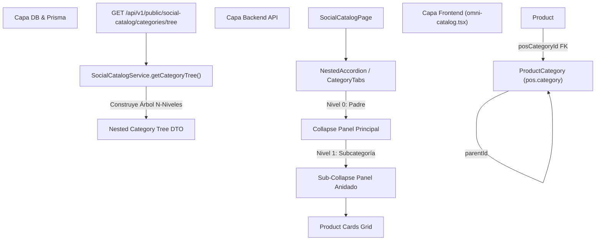

# 📊 Informe de Estado del Arte: Social Catalog & Jerarquía Anidada con `pos.category`

> **Proyecto:** OmniFlow / OrderFlow  
> **Versión Actual del Core:** v1.20.16  
> **Ubicación:** `docs/info/INFORME_ESTADO_DEL_ARTE_SOCIAL_CATALOG_POS_CATEGORIES.md`  
> **Fecha:** 2026-08-25  

---

## 1. Executive Summary / Resumen Ejecutivo

El presente informe documenta el **Estado del Arte** del módulo **Social Catalog (OmniCatalog / Menú Digital)** dentro del ecosistema OmniFlow, analizando la arquitectura actual de categorización, su grado de desacoplamiento frente al POS y ERP Odoo, y trazando el **Plan de Implementación** para permitir el uso de **`pos.category` con jerarquías anidadas N-niveles** (Categoría Padre ➔ Subcategoría ➔ Productos).

Actuación bajo protocolo **AGENTS.md (Harness Engineering Standard)**: se preserva la compatibilidad multi-tenant (`tenantId`), la arquitectura modular de NestJS + React/Refine y el estándar de subdominios únicos por tenant.

---

## 2. Diagnóstico del Estado del Arte Actual (v1.20.16)

Actualmente, **Social Catalog** opera bajo la siguiente arquitectura:



### 2.1 Puntos Fuertes Actuales
- **Rendimiento Elevado:** Agrupación plana indexada en memoria en frontend con bajo consumo de CPU.
- **Sincronización Odoo:** El modelo Prisma `ProductCategory` ya cuenta con los campos para mapear tanto `odooProductCategoryId` como `odooPosCategoryId`.
- **Estructura Auto-referencial Lista:** `ProductCategory` posee las relaciones `parentId`, `parent`, `children` y `level` (`0=root, 1=child, 2=grandchild`).

### 2.2 Limitaciones Detectadas para el Requerimiento
1. **Fuente de Categorización Fija:** El backend (`social-catalog.service.ts`) consume exclusivamente `Product.category` (cadena de texto basada en la categoría logística del producto), ignorando la clasificación por `pos.category`.
2. **Representación Plana en API y UI:**
   - La API `/public/social-catalog/products` retorna una lista de productos con su categoría en texto plano.
   - El frontend `omni-catalog.tsx` agrupa mediante `sortedProducts.reduce((acc, p) => ...)` creando un diccionario de 1 solo nivel `Record<string, Product[]>`.
3. **Falta de Renderizado Anidado en Frontend:** El componente `<Collapse>` de Ant Design actualmente itera únicamente las claves de primer nivel sin sub-acordeones ni pestañas jerárquicas.

---

## 3. Comparativa de Modelos de Categorización: `product.category` vs `pos.category`

| Característica | `product.category` (Actual) | `pos.category` (Requerido) |
| :--- | :--- | :--- |
| **Propósito** | Clasificación logística / contable / inventario. | Clasificación táctica visual para Menú / POS / Mozo. |
| **Origen en Odoo** | Tabla `product.category` | Tabla `pos.category` |
| **Jerarquía en DB** | Relación `parent_id` en Odoo | Relación `parent_id` en Odoo |
| **Indexación Prisma** | `ProductCategory.odooProductCategoryId` | `ProductCategory.odooPosCategoryId` |
| **Soporte en Social Catalog** | ✅ Total (1 nivel plano) | 🚧 Pendiente de habilitar en API y UI |

---

## 4. Plan de Arquitectura e Implementación para Jerarquía Anidada `pos.category`

Para lograr que el menú digital utilice las categorías del POS y anide automáticamente las subcategorías dentro de sus categorías superiores, se define el siguiente plan técnico:



### 4.1 Cambios en Modelo Prisma (`backend/prisma/schema.prisma`)
1. Agregar campo `posCategoryId` opcional en `Product`:
   ```prisma
   model Product {
     // ...
     posCategoryId   String?
     posCategoryRel  ProductCategory? @relation("ProductPosCategory", fields: [posCategoryId], references: [id], onDelete: SetNull)
   }
   ```
2. Extender `ProductCategory` para diferenciar el rol o permitir doble relación (`ProductCategory.posProducts`).

### 4.2 Cambios en Backend (`backend/src/social-catalog/`)
1. **Configuración de Fuente de Categoría:**
   Añadir opción en `SocialCatalogConfig`:
   - `categorySource`: `'product'` | `'pos'` (default: `'product'`).
   - `categoryHierarchyEnabled`: `boolean` (default: `true`).
2. **Nuevo Endpoint de Árbol de Categorías:**
   `GET /api/v1/public/social-catalog/categories/tree`
   - Retorna la estructura jerárquica:
     ```json
     [
       {
         "id": "cat-bebidas",
         "name": "Bebidas",
         "level": 0,
         "children": [
           {
             "id": "cat-vinos",
             "name": "Vinos",
             "level": 1,
             "children": [],
             "products": [...]
           },
           {
             "id": "cat-cocteles",
             "name": "Cócteles",
             "level": 1,
             "children": [],
             "products": [...]
           }
         ],
         "products": []
       }
     ]
     ```

### 4.3 Cambios en Frontend (`frontend/src/pages/omni-catalog.tsx`)
1. **Componente de Renderizado Recursivo / Anidado (`NestedCategoryAccordion`):**
   Sustituir el `<Collapse>` plano actual por un componente recursivo que renderice:
   - Panel Nivel 0 (Categoría Principal, ej: *Entradas*, *Bebidas*, *Postres*).
   - Paneles Anidados Nivel 1/2 (Subcategorías, ej: *Tragos de Autor*, *Sin Alcohol*).
   - Grilla de tarjetas de productos dentro de la subcategoría correspondiente.
2. **Soporte de Filtros por Subcategoría:**
   Permitir filtrar por categoría padre (muestra todos los productos de sus hijas) o seleccionar una subcategoría específica.

---

## 5. Matriz de Impacto y Riesgos

| Área | Riesgo | Mitigación |
| :--- | :--- | :--- |
| **Compatibilidad Inversa** | Que tenants existentes sin `pos.category` vean el menú vacío. | Mantener fallback automático a `Product.category` si `categorySource === 'product'` o si `posCategoryId` es nulo. |
| **Sincronización Odoo** | Que Odoo no tenga asignadas `pos.category` en algunos productos. | El adapter usará `product.category` como fallback cuando `pos_categ_id` en Odoo venga vacío. |
| **Rendimiento Frontend** | Exceso de re-renders al desplegar múltiples acordeones profundos. | Memoización con React `useMemo` y renderizado perezoso (`LazyImage`). |

---

## 6. Próximos Pasos Recomendados

1. **Fase 1 (Schema & Backend):** Agregar `posCategoryId` en `schema.prisma`, regenerar Prisma Client y crear `getCategoryTree()` en `SocialCatalogService`.
2. **Fase 2 (Sincronización Odoo Adapter):** Asegurar que `odoo-adapter` pueble `posCategoryId` al importar desde Odoo (mapeando `pos_categ_id`).
3. **Fase 3 (Frontend Admin & Public UI):** Agregar selector "Fuente de Categorías: Producto vs POS" en `/admin/social-catalog` y habilitar el acordeón anidado en `omni-catalog.tsx`.
4. **Fase 4 (QA & CI/CD):** Ejecutar `./scripts/init.sh` y validar con Playwright E2E.

---

*Documento registrado en la base oficial de conocimiento de OmniFlow.*  
*Archivo:* `docs/info/INFORME_ESTADO_DEL_ARTE_SOCIAL_CATALOG_POS_CATEGORIES.md`
