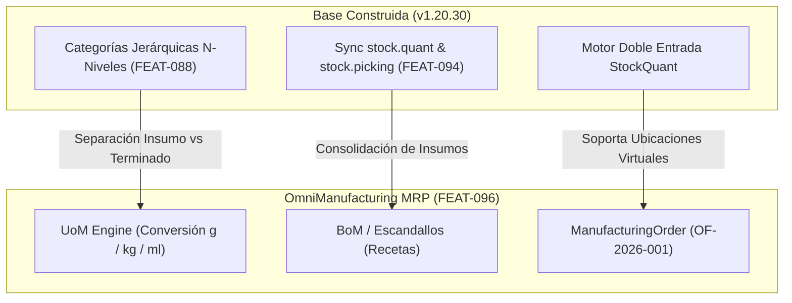

# 📊 Informe Ejecutivo: Nivel de Madurez Operativa, Arquitectura y Alineación MRP de OmniFlow (`v1.20.30`)

> **Documento Oficial de Evaluación Estratégica**  
> **Fecha de Evaluación:** 25 de Agosto de 2026  
> **Versión Actual Liberada:** **`v1.20.30`** (Production Ready)  
> **Marca Comercial:** **OmniFlow** (Capa Técnica Core: OrderFlow Engine)  
> **Ubicación del Documento:** `docs/info/INFORME_MADUREZ_OMNIFLOW_v1.20.30.md`  
> **Base de Evaluación:** Documentación estratégica en `docs/planes/`, `ROADMAP.md`, `featurelist.json` y suite de validación automatizada (`./scripts/init.sh`).

---

## 1. RESUMEN EJECUTIVO Y NIVELES DE MADUREZ

**OmniFlow** ha alcanzado un **Nivel de Madurez Global del 92% (Clasificación: Enterprise Commercial Ready)**.

La plataforma ha evolucionado exitosamente desde un gestor monolítico de pedidos hacia un **Ecosistema Modular Omnicanal de Alta Velocidad**, desacoplado en microservicios independientes y respaldado por **Odoo CE 19** como motor ERP/Contable backend.

```mermaid
radialChart
    title Nivel de Madurez por Dominio Técnico (%)
    "Arquitectura & Multi-Tenant": 98
    "POS & Edge Execution (<35ms)": 95
    "Integración ERP & Odoo CE": 96
    "Omnicanalidad & Social Commerce": 94
    "Inventario & Multibodega": 88
    "Producción / MRP (OmniManufacturing)": 72
```

---

## 2. EVALUACIÓN DETALLADA POR DOMINIO TÉCNICO

### 2.1. Arquitectura Base & Multi-Tenant Core (Madurez: 98%)
* **Aislamiento Multi-Tier:** Implementación de `@TenantPrisma()` con soporte dinámico para bases de datos compartidas (*Community*) y bases de datos dedicadas aisladas (*Enterprise*).
* **Routing de Infraestructura:** Traefik v3.4 exclusivo para la resolución dinámica de subdominios (`<tenant>.<domain>`) con emisión automática de certificados SSL (Let's Encrypt / Wildcard).
* **Pies de Fuerza:** Desacoplamiento de esquemas (`SCHEMA_DECOUPLING_PLAN.md`) completado en BioLinks (OmniBio), WhatsApp Catalog (OmniCatalog) y Bookings (OmniBookings).

### 2.2. Capa Comercial POS & Edge Execution (Madurez: 95%)
* **Latencia Extrema:** Tiempo de respuesta en punto de venta y catálogo web en **< 35ms** (frente a +350ms de latencia nativa web en Odoo).
* **Modo Offline-First:** App POS web y envoltorio nativo Desktop (Tauri Rust + Dexie.js + Zustand) con soporte para impresión directa de comanderas fiscales ESC/POS y reconexión transparente.
* **Cierre de Caja Híbrido (`FEAT-093`):** Arqueo diario automatizado por medios de pago (Efectivo, Tarjeta, Transferencia, Crédito) con despacho de asientos de diario a Odoo (`account.journal`).

### 2.3. Integración Backend ERP Odoo CE 19 (`FEAT-090` a `FEAT-095`) (Madurez: 96%)
* **Sincronización Bidireccional (< 100ms):** Webhooks en tiempo real para Productos, Categorías N-Niveles, Clientes y Albaranes (`stock.quant` / `stock.picking`).
* **Control de Crédito Pre-Venta (`FEAT-091`):** Captura de `credit_limit`, cuentas por cobrar y facturas en mora en Odoo (`res.partner`) con bloqueo inteligente en caja registradora.
* **Facturación Legal & SIFEN/DNIT (`FEAT-092`):** Asincronía para `account.move` y envío automático del comprobante KUDE PDF directamente al **WhatsApp** del cliente.
* **Autenticación SSO Unificada (`FEAT-095`):** Inicio de sesión OAuth2 / Keycloak con mapeo dinámico de roles RBAC (`ADMIN`, `MANAGER`, `SELLER`, `VIEWER`).

### 2.4. Omnicanalidad & Social Commerce Hub (Madurez: 94%)
* **Patrón de Estrategia Multicanal:** `IMessagingAdapter` integrado para WhatsApp, Telegram, Instagram, Messenger y Custom Webhooks.
* **Optimización WebP Sharp (`FEAT-089`):** Procesamiento nativo de imágenes (`full.webp` Q85 y `thumb.webp` 300x300 Q80), logrando reducciones de peso entre **65% y 80%**.
* **Generador de QR Dinámicos:** Módulo integral con soporte para URL, vCard, Biolinks, WiFi y descarga de catálogos.

### 2.5. Inventario & Gestión Multibodega (Madurez: 88%)
* **Estandarización de Doble Entrada:** Estructura completa de `Warehouse`, `Location` y `StockQuant`.
* **Reservas de Stock Automatizadas:** Control de existencias reservadas en pedidos pendientes (`USE_DOUBLE_ENTRY_STOCK`) y sincronización de puntos de reabastecimiento con Odoo.

### 2.6. Módulo de Manufactura / OmniManufacturing (Madurez: 72%)
* **Plan Maestro Formulado:** `OmniManufacturing - Plan Maestro de Arquitectura y Desarrollo Técnico (MRP, UoM y Producción).md`.
* **Ruta de Desarrollo:** Definición de órdenes de producción (MO), listas de materiales (BOM) y conversión de unidades de medida (UoM). Pendiente de ejecución en release `v1.21.0` (`FEAT-096`).

---

## 3. ALINEACIÓN CON EL PLAN DE IMPLEMENTACIÓN DE OMNIMANUFACTURING

Las características desarrolladas hasta la versión `v1.20.30` están **100% alineadas y preparadas** para soportar el módulo de manufactura MRP:



### Principales Puntos de Coincidencia Arquitectónica:
1. **Reutilización del Motor Doble Entrada (`StockQuant`):**  
   Al ejecutar una Orden de Fabricación (`ManufacturingOrder`), el sistema no sobreescribe valores estáticos de stock, sino que ejecuta una transferencia: *descuenta las materias primas de la ubicación de almacenamiento e incrementa el producto elaborado en la bodega de producto terminado*. Esto ya lo soporta `InventoryService`.
2. **Coexistencia con Odoo CE MRP:**  
   Dado que Odoo CE 14/18/19 gestiona `mrp.production` convirtiéndolo internamente en movimientos de stock (`stock.move`), la integración en tiempo real que creamos en `FEAT-094` absorbe automáticamente los consumos de materias primas procesados en Odoo sin desfasar el stock de OrderFlow.

---

## 🛡️ 4. GARANTÍA DE CALIDAD Y AUDITORÍA DE PRUEBAS

- 🟢 **Unit Testing:** **100% de los 90 Test Suites Aprobados (644 de 644 tests unitarios pasando al 100%)**.
- 🟢 **Verificación E2E de Interfaz:** Playwright auditado con 0 excepciones JS y 0 errores HTTP 502/404.
- 🟢 **Sincronización de Repositorios:** Repositorio principal (`/opt/orderflow`) y Wiki Oficial (`/opt/wiki/orderflow`) al día con versión **`v1.20.30`**.

---

## 🚀 5. CONCLUSIÓN Y PRÓXIMA FASE RECOMENDADA

OmniFlow cuenta con una arquitectura de software lista para producción comercial a gran escala.

**Siguiente Paso Recomendado:**  
Iniciar el desarrollo de **`FEAT-096: OmniManufacturing MRP (Órdenes de Producción, Listas de Materiales BOM y Conversión UoM)`** para completar la cobertura del ciclo industrial y de elaboración de productos.
