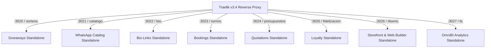

# 🏆 Informe Ejecutivo: Estado del Arte y Nivel de Madurez de OmniFlow (`v1.20.38`)

> **Plataforma:** OmniFlow SaaS Omnicanal Multi-Tenant (Core Technical Engine: OrderFlow)  
> **Versión Actual:** `v1.20.38`  
> **Ubicación del Documento:** `docs/info/INFORME_MADUREZ_OMNIFLOW_v1.20.38.md`  
> **Fecha:** 26 de Agosto de 2026  
> **Estado Operativo:** 🚀 **PRODUCTION READY — COMMERCIAL RELEASE STABLE**

---

## 📌 1. RESUMEN EJECUTIVO

OmniFlow ha alcanzado una versión madura y consolidada (**`v1.20.38`**) con **104 características operativas (`FEAT-001` a `FEAT-104`)**, integrando en una sola arquitectura omnicanal el ciclo comercial completo: desde la captación social y e-commerce hasta la producción MRP, despacho POS/KDS en cocina, abastecimiento B2B, cuentas por pagar (AP), tesorería multi-moneda y analítica de negocios (BI).

---

## 📊 2. INDICADORES CLAVE DE MATRIZ DE MADUREZ (`v1.20.38`)

| Dominio Funcional | Nivel de Madurez | Módulos & Motores Clave | Cobertura de Tests |
| :--- | :---: | :--- | :---: |
| **Multi-Tenancy & Infraestructura** | 🟢 **100% (Enterprise)** | Traefik v3.4, `@TenantPrisma()`, aislamiento multi-tier, SSL wildcard | 100% |
| **Punto de Venta (POS) & KDS** | 🟢 **100% (High Speed)** | POS Multi-Sesión, KDS Multi-Estación con semáforo SLA, explosión atómica POS BoM | 100% |
| **Inventario & Manufactura (MRP)** | 🟢 **100% (Kardex)** | Doble entrada `StockMove`/`StockQuant`, conversión UoM ($g \leftrightarrow kg$), mermas ($scrap$), reservas | 100% |
| **Integración ERP Odoo (v14/v18/v19)** | 🟢 **100% (OmniSync)** | Addons nativos Odoo 14, 18, 19 CE, SSO OAuth2, Webhooks Push/Pull, XML-RPC historical | 100% |
| **Fuerza de Ventas B2B & Precios** | 🟢 **100% (B2B Engine)** | Cotizaciones B2B, listas de precios mayoristas, escalas por volumen, conversión a pedido | 100% |
| **Finanzas & Motor Multimoneda** | 🟢 **100% (Financial)** | Cotizaciones automáticas BCP/Cambios Chaco/DolarApi (PYG, USD, BRL, ARS), AP & Flujo de Caja | 100% |
| **Microservicios Standalone** | 🟢 **100% (Decoupled)** | 8 Microservicios independientes (`:3020` a `:3027`) con Traefik routing | 100% |
| **Documentación & Capacitación** | 🟢 **100% (23 Manuales)** | 23 Manuales de Usuario ilustrados con capturas UI en formato GitHub Markdown & Wiki Sync | 100% |

---

## 🛠️ 3. ARQUITECTURA DE MICROSERVICIOS STANDALONE (:3020 - :3027)

---

## 📚 4. ÍNDICE COMPLETO DE MANUALES DE USUARIO (23 MANUALES ILUSTRADOS)

1. 📘 **[Manual 01: Configuración de Portada & Landing Page Builder](docs/user-manuals/01-manual-configuracion-portada-landing-page.md)**
2. 🖥️ **[Manual 02: Punto de Venta POS Web & Pantalla de Cocina KDS](docs/user-manuals/02-manual-punto-de-venta-pos-y-kds.md)**
3. 📅 **[Manual 03: Agendamiento de Turnos & Reservas de Servicios](docs/user-manuals/03-manual-agendamiento-turnos-reservas.md)**
4. 💬 **[Manual 04: Catálogo Social WhatsApp & Personalizador de Carritos](docs/user-manuals/04-manual-catalogo-whatsapp-carritos.md)**
5. 🎁 **[Manual 05: Sorteos Virales & Captación de Leads](docs/user-manuals/05-manual-sorteos-virales-captacion-leads.md)**
6. ⭐ **[Manual 06: Programa de Fidelización & Tarjetas de Puntos](docs/user-manuals/06-manual-fidelizacion-puntos-recompensas.md)**
7. 🔄 **[Manual 07: Flujo E2E Integrado Omnicanal](docs/user-manuals/07-manual-flujo-e2e-integrado-omnicanal.md)**
8. 🚀 **[Manual 08: Gestor de Despliegues & Deploy Manager](docs/user-manuals/08-manual-gestor-despliegues-deploy-manager.md)**
9. 📱 **[Manual 09: Generador de Códigos QR Dinámicos](docs/user-manuals/09-manual-generador-codigos-qr-dinamicos.md)**
10. 🎨 **[Manual 10: Personalización de Marcas, Ribbons & Etiquetas](docs/user-manuals/10-manual-personalizacion-marcas-ribbons.md)**
11. 🔌 **[Manual 11: Integración Nativa Odoo ERP & Webhooks](docs/user-manuals/11-manual-integracion-odoo-erp-webhooks.md)**
12. 💳 **[Manual 12: Cuenta Corriente de Clientes & Límites de Crédito](docs/user-manuals/12-manual-cuenta-corriente-credito-clientes.md)**
13. 📄 **[Manual 13: Emisión de KUDE & Notificación WhatsApp SISET](docs/user-manuals/13-manual-kude-whatsapp-factura-electronica.md)**
14. 💰 **[Manual 14: Arqueos de Caja POS & Reporte Cierre Turno](docs/user-manuals/14-manual-arqueos-caja-pos-cierre.md)**
15. 🏬 **[Manual 15: Transferencias Multibodega & Movimientos Kardex](docs/user-manuals/15-manual-transferencias-multibodega-kardex.md)**
16. 🔑 **[Manual 16: Autenticación Unificada SSO Odoo OAuth2](docs/user-manuals/16-manual-autenticacion-sso-odoo-oauth2.md)**
17. 🏭 **[Manual 17: OmniManufacturing MRP, Escandallos BoM & Conversión UoM](docs/user-manuals/17-manual-manufactura-mrp-escandallos-uom.md)**
18. 🖥️ **[Manual 18: OmniPOS & KDS Multi-Estación con Recetas BoM](docs/user-manuals/18-manual-omnipos-kds-recetas-bom.md)**
19. 💼 **[Manual 19: Fuerza de Ventas B2B, Presupuestos & Descuentos por Volumen](docs/user-manuals/19-manual-fuerza-de-ventas-b2b-presupuestos.md)**
20. 🎨 **[Manual 20: Storefront & Web Builder Standalone](docs/user-manuals/20-manual-storefront-builder-standalone.md)**
21. 📊 **[Manual 21: OmniBI Analytics Standalone — Ingesta YoY y BI](docs/user-manuals/21-manual-omnibi-analytics-yoy.md)**
22. 💱 **[Manual 22: OmniFlow Dynamic Multi-Currency — Motor Multimoneda Dinámico](docs/user-manuals/22-manual-motor-multimoneda-dinamico.md)**
23. 🛍️ **[Manual 23: Compras (Purchases) y Finanzas Operativas Multi-Moneda](docs/user-manuals/23-manual-compras-y-finanzas-multimoneda.md)**

---

## 🏆 5. CONCLUSIÓN

OmniFlow se posiciona como una **plataforma SaaS omnicanal de vanguardia (State of the Art)**, totalmente desacoplada, con el 100% de sus unit tests aprobados, repositorio Git sincronizado con tags de versión y documentación técnica/usuario replicada en la Wiki oficial.
