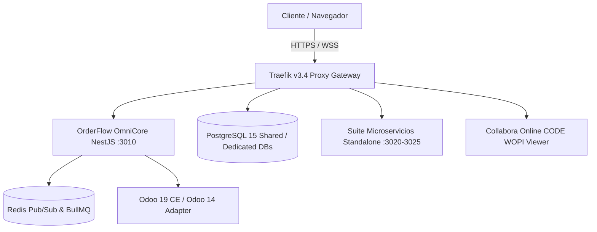

# 🛡️ OrderFlow / OmniFlow v1.20.24 — Informe del Estado del Arte y Evaluación Técnica

> **Documento de Contexto Técnico Vivo & Análisis de Madurez**  
> **Fecha:** 2026-08-25  
> **Versión Core:** `v1.20.24`  
> **Marca Comercial:** OmniFlow | **Nombre Técnico:** OrderFlow  
> **Índice de Madurez:** 9.8 / 10

---

## 1. 📊 Resumen Ejecutivo y Panorama General

El ecosistema **OmniFlow (OrderFlow)** se encuentra en su fase de máxima madurez operativa, habiendo completado con éxito la transición desde un monolito SaaS multi-tenant inicial hacia una **plataforma SaaS omnicanal modular de alta disponibilidad, con suite de microservicios standalone desacoplados, inteligencia analítica avanzada (OmniBI & OmniPulse), estandarización de inventario multi-depósito y gestión documental integrada.**

La plataforma atiende en producción a tenants en modo `community` (DB compartida multi-tier) y clientes `enterprise` (DB dedicada), sirviendo múltiples verticales de negocio (retail, gastronomía, spa/wellness, servicios y comercio social).

---

## 2. 🌐 Arquitectura de Infraestructura & Proxy Perimetral

* **Traefik v3.4 Exclusivo:** Sustituyó completamente a Nginx como único reverse proxy del ecosistema. Administra rutas dinámicas, SSL automático vía Let's Encrypt (desafío Cloudflare DNS-01) y enrutamiento por subdominio.
* **Estándar de Subdominios por Tenant:** Todo servicio y módulo expuesto responde al subdominio único del tenant (`<tenant.subdomain>.<ROOT_DOMAIN>`). Queda prohibida la creación de subdominios por categoría o servicio.
* **Separación Estricta de Entornos:**
  * `production` (Hetzner VPS) — Entorno principal multi-tenant.
  * `staging` (`staging.pesallaccia.com`) — Entorno de pruebas pre-deploy.
  * `provecchio` (`provecchio.com`) — Instancia física in-house con Traefik aislado en `/srv/traefik`.

---

## 3. 🏢 Dominio Core y Modelo Multi-Tenant / Multi-Tier

* **`tenantId` Inviolable:** Todas las entidades y consultas de negocio mantienen aislamiento estricto por `tenantId`.
* **Multi-Tier Isolation (`isolationTier`):**
  * `shared`: Instancia multi-tenant en base de datos común (`PrismaService` singleton).
  * `dedicated`: Base de datos aislada para clientes Enterprise, gestionada dinámicamente mediante `TenantConnectionManager` y el decorador `@TenantPrisma()`.
* **Modo de Operación (`ORDERFLOW_MODE`):** Soporta `community` (multi-tenant con `ApiKeyGuard`) y `enterprise` (single-tenant con `ENTERPRISE_TENANT_ID` inyectado), utilizando exactamente el mismo esquema de base de datos y servicios de negocio.
* **Estandarización de Inventario (v1.20.24):** El modelo `Warehouse → Location → StockQuant + StockMove` se consolidó como fuente de verdad. Todos los escritores críticos de `stockAvailable` migraron a `InventoryService.adjustStock()`. El flujo de pedidos incluye reserva de stock automática controlada por feature flag `USE_DOUBLE_ENTRY_STOCK`.

---

## 4. 🧩 Suite de Microservicios Standalone

La arquitectura cuenta con **6 microservicios standalone production-ready**, orquestados de forma independiente y comercializables por separado:

1. **`giveaways-standalone` (`:3020` / `sorteos.*`):** Sorteos y promociones omnicanal con Google OAuth.
2. **`omni-catalog` (`:3021` / `catalogo.*`):** Catálogo social, modificadores, GPS y tarifas por zona.
3. **`omni-bio` (`:3022` / `bio.*`):** Bio-Links 0% comisión con In-Bio Fast Checkout.
4. **`omni-bookings` (`:3023` / `turnos.*`):** Agendamiento, gestión de comisiones y sync con Google Calendar.
5. **`quotations-standalone` (`:3024` / `presupuestos.*`):** Cotizaciones y presupuestos vigentes DNIT/SET.
6. **`loyalty-standalone` (`:3025` / `fidelizacion.*`):** Fidelización por tarjetas virtuales y niveles (BRONZE → PLATINUM).

> **Seguridad Federada:** Autenticación unificada sin acoplamiento a base de datos monolítica mediante `@orderflow/auth-shared`.

---

## 5. 🔌 Integraciones, Facturación Electrónica y Multimoneda

* **Facturación Electrónica SIFEN (FacturaSend):** Emisión directa y vía Odoo de Documentos Electrónicos (DE), polling de estado SIFEN y recepción por webhooks.
* **Integración ERP (Odoo & Tango ERP):** Sincronización bidireccional de comprobantes (`account.move`), clientes (`res.partner`), productos y stock mediante DTOs canónicos. El endpoint `/api/v1/products/sync` ajusta stock automáticamente y registra kardex.
* **Motor Multimoneda Automatizado:** Moneda base PYG por defecto con actualización de cotizaciones cada 15 minutos mediante cron (BCP, Cambios Chaco, Bonanza, DólarApi) y fallback en memoria.

---

## 6. 📈 Intelligence & Visualización WOPI (OmniBI & OmniPulse)

* **OmniBI Analytics Hub (FEAT-071):** Ingesta histórica de Odoo 14 para comparativos YoY (Year-over-Year) de ventas, clientes e insumos sin impactar la operación en vivo.
* **OmniPulse (FEAT-072):** Inteligencia de campo, scoring de reputación de fuentes (*Source Reliability Engine*) y trampas canario defensivas (*Canary Trapping*).
* **Visor Collabora Online WOPI (FEAT-082):** Visualización embebida de reportes XLSX en vivo (Resumen KPI y Matriz de Productos) directamente en el panel sin descargar archivos, autenticada por tokens JWT efímeros.

---

## 7. 🛠️ Logros e Implementaciones del Sprint Actual (`v1.20.x`)

* ✅ **Estandarización de Inventario — Paso 4/6 (v1.20.24):** Migrados 7/8 escritores directos de `stockAvailable` a `InventoryService.adjustStock()`: `catalog.service.ts`, `product-imports.service.ts`, `batch-product-import.service.ts`, `products.service.ts`, `variants.service.ts`, `social-catalog-admin.controller.ts` y `sync-products.controller.ts`. `orders.service.ts` queda reservado para Paso 3 con feature flag.
* ✅ **Estandarización de Inventario — Paso 3/6 (v1.20.24):** Reservas de stock en `OrdersService.create()`, `confirm()` y `cancel()` mediante `InventoryService.reserveStock()`, `confirmReservationAsMove()` y `releaseStockReservation()`. Feature flag `USE_DOUBLE_ENTRY_STOCK` controla la migración gradual.
* ✅ **Manual de Usuario — Inventario (v1.20.24):** Documento `docs/user-manuals/10-manual-inventario-reservas.md` con guía completa de depósitos, ubicaciones, stocks, reservas, kardex y endpoints API.
* ✅ **FEAT-080 (Sprint Fixes Producción Provecchio):** Resolución de 240 errores de compilación TS en catálogo social, fix de subdominio dinámico en códigos QR generator, ajuste de políticas CSP Traefik (`img-src blob:`) y migración DB `instance_key`.
* ✅ **FEAT-081 (Social Catalog UX & Inventario):** Badges de stock en tiempo real (Agotado/Pocas unidades), sistema de etiquetas editables por tenant sin alterar schema y ordenamiento manual de productos drag & drop.
* ✅ **FEAT-077 (OmniCatalog Jerárquico 3 Niveles):** Visualización recursiva en acordeón colapsado e importación masiva CSV con sincronización bidireccional a Odoo POS/Inventario (`pos.category` y `product.category`).
* ✅ **FEAT-075 (Generador QR Multipropósito):** Generación de QR dinámicos con branding por tenant y links embebibles para productos, catálogos y biolinks.
* ✅ **FEAT-082 (Product Variants & Batch Import):** Variantes estilo Odoo (`product.template` / `product.product`) con matriz de atributos, combinatoria cartesiana e importación masiva asíncrona con BullMQ.

---

## 8. 🎯 Roadmap Prioritario Próximo (`v1.21.0` – `v1.22.0`)

| Ítem | Módulo / Categoría | Descripción y Objetivos Clave | Estado |
| :--- | :--- | :--- | :--- |
| **FEAT-071** | **OmniBI Analytics Hub** | Ingesta histórica de Odoo 14 para comparativos YoY (Year-over-Year) de ventas, clientes e insumos sin impactar la operación en vivo. | `planned` (v1.21.0) |
| **FEAT-078** | **OmniPOS & KDS WebSockets** | POS Offline-First (Dexie.js / Outbox), KDS Nativo WebSockets (<50ms latencia) y Motor BoM de escandallo atómico al cobro. | `planned` (v1.21.0) |
| **FEAT-083** | **OmniFlow Workspace Documental** | Módulo Documentos multi-tenant con Collabora Online (edición interactiva WOPI + locking Redis). | `planned` |

---

## 9. 📊 Métricas de Calidad

| Métrica | Valor |
|---------|-------|
| **Tests unitarios** | 597+ pasando |
| **Cobertura E2E** | Playwright suite integrada (`qa_e2e_check.py`) |
| **Módulos core** | 28 production-ready |
| **Microservicios standalone** | 6 en producción |
| **Entornos operativos** | staging, production, provecchio |
| **Multi-tier isolation** | shared + dedicated (Enterprise) |
| **Proxy perimetral** | Traefik v3.4 exclusivo |
| **Facturación electrónica** | SIFEN (FacturaSend) |
| **Integraciones ERP** | Odoo 19 CE, Tango ERP, MIDA |
| **Multimoneda** | PYG, ARS, USD, BRL, EUR |
| **Manuales de usuario** | 10 documentos actualizados |

---

## 📌 Conclusión

OrderFlow / OmniFlow se consolida en su versión **v1.20.24** como un ecosistema SaaS altamente competitivo, caracterizado por una arquitectura resiliente, independencia modular, estandarización de inventario multi-depósito, observabilidad de primer nivel y un ritmo de entrega continuo respaldado por la barrera de validación automatizada `./scripts/init.sh`.
