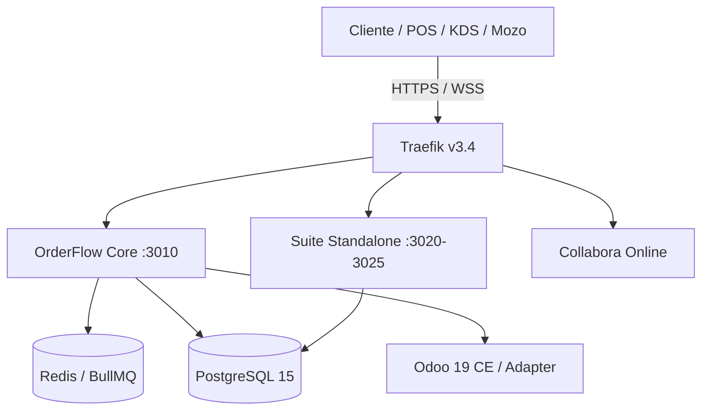

# OrderFlow v1.36.4 — Estado del Arte

**Fecha:** 2026-09-28  
**Versión actual:** `v1.36.4`  
**Versión anterior:** `v1.35.0`  
**Marca pública:** OmniFlow  
**Capa técnica interna:** OrderFlow  
**Índice de madurez:** 9.9 / 10

---

## 1. Resumen ejecutivo

Release `v1.36.4` centrada en **OmniGastro / OmniDineIn** y hardening de RBAC para personal operativo.

**Hitos cerrados:**
- **FEAT-151/152** — KDS Configurable Multi-Estación + Impresión Selectiva (ESC/POS, cola BullMQ, routing N:N por pedido).
- **FEAT-147/148** — KDS Dynamic Routing por `PreparationStation` + visibilidad `showInKDS` por producto.
- **RBAC hardening** — cierre de brechas críticas en POS, mesas y waiter calls; paso 1 de hardening post-OmniGastro.

**En progreso:**
- PR #1 — `feat/gastro-rbac-empleados` → `main`: blindaje de endpoints sensibles, step-up por PIN, seed extendida de roles, eliminación de bypasses.

---

## 2. Estado de Git

| Item | Estado |
|------|--------|
| **Branch principal** | `main` |
| **Working tree** | Clean |
| **Último commit** | `750bcee1` — `feat(gastro-rbac): harden employee RBAC for POS, tables and waiter calls` |
| **Rama feature abierta** | `feat/gastro-rbac-empleados` → PR #1 hacia `main` |
| **Último tag** | `v1.36.4` |
| **Commits recientes** | Ver §2.1 |

### 2.1 Últimos commits destacados

| Commit | Mensaje |
|--------|---------|
| `750bcee1` | feat(gastro-rbac): harden employee RBAC for POS, tables and waiter calls |
| `0c72c244` | chore(featurelist): mark FEAT-151/152 as completed |
| `244078ed` | Merge branch `feat/gastro-kds-multi-station-print` |
| `accfeada` | feat(gastro): FEAT-151/152 schema, migration, routing, services |
| `b7f7ded7` | chore: bump version to 1.36.4 for omni-gastro e2e stabilization |
| `1ee5624d` | feat(omni-gastro): stabilize playwright e2e suite |

---

## 3. Stack tecnológico

| Capa | Tecnología | Versión / Nota |
|------|-----------|----------------|
| **Backend** | NestJS + Prisma + PostgreSQL 15 | `orderflow-backend@1.36.4` |
| **Frontend** | React 18 + Vite + Refine + Ant Design 5 | `orderflow-frontend@1.36.4` |
| **Auth** | JWT + API Key + PermissionsGuard RBAC | Multi-tenant (`community`) y single-tenant (`enterprise`) |
| **Colas** | BullMQ + Redis | Colas: `webhook-cron`, `follow-up`, `import-products`, `kitchen-print` |
| **Realtime** | WebSockets (Gateway.IO) | Salas por tenant y por estación KDS |
| **Proxy** | Traefik v3.4 | SSL, subdominios dinámicos por tenant, routing a microservicios |
| **Microservicios** | 6 standalone (Giveaways, WhatsApp Catalog, BioLinks, Bookings, Quotations, Loyalty) | Puertos :3020-:3025 |
| **BI / Docs** | Collabora Online (CODE) | WOPI host para reportes XLSX y workspace documental |
| **E2E** | Playwright + Python | Suites admin + OmniGastro |
| **Tests unitarios** | Jest (backend) + Vitest (frontend) | Cobertura backend >80% |

---

## 4. Producción

### 4.1 Entornos

| Entorno | Host | Estado | Health Check | Comentario |
|---------|------|--------|--------------|------------|
| **Provecchio** | `192.168.69.240` | ✅ Operativo | HTTP 200 | Último deploy exitoso. Traefik propio aislado. |
| **Staging** | `hetzner-orderflow` | ✅ Operativo | HTTP 200 | Refleja `main`. Validación pre-producción. |
| **Production** | `178.105.226.175` | ⚠️ Último fallo | HTTP 502 | Último deploy falló por DB unhealthy (`orderflow-database-1`). No es problema de código. |

### 4.2 Acciones pendientes de deploy

1. Aplicar migración `20260927193000_kds_multi_station_printing` en prod (`prisma db push` o migrate deploy).
2. Validar estabilidad de PostgreSQL en Hetzner antes de reintentar deploy.
3. Deploy de `feat/gastro-rbac-empleados` post-merge a `main`.

---

## 5. OmniGastro / OmniDineIn

**Estado:** Fases 0–3.1 completadas.

| Fase | FEATs | Estado |
|------|-------|--------|
| **0 — Safeguards** | FEAT-112 | ✅ completed |
| **1 — Cimientos + Caja** | FEAT-113 | ✅ completed |
| **2 — Salón + Guest Experience** | FEAT-114, 115, 116, 119, 125 | ✅ completed |
| **3 — Cocina + Costos** | FEAT-117, 118 | ✅ completed |
| **3.1 — KDS Configurable + Impresión** | FEAT-147, 148, 151, 152 | ✅ completed |
| **4 — Hardware + Escala** | FEAT-120 → 124 | ⏳ planned |

### 5.1 FEAT-151/152 — KDS Multi-Estación + Impresión

- **Schema:** `Product.kdsVisibilityMode`, `ProductPreparationStation` (N:N), `PreparationStation.printer*`, `KitchenTicket.print*`, `KitchenPrintJob`.
- **Migración:** `20260927193000_kds_multi_station_printing`.
- **Backend:** `KitchenPrintService`, `ProductStationService`, routing multi-destino en `OrdersService.sendToKitchen`, processor BullMQ `kitchen-print`.
- **Frontend:** `/admin/kds/stations` (`gastro-kds-stations.tsx`), visibilidad KDS en productos, botones de impresión en KDS.
- **WebSockets:** sala por estación `tenant:{tenantId}:station:{stationId}`.

### 5.2 RBAC Empleados — Hardening

Diseño auditado en `docs/plans/omnigastro/diseno-rbac-empleados.md`.  
PR abierto: `feat/gastro-rbac-empleados` (#1).

Cambios en el PR:
- Cierre de bypass por API key en `PermissionsGuard`.
- Cierre de bypass de `MANAGER` en `RbacService.hasPermission`.
- Permisos nuevos: `tables:status`, `tables:guests`, `tables:gift`, `pos:config`.
- Seed extendida para `EMPLOYEE` y `VIEWER`.
- `StepUpGuard` para acciones críticas (gift, cierre Z).
- Tests: `rbac.service.spec.ts`, `permissions.guard.spec.ts`.

---

## 6. Cobertura de tests

| Suite | Herramienta | Estado |
|-------|-------------|--------|
| Backend unit + integration | Jest | >80% cobertura |
| Frontend unit | Vitest | Activo |
| E2E admin + OmniGastro | Playwright | Activo (stabilizado en v1.36.2-1.36.4) |
| RBAC hardening | Jest (nuevo) | En PR #1 |

---

## 7. Arquitectura

**Principios activos:**
1. Tenant isolation sagrada (`@TenantPrisma()`).
2. RBAC granular por rol + permisos + step-up PIN para acciones críticas.
3. Offline-first nativo en POS (Dexie + Outbox).
4. Live Escandallo atómico con deducción en tiempo real.
5. Multi-tier (Shared / Dedicated DB por tenant).

---

## 8. Riesgos y bloqueadores

| Riesgo | Estado | Mitigación |
|--------|--------|------------|
| Schema `kds_multi_station_printing` no aplicada en prod | ⚠️ Abierto | `prisma db push` en próximo deploy |
| Hetzner DB unhealthy | ⚠️ Abierto | Validar infra antes de deploy |
| Bypass API-key legacy en POS | 🟡 En PR | Cerrado en `feat/gastro-rbac-empleados` |
| Escáner ESC/POS por modelo de impresora | 🟡 Futuro | Capa de abstracción por `printerModel` en `KitchenPrintService` |

---

## 9. Próximos pasos

1. Merge de PR #1 (`feat/gastro-rbac-empleados`) a `main`.
2. Aplicar migración `20260927193000_kds_multi_station_printing` en staging + prod.
3. Validar Hetzner production y reintentar deploy.
4. Tag `v1.37.0` + release notes.
5. Continuar Fase 4: Hardware Bridge Tauri/Rust (FEAT-120).

---

*Generado el 2026-09-28. Fuente: `VERSION`, `git log`, `docs/plans/omnigastro/`, `backend/package.json`, `frontend/package.json`.*
