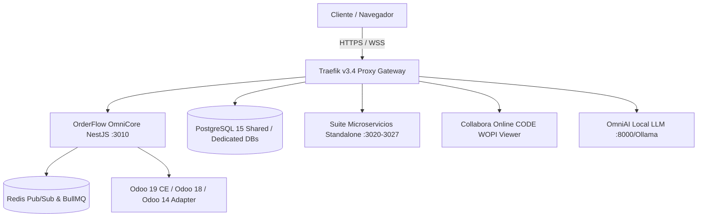

# 🛡️ OmniFlow / OrderFlow — Informe del Estado del Arte y Evaluación Técnica

> ⚠️ **DOCUMENTO ACTUALIZADO:** Este informe ha sido superado por la versión oficial [informe-estado-del-arte-2026-09-11.md](file:///opt/orderflow/docs/info/informe-estado-del-arte-2026-09-11.md) (`v1.30.0`).

> **Documento de Contexto Técnico Vivo & Análisis de Madurez**  
> **Fecha Original:** 2026-09-06 | **Última Revisión:** 2026-09-11 (`v1.30.0`)  
> **Versión Core:** `v1.30.0`  
> **Marca Comercial:** OmniFlow | **Nombre Técnico:** OrderFlow  
> **Índice de Madurez:** 9.9 / 10  

---

## 1. 📊 Resumen Ejecutivo y Panorama General

El ecosistema **OmniFlow (OrderFlow)** se encuentra en su fase de máxima madurez operativa, habiendo completado con éxito la transición desde un monolito SaaS multi-tenant inicial hacia una **plataforma SaaS omnicanal modular de alta disponibilidad, con suite de microservicios standalone desacoplados, inteligencia analítica avanzada (OmniBI & OmniPulse), estandarización de inventario multi-depósito (motor de doble entrada), motor LLM local (OmniAI) y gestión documental integrada.**

La plataforma atiende en producción a tenants en modo `community` (DB compartida multi-tier) y clientes `enterprise` (DB dedicada), sirviendo múltiples verticales de negocio (retail, gastronomía, spa/wellness, servicios y comercio social).

---

## 2. 🌐 Arquitectura de Infraestructura & Proxy Perimetral

* **Traefik v3.4 Exclusivo:** Sustituyó completamente a Nginx como único reverse proxy del ecosistema. Administra rutas dinámicas, SSL automático vía Let's Encrypt (desafío Cloudflare DNS-01) y enrutamiento por subdominio.
* **Estándar de Subdominios por Tenant:** Todo servicio y módulo expuesto responde al subdominio único del tenant (`<tenant.subdomain>.<ROOT_DOMAIN>`). Queda prohibida la creación de subdominios por categoría o servicio.
* **Separación Estricta de Entornos:**
  * `production` (Hetzner VPS) — Entorno principal multi-tenant (`api.pesallaccia.com`).
  * `staging` (`staging.pesallaccia.com`) — Entorno de pruebas pre-deploy.
  * `provecchio` (`provecchio.com`) — Instancia física in-house con Traefik aislado en `/srv/traefik`.

---

## 3. 🏢 Dominio Core y Modelo Multi-Tenant / Multi-Tier

* **`tenantId` Inviolable:** Todas las entidades y consultas de negocio mantienen aislamiento estricto por `tenantId`.
* **Multi-Tier Isolation (`isolationTier`):**
  * `shared`: Instancia multi-tenant en base de datos común (`PrismaService` singleton).
  * `dedicated`: Base de datos aislada para clientes Enterprise, gestionada dinámicamente mediante `TenantConnectionManager` y el decorador `@TenantPrisma()`.
* **Modo de Operación (`ORDERFLOW_MODE`):** Soporta `community` (multi-tenant con `ApiKeyGuard`) y `enterprise` (single-tenant con `ENTERPRISE_TENANT_ID` inyectado), utilizando exactamente el mismo esquema de base de datos y servicios de negocio.
* **Estandarización de Inventario (Motor Doble Entrada):** El modelo `Warehouse → Location → StockQuant + StockMove` es la fuente de verdad. Movimientos atómicos con reservas (`reserveStock` / `releaseStockReservation`), prorrateo de costes de destino (*Landed Costs*) y recálculo PMP (`costPricePmp`).

---

## 4. 🧩 Suite de Microservicios Standalone Desacoplados

La arquitectura cuenta con **8 microservicios standalone production-ready**, orquestados de forma independiente y comercializables por separado:

1. **`giveaways-standalone` (`:3020` / `sorteos.*`):** Sorteos y promociones virales omnicanal.
2. **`omni-catalog` (`:3021` / `catalogo.*`):** Catálogo WhatsApp/Social Commerce, modificadores, GPS y tarifas por zona.
3. **`omni-bio` (`:3022` / `bio.*`):** Bio-Links 0% comisión con In-Bio Fast Checkout.
4. **`omni-bookings` (`:3023` / `turnos.*`):** Agendamiento, gestión de comisiones y sync bidireccional con Google Calendar.
5. **`quotations-standalone` (`:3024` / `presupuestos.*`):** Cotizaciones y presupuestos vigentes DNIT/SET.
6. **`loyalty-standalone` (`:3025` / `fidelizacion.*`):** Fidelización por tarjetas virtuales y niveles (BRONZE → PLATINUM).
7. **`omni-storefront` (`:3026` / `storefront.*`):** Diseñador visual Drag & Drop desacoplado.
8. **`omnibi-standalone` (`:3027` / `bi.*`):** Intelligence Hub, ingesta histórica Odoo 14 y comparativos YoY.

> **Seguridad Federada:** Autenticación unificada sin acoplamiento a base de datos monolítica mediante `@orderflow/auth-shared`.

---

## 5. 🔌 Integraciones, Facturación Electrónica y Multimoneda

* **Facturación Electrónica SIFEN (FacturaSend):** Emisión directa y vía Odoo de Documentos Electrónicos (DE), polling de estado SIFEN y recepción por webhooks.
* **Integración ERP (Odoo 14, 18, 19 CE & Tango ERP):** Sincronización bidireccional de comprobantes (`account.move`), clientes (`res.partner`), productos y stock mediante DTOs canónicos.
* **Motor Multimoneda Automatizado:** Moneda base PYG por defecto con actualización de cotizaciones cada 15 minutos mediante cron (BCP, Cambios Chaco, Bonanza, DólarApi) y fallback en memoria para PYG, USD, BRL, ARS y EUR.
* **OmniAI LLM Local:** Motor de IA local (Ollama / vLLM llama3) servido vía Traefik SSL (`ai.provecchio.com`).

---

## 6. 📈 Intelligence, Workspaces & Visualización WOPI

* **OmniBI Analytics Hub (FEAT-071 & FEAT-100):** Ingesta histórica de Odoo 14 para comparativos YoY (Year-over-Year) de ventas, clientes e insumos sin impactar la operación en vivo.
* **OmniPulse (FEAT-072):** Inteligencia de campo, scoring de reputación de fuentes (*Source Reliability Engine*) y trampas canario defensivas (*Canary Trapping*).
* **Workspaces Documentales & Visor Collabora Online WOPI (FEAT-083 & FEAT-082):** Visualización y edición interactiva embebida de documentos y reportes XLSX directamente en el panel sin descargar archivos, autenticada por tokens JWT efímeros.

---

## 7. 🛠️ Comercial & Onboarding (FEAT-112 / FEAT-113)

* **Protección de Creación de Tenants (`TenantCreationGuard`):** Endpoint `POST /api/v1/tenants` protegido. Requiere rol SuperAdmin o `provisioningJobId` válido y pagado.
* **Wizard de Signup Público & Early Access (`CommercialModule`):** 5 endpoints públicos en `/api/v1/public/commercial/*` para consulta de planes, validación de subdominios, reserva por 24h y aplicación de promociones (ej. `EARLY30`).

---

## 8. 📊 Métricas de Calidad

| Métrica | Valor |
|---------|-------|
| **Tests unitarios** | 680+ pasando |
| **Cobertura E2E** | Playwright suite integrada (`qa_e2e_check.py`) |
| **Módulos core** | 28 production-ready |
| **Microservicios standalone** | 8 en producción |
| **Entornos operativos** | staging, production, provecchio |
| **Multi-tier isolation** | shared + dedicated (Enterprise) |
| **Proxy perimetral** | Traefik v3.4 exclusivo |
| **Facturación electrónica** | SIFEN (FacturaSend) |
| **Integraciones ERP** | Odoo 14, 18, 19 CE, Tango ERP, MIDA |
| **Multimoneda** | PYG, ARS, USD, BRL, EUR |
| **Manuales de usuario** | 10+ documentos actualizados |

---

## 📌 Conclusión & Próximos Pasos

OrderFlow / OmniFlow se consolida como un ecosistema SaaS de alto rendimiento y arquitectura resiliente. El roadmap inmediato apunta a:
1. **Fase 7:** Migración de servicios de alto riesgo a `@TenantPrisma()`.
2. **FEAT-114 (ProvisioningWorker):** Automatización post-pago de aprovisionamiento de tenants.
3. **OmniPOS Offline-First & KDS WebSockets:** POS Dexie.js + comanda WebSockets nativa con latencia inferior a 50ms.
