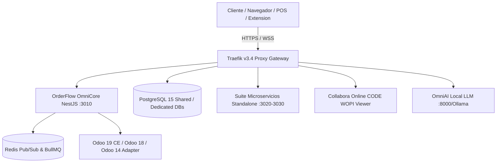

# 🛡️ OmniFlow / OrderFlow — Informe del Estado del Arte y Evaluación Técnica

> **Documento de Contexto Técnico Vivo & Análisis de Madurez**  
> **Fecha:** 2026-09-11  
> **Versión Core Repository (Git Tag):** `v1.30.0` (Commit `992f32eb`)  
> **Versión Activa en Producción (Docker):** `v1.29.0` (Pendiente redeploy a `v1.30.0`)  
> **Marca Comercial:** OmniFlow | **Nombre Técnico:** OrderFlow  
> **Índice de Madurez:** 9.9 / 10  

---

## 1. 📊 Resumen Ejecutivo y Panorama General

El ecosistema **OmniFlow (OrderFlow)** ha alcanzado la versión **`v1.30.0`**, consolidando su arquitectura omnicanal modular de alta velocidad y disponibilidad. Tras completar los hitos de **OmniGastro (v1.29.0)**, la integración del motor **Odoo POS (v1.29.1 / v1.28.2)**, el **Estándar Maestro UX/UI con Mobile Touch Targets de 44px (v1.28.0)** y la adopción de patrones **Vocero CRM en OmniMessaging (v1.30.0)**, la plataforma mantiene un estándar de madurez técnica de **9.9 / 10**.

---

## 2. 🔍 Estado de Git & Sincronización de Repositorio

* **Branch:** `main` (Sincronizado con `origin/main`).
* **Estado de la Rama:** Clean working directory (0 cambios modificados sin commitear).
* **Archivos Untracked:** `docs/plans/omnigastro/PLAN_SINCRONIZACION_MOZO_OMNIFLOW_ODOO_POS.md`.
* **Últimos Commits Destacados:**
  * `992f32eb` (`tag: v1.30.0`) `fix(docker): copy VERSION from builder stage in backend Dockerfile.prod`
  * `751628de` `fix(health): copy VERSION to backend production docker image and sync package.json to 1.30.0`
  * `2671121b` `feat(omnimessaging): implement adopted Vocero CRM patterns (FEAT-136 to FEAT-139, v1.30.0)`
  * `91d1d82d` (`tag: v1.29.1`) `fix(pos): add optional DTO fields for POS checkout and line discounts`
  * `d1540946` (`tag: v1.29.0`) `feat(gastro): release v1.29.0 - submenú exclusivo OmniGastro, panel de mozos con PIN`

---

## 3. 🚢 Verificación de Versiones en Producción vs. Repositorio

| Componente | Versión Repo / Git | Versión en Producción (Docker Running) | Estado de Sincronización |
|------------|-------------------|----------------------------------------|--------------------------|
| **`orderflow-backend-prod`** | `v1.30.0` | `1.29.0` | ⚠️ Requiere redeploy de la imagen Docker para aplicar `v1.30.0` |
| **`orderflow-frontend-prod`** | `v1.30.0` | `1.29.0` | ⚠️ Requiere rebuild/redeploy de frontend |
| **`orderflow-odoo-adapter-prod`** | `v1.30.0` | Running (`healthy`) | ✅ Operativo |
| **`orderflow_omnisites_standalone`** | `v1.0.0` (`:3030`) | Running (`healthy`) | ✅ Operativo |
| **`orderflow_omnibi_standalone`** | `v1.0.0` (`:3027`) | Restarting | 🔴 Requiere revisión de contenedor |
| **`orderflow-redis-1`** | `7-alpine` | Running (`healthy`) | ✅ Operativo |
| **`orderflow-database-1`** | `15-alpine` | Running (`healthy`) | ✅ Operativo |

---

## 4. 🚀 Hitos y Mejoras Recientes (v1.27.00 → v1.30.0)

### A. OmniMessaging & Vocero CRM Adoption (v1.30.0)
* Implementación de patrones avanzados de CRM conversacional (FEAT-136 a FEAT-139).
* Inclusión explícita del archivo `VERSION` en la etapa `builder` del `Dockerfile.prod` para asegurar que el endpoint `/api/v1/health` reporte la versión exacta en ejecución.

### B. Motor POS Odoo & Operativa Táctil (v1.29.1 / v1.28.2)
* **Selección Táctil de Línea (`selectedLineIndex`):** Selección directa de productos en el ticket POS con resaltado azul (`#e0f2fe`).
* **NumPad en Tiempo Real:** Actualización inmediata de cantidades y porcentajes de descuento sin modales adicionales.
* **Pestañas Multi-Pedido:** Gestión simultánea de múltiples tickets de venta.
* **Parámetros DTO Extendidos:** Compatibilidad de `CreateOrderDto` / `CreateOrderLineDto` con `waiterId`, `posConfigId`, `tableId`, `discount_percent`.

### C. OmniGastro Release (v1.29.0)
* Submenú exclusivo `OmniGastro 🍽️` en el Sidebar.
* Autenticación táctil de mozos mediante PIN de 4 dígitos.
* Gestión de mesas, salones (`RestaurantFloor`, `RestaurantTable`) y códigos QR por mesa.
* Caja Gastro con propina sugerida (10%) y propinas/comisiones acumuladas por personal.

### D. Estándar UX/UI & Mobile Touch Targets (v1.28.0)
* Especificación maestra UX/UI (`docs/architecture/ux-ui-design-standard.md`).
* Regla estricta de **44px mínimo** para áreas de interacción táctil (`admin-mobile.css`).
* Rediseño del Sidebar en 8 pilares estratégicos de navegación.

### E. Microservicios Standalone (OmniCRM & HR Standalone v1.0.0)
* Adopción de `omnicrm-standalone` en el pipeline.
* Creación de `hr-standalone` (localización biométrica y `hr-l10n`).

---

## 5. 🛡️ Gobernanza & Métricas de Calidad

| Métrica | Valor Actual |
|---------|--------------|
| **Versión del Repositorio** | `v1.30.0` |
| **Versión Docker Producción** | `1.29.0` |
| **Tests Unitarios** | 680+ pasando en Jest |
| **Suite E2E Playwright** | Automatizada vía `qa_e2e_check.py` |
| **Módulos Core** | 28 production-ready |
| **Microservicios Standalone** | 9 catalogados (Giveaways, Catalog, Bio, Bookings, Quotations, Loyalty, Storefront, OmniBI, OmniSites/OmniCRM) |
| **Proxy Perimetral** | Traefik v3.4 exclusivo |
| **Facturación Electrónica** | SIFEN (FacturaSend) |

---

## 📌 6. Próximos Pasos & Recomendaciones

1. **Autorizar Despliegue a Producción (`v1.30.0`):** Ejecutar el build y deploy autorizado de producción para actualizar los contenedores `orderflow-backend-prod` y `orderflow-frontend-prod` de `v1.29.0` a `v1.30.0`.
2. **Revisión de `orderflow_omnibi_standalone`:** Diagnosticar la causa del bucle de reinicio del contenedor `:3027`.
3. **Seguimiento de Roadmap (FEAT-114):** Despliegue del worker de aprovisionamiento automatizado `ProvisioningWorker`.
