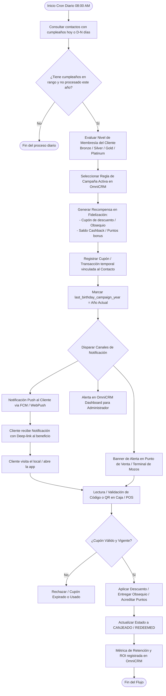

# Plan de Implementación: Alertas de Cumpleaños y Campañas de Fidelización (OmniCRM)

## 1. Resumen Ejecutivo
Aprovechar la base de datos de clientes capturada a través del módulo de sorteos (celular, email, fecha de cumpleaños) para activar un canal automatizado de fidelización, premios y retención dentro de **OmniCRM (Marketing Interno y Fidelización)**.

El sistema detectará los cumpleaños de forma programada, asignará beneficios diferenciados (cashback, puntos de lealtad, obsequios o descuentos según nivel Bronze/Platinum), alertará al administrador en el panel del CRM y despachará notificaciones Push a los clientes.

---

## 2. Diagrama de Flujo Funcional

---

## 3. Arquitectura del Módulo y Componentes

### 3.1. Modelo de Datos (Extensión de Entidades)

#### `crm_contacts` (Campos adicionales / generados)
* `birthdate`: `DATE`
* `birth_day`: `INT` (Generado / indexado)
* `birth_month`: `INT` (Generado / indexado)
* `last_birthday_campaign_year`: `INT` (Evita duplicidad anual)
* `fcm_token` / `push_subscription`: `TEXT`

#### `birthday_campaigns`
* `id`: `UUID`
* `name`: `VARCHAR(100)` (ej. *Campaña Cumpleaños Premium 2026*)
* `is_active`: `BOOLEAN`
* `trigger_days_before`: `INT` (0 = mismo día, 3 = tres días antes, etc.)
* `tier_eligibility`: `ENUM('ALL', 'BRONZE', 'SILVER', 'GOLD', 'PLATINUM')`
* `reward_type`: `ENUM('DISCOUNT_PERCENT', 'FIXED_AMOUNT', 'FREE_ITEM', 'CASHBACK_POINTS')`
* `reward_value`: `DECIMAL(10,2)`
* `validity_days`: `INT` (ej. 7 o 15 días de validez)
* `push_title`: `VARCHAR(150)`
* `push_body`: `TEXT`

#### `loyalty_coupons` / `birthday_rewards`
* `id`: `UUID`
* `contact_id`: `FK(crm_contacts)`
* `campaign_id`: `FK(birthday_campaigns)`
* `code`: `VARCHAR(20)` (Único, alfanumérico o QR payload)
* `status`: `ENUM('PENDING', 'REDEEMED', 'EXPIRED', 'REVOKED')`
* `issued_at`: `TIMESTAMP`
* `expires_at`: `TIMESTAMP`
* `redeemed_at`: `TIMESTAMP`
* `order_id`: `FK(pos_orders)` (Vinculación con el consumo real)

---

## 4. Pipeline de Procesamiento (Paso a Paso)

### Fase 1: Extracción y Calificación (Cron Job)
1. **Ejecución Diaria:** Un cron ejecuta a primera hora la consulta de contactos cuyo día y mes coinciden con la fecha actual (o días previos según la configuración de la campaña activa).
2. **Filtro Anti-Spam:** Valida que `last_birthday_campaign_year < CURRENT_YEAR`.
3. **Ponderación por Nivel:** Si el cliente es nivel *Platinum*, la campaña puede asignar un regalo de mayor categoría o cashback adicional que a un nivel *Bronze*.

### Fase 2: Despacho Multicanal
1. **Push al Cliente:**
   * Envío de payload FCM / WebPush con deep-link a su tarjeta de lealtad en la app/PWA.
   * Mensaje personalizado con token dinámico: `¡Feliz cumpleaños {{nombre}}! Tenés un regalo exclusivo esperando por vos.`
2. **Feed del Administrador en OmniCRM:**
   * Widget de "Cumpleañeros del Día / Semana".
   * Indicador visual de si el cliente ya fue notificado y si tiene visitas recientes.
3. **Alerta en Terminal de Servicio / POS:**
   * Si el cliente se identifica por número telefónico en el salón o en la caja, el sistema levanta un pop-up/badge: *🎂 Cumpleañero - Obsequio de Bienvenida Disponible*.

### Fase 3: Redención y Análisis de Métricas
1. **Canje en POS:** El operador escanea el QR del cliente o valida el código al cerrar la cuenta.
2. **Cierre de Ciclo:**
   * Se marca el cupón como `REDEEMED`.
   * Si la recompensa era Cashback / Puntos, se acreditan al balance de fidelización.
   * Se calcula el ticket promedio generado por la visita de cumpleaños vs. el costo del obsequio.

---

## 5. Próximos Hitos de Desarrollo
- [ ] **Hito 1:** Migración de esquema en base de datos (`crm_contacts` y tablas de campañas).
- [ ] **Hito 2:** Implementación del cron worker en backend para evaluación diaria.
- [ ] **Hito 3:** Integración con servicio de Push (FCM / WebPush Service).
- [ ] **Hito 4:** Pantalla de configuración en OmniCRM (Marketing Interno) y widget de alertas para administradores.
- [ ] **Hito 5:** Validación de canje en el módulo de Caja / POS y tracking de ROI.
