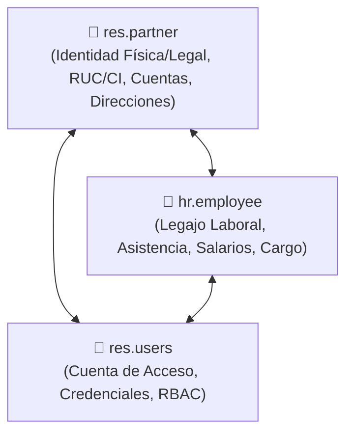

# 🏛️ Plan Maestro de Conciliación y Paridad Odoo ↔ OmniFlow: `res.partner` & `hr.employee`

**Documento:** `PLAN_CONCILIACION_ODOO_CONTACT_EMPLOYEE.md`  
**Versión:** 1.0.0  
**Fecha:** 16 de Septiembre de 2026  
**Ecosistema:** OmniFlow / OrderFlow  

---

## 1. Contexto y Arquitectura Comparativa

En el ERP Odoo, la gestión de personas físicas y jurídicas se estructura sobre una **Triada Identitaria Relacional**:

1. **`res.partner` (Contacto Raíz)**: Representa a cualquier entidad (persona o empresa). Contiene RUC/Cédula (`vat`), direcciones, cuentas bancarias, límite de crédito y funciones (cliente `customer_rank`, proveedor `supplier_rank`, empleado).
2. **`hr.employee` (Legajo de Empleado)**: Contiene la relación laboral (`partner_id`), cargo, departamento, modalidad, sueldo y marcaciones.
3. **`res.users` (Cuenta de Sistema)**: Gestiona el inicio de sesión y permisos. Se vincula 1 a 1 con `res.partner` (`partner_id`).

### Modelo Traducido en OmniFlow (Prisma ORM):
- `Contact` $\leftrightarrow$ `res.partner`
- `Employee` $\leftrightarrow$ `hr.employee`
- `User` + `UserTenantAccess` $\leftrightarrow$ `res.users`

---

## 2. Diagnóstico de Brechas (Gap Analysis)

| # | Módulo / Operación | Comportamiento en Odoo | Estado en OmniFlow (Previo) | Brecha Identificada | Estado de Corrección |
|---|-------------------|------------------------|-----------------------------|---------------------|----------------------|
| **1** | **Creación de Empleado en RRHH** | Crear `hr.employee` genera/vincula automáticamente `res.partner` con rol Empleado. | Creaba la fila en `employees` manteniendo `contactId: null`. No aparecía en `/admin/contacts`. | Falta de creación/asociación automática de `Contact` CRM desde RRHH. | ✅ **Resuelto en v1.34.1** (`syncContactForEmployee` + auto-healing) |
| **2** | **Sincronización Inversa desde CRM** | Asignar rol Empleado en `res.partner` sugiere/crea la ficha en `hr.employee`. | Modificar funciones en `/admin/contacts` (`contact_roles`) no notifica ni crea la entidad `Employee`. | Desconexión en creación inversa Contacto $\rightarrow$ Empleado. | ⏳ **Planificado (Fase 1)** |
| **3** | **Enlace Tripartito de Usuario (`User`)** | Crear cuenta de usuario vincula sincrónicamente `res.partner`, `hr.employee` y `res.users`. | `syncUserForContact` asocia `user_tenant_access.contactId`, pero no sincroniza el campo `Employee.userId`. | `Employee.userId` queda desincronizado cuando el contacto recibe cuenta de acceso. | ⏳ **Planificado (Fase 1)** |
| **4** | **Consolidación de Direcciones y Banco** | `hr.employee` hereda direcciones y cuentas bancarias de `res.partner`. | `Employee` usa campos string planos (`bankName`, `bankAccount`, `address`) sin integrar `ContactAddress` ni `ContactBankAccount`. | Duplicidad de datos y falta de normalización de direcciones/bancos. | ⏳ **Planificado (Fase 2)** |
| **5** | **Adapter de Ingesta Odoo (`odoo-adapter`)** | Sincronización bidireccional completa de `res.partner` y `hr.employee` vía JSON-RPC. | `orderflow-odoo-adapter` sincroniza clientes y proveedores, pero no incluye el mapeo de `hr.employee`. | Falta de ingesta/sincronización de legajos laborales con Odoo remoto. | ⏳ **Planificado (Fase 3)** |

---

## 3. Plan Maestro de Corrección, Documentación y Despliegue

### Fase 1: Sincronización Bi-direccional y Enlace de Triada (Sprint Inmediato)
- [x] **1.1 Sync Empleado $\rightarrow$ Contacto CRM (Resuelto):** Implementar `syncContactForEmployee` y auto-healing `syncUnlinkedEmployees` en `HrService`.
- [x] **1.2 Sync Inversa Contacto $\rightarrow$ Empleado (Resuelto):** Actualizar `ContactsService.addRole` y `syncEmployeeForContact` para instanciar automáticamente el legajo en RRHH (`/admin/hr`) al asignar la función `EMPLOYEE`.
- [x] **1.3 Enlace Tripartito `User` $\leftrightarrow$ `Contact` $\leftrightarrow$ `Employee` (Resuelto):** En `ContactsService.syncUserForContact`, al crear/actualizar la cuenta de acceso, se vincula atómicamente el `userId` en `Employee`.

### Fase 2: Normalización de Direcciones y Datos Bancarios (Sprint Siguiente)
- [ ] **2.1 Sincronización Bancaria:** Al actualizar `bankName` / `bankAccount` en `Employee`, invocar `ContactsService.addBankAccount` para reflejar la cuenta bancaria en la ficha de `Contact`.
- [ ] **2.2 Sincronización de Dirección:** Vincular la dirección del legajo con `ContactAddress` del contacto raíz.

### Fase 3: Integración con Odoo Output Adapter (Fase Backend)
- [ ] **3.1 `orderflow-odoo-adapter` Expansion:** Agregar mapeo `hr.employee` $\leftrightarrow$ `Employee` con `odooEmployeeId` en el adaptador Odoo v14/v18/v19.

---

## 4. Estrategia de Pruebas y Despliegue Total

1. **Barrera de Validación Automatizada:**
   - Pruebas unitarias backend: `npm test src/hr/hr.service.spec.ts` y `src/contacts/contacts.service.spec.ts`.
   - Barrera de compilación limpia: `npx tsc --noEmit`.
2. **Sincronización de Documentación:**
   - Registrar en `docs/troubleshooting/140-hr-employee-auto-sync-to-contacts.md`.
   - Actualizar `ROADMAP.md`, `CHANGELOG.md` e incrementar patch version en `VERSION`.
   - Sincronizar documentación con la Wiki oficial (`/opt/wiki/orderflow/`).
3. **Despliegue a Producción (Con Autorización Previa):**
   - Ejecución del script homologado `deploy-production.sh` tras confirmación explícita del usuario.
