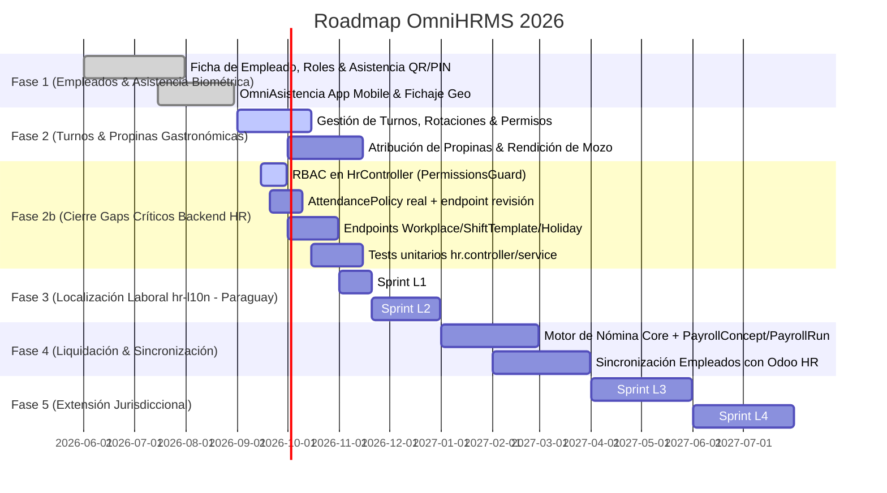

# ROADMAP EJECUTIVO OMNIHRMS & CAPITAL HUMANO

> **Proyecto:** OrderFlow / OmniFlow → OmniHRMS (Capital Humano & Asistencia)  
> **Versión Baseline:** v1.25.0  
> **Fecha:** 20 de Septiembre de 2026  
> **Área:** Empleados, Fichaje/Asistencia Biométrica, Turnos, Liquidación de Sueldos & Propinas, Localización Laboral (Paraguay/Argentina/Brasil)

---

## 1. VISIÓN EJECUTIVA

**OmniHRMS** gestiona la nómina de personal, marcación de asistencia (geolocalizada y facial), asignación de turnos de trabajo y liquidación de remuneraciones acorde a las normativas laborales locales, integrando el reparto de propinas y la custodia de caja para el personal de salón y caja.

**Arquitectura de Localización (hr-l10n):** Core agnóstico + Plugins de Jurisdicción (Strategy + Registry) con inyección dinámica según `tenant.defaultJurisdiction` o `workplace.jurisdiction` (PY | AR | BR). Ver `docs/plans/OmniHRMS/PlanMaestrodeArquitecturayDesarrollo_ LocalizacionLaboral(hr-l10n).md`.

---

## 2. HOJA DE RUTA Y ENTREGABLES (2026)

---

## 3. DETALLE POR FASE

### 1. **Fase 1: Empleados & Asistencia (COMPLETED)**
- Expediente digital de empleados con fotos, contratos y contactos de emergencia.
- Fichaje móvil y terminal kiosco con PIN/QR y geolocalización.
- **Biometric Module Standalone (FEAT-125):** Módulo NestJS independiente (`backend/src/biometric/`) con `BiometricCredential` (tenantId, userId?, employeeId?, method, deviceId, secretHash, isActive, lastUsedAt) y relaciones a `User`, `Employee`, `Tenant`, `AttendanceRecord`. Endpoints: `POST /api/v1/biometric/enroll`, `POST /api/v1/biometric/verify`, `POST /api/v1/biometric/login`, `GET /api/v1/biometric/credentials`, `DELETE /api/v1/biometric/credentials/:id`. RBAC: `biometric:credentials:create/read/delete/verify`.
- **OmniAsistencia Mobile (FEAT-124):** React Native/Expo, `EmployeeClockInScreen` + `AdminEmployeeScreen`, biometría nativa Face ID / Huella / Selfie fallback (`expo-local-authentication`, `expo-image-picker`, `expo-location`), geocerca configurable (`AttendancePolicy.geofenceEnforcement`). 100% biometría en dispositivo (OS).

### 2. **Fase 2: Turnos & Propinas (IN_PROGRESS)**
- **FEAT-120 — Position (Cargos/Puestos):** Bridge hacia OmniHRMS. Modelo `Position` (name, code, baseRole → UserRole, active) + `positionId` en `UserTenantAccess`. Seed: Cajero, Mozo, Cocinero, Jefe de Sala, Barman, Host.
- **FEAT-121 — POS Core Cash Management:** Apertura sesión con PIN (valida `User.pinCode`), cash in/out (CHANGE_FUND, SAFE_DROP, PAYOUT, OPERATIONAL_EXPENSE, REFUND) que NO afectan cierre de caja, Arqueo X/Z. 35 feature toggles en `PosConfig`.
- **FEAT-122 — KDS Feature Toggles + Configuración Impresoras:** `enableKDS`, `enableKDSBumpBar`, `enableKDSCoursing`, `enableKitchenPrinter`, `enableOrderPrinter`, `printAutoOnConfirm`, `printBillOnPayment`.
- **FEAT-123 — TipPool / TipDistribution:** 5 métodos (EQUAL, BY_HOURS_WORKED, BY_ROLE_WEIGHT, BY_SALES, CUSTOM). Integración `CashMovement.tipPoolId`. 14/14 tests passing.

### 2b. **Fase 2b: Cierre de Gaps Críticos Backend HR (ACTIVE — prioridad de seguridad)**
*Basado en `docs/plans/OmniHRMS/AUDITORIA_HR_v1.21.01.md`*
1. **RBAC en HrController** — Aplicar `PermissionsGuard` + `@RequirePermissions` a todos los endpoints (roles: Colaborador/Jefe/RRHH/Nómina/Auditor/Administrador).
2. **Resolución real de `AttendancePolicy` + endpoint de revisión** — Consulta por `employeeId` > `role` > default tenant; modos `STRICT` (bloquear), `FLAG` (avisar), `NONE` (no validar). Endpoint `PATCH /api/v1/hr/attendance/records/:id/review` para RRHH.
3. **Endpoints faltantes para modelos existentes en schema:** `Workplace`, `ShiftTemplate`, `WorkSchedule`/`WorkScheduleDetail`/`WorkScheduleAssignment`, `Holiday`, `BiometricDevice`/`BiometricDeviceEnrollment`, `LeaveRequest`, `VacationBalance`, `Reprimand`, `LegalParameter`, `EmploymentContract`, `EmployeeDocument`.
4. **Corregir patrón Contact↔Employee↔User** — Añadir `contactId`/`userId` a `Employee`; `CreateEmployeeDto` resuelve `Contact` existente por `nationalId`.
5. **Tests unitarios** para `hr.controller.ts` / `hr.service.ts`.

### 3. **Fase 3: Localización Laboral hr-l10n — Paraguay (l10n-py) — PRIORIDAD INMEDIATA**
*Siguiendo `docs/plans/OmniHRMS/PlanMaestrodeArquitecturayDesarrollo_ LocalizacionLaboral(hr-l10n).md`*

#### Sprint L1 — Fundaciones del Core Localization (Nov 2026)
- [ ] Crear `backend/src/hr/localization/`.
- [ ] Definir interfaces genéricas: `LocalizationAdapter`, `StatutoryReportInput`, `GeneratedReportOutput`.
- [ ] Implementar `LocalizationRegistry` (resuelve plugin por `tenant.defaultJurisdiction` o `workplace.jurisdiction`).
- [ ] Conectar `PayrollEngine` del core para invocar adaptador correspondiente.

#### Sprint L2 — Entrega Completa l10n-py (Paraguay) (Nov–Dic 2026)
- [ ] **ParaguayLocalizationAdapter** implementando:
  - **Vacaciones (Art. 218 Código Laboral):** 1-5 años = 12 días; 5-10 años = 18 días; >10 años = 30 días corridos.
  - **Cargas Sociales IPS (Régimen General):** Obrero 9.0% (descuento), Patronal 16.5% (14% IPS + 1.5% MinSalud + 1% SNPP/SINAFOCAL). Salario Mínimo Legal como piso imponible.
  - **Aguinaldo (Art. 243):** 1/12 de remuneraciones anuales (diciembre), libre de descuentos e inembargable.
  - **Horas Extra:** Diurnas +50%; Nocturnas (20:00-06:00) o feriados/descanso +100%.
- [ ] **Reportes Regulatorios Paraguay:**
  - `MTESS_REOP_EXCEL_v1` — Planilla oficial .xlsx (Datos Trabajador, Sueldos/Jornales, Resumen Personal Ocupado) con `exceljs`.
  - `IPS_REI_TXT_v1` — Exportador novedades/salarios para portal REI IPS.
  - `RECIBO_SALARIO_PY_PDF` — Recibo oficial con detalle horas, retención 9% IPS, número patronal.
- [ ] Modelos Prisma necesarios: `PayrollConcept`, `PayrollRun`, `Payslip`, `CompensationPlanLine`, `LegalParameter` (con `legalSource`).
- [ ] Tests del adaptador py + integración con `PayrollEngine`.

### 4. **Fase 4: Motor de Liquidación Core + Sincronización Odoo (Ene–Mar 2027)**
- Motor de nómina matemático (`PayrollEngine`) con conceptos (`PayrollConcept`), ejecuciones (`PayrollRun`), recibos (`Payslip`), líneas de plan de compensación (`CompensationPlanLine`).
- Cálculo horas extra/nocturnas/feriados, antigüedad, vacaciones, aguinaldo.
- Conciliación Contact↔Employee↔User con Odoo HR (`res.partner` ↔ `hr.employee` ↔ `res.users`).

### 5. **Fase 5: Extensión Jurisdiccional (Abr–Jul 2027)**
- **Sprint L3 — l10n-ar (Argentina):** LCT 20.744, vacaciones 14/21/28/35 días, divisor plus vacacional /25, aportes ~17% trabajador, contribuciones patronales ~24-26.4%, SAC 2 cuotas (junio/diciembre), `LSD_TXT_AFIP_v1` (Libro Sueldos Digital ancho fijo), `RECIBO_LEY_20744_PDF`.
- **Sprint L4 — l10n-br (Brasil):** CLT, férias 30 días + 1/3 constitucional, INSS progresivo 7.5-14%, FGTS 8% patronal, IRRF progresivo, 13º salario 2 cuotas, `ESOCIAL_EVENTS_JSON_v1` (S-1200/S-1210), `GUIA_FGTS_SEFIP_v1`, `HOLERITE_PDF`.

---

## 4. MATRIZ COMPARATIVA PARAGUAY (l10n-py) — FOCO INMEDIATO

| Dimensión | Especificación Paraguay |
| :--- | :--- |
| **Norma Marco** | Código del Trabajo (Ley 213/93), MTESS, Régimen IPS |
| **Vacaciones Básicas** | 12 / 18 / 30 días corridos según años de antigüedad |
| **Aportes Trabajador** | 9% fijo (IPS) |
| **Carga Patronal** | 16.5% (14% IPS + 1.5% MinSalud + 1% SNPP/SINAFOCAL) |
| **Aguinaldo** | 1 pago en diciembre (1/12 anual, libre de descuentos) |
| **Horas Extra** | Diurnas +50%; Nocturnas/feriados +100% |
| **Reporte Central** | Excel REOP (MTESS) + TXT REI (IPS) |
| **Recibo Oficial** | PDF con detalle horas, retención 9% IPS, número patronal |

---

## 5. ESTADO REAL DE AUDITORÍA (v1.21.01 → v1.35.0)

| Área | Estado Real | Gap vs Plan |
| :--- | :--- | :--- |
| **Endpoints HR** | 6 endpoints básicos (CRUD Employee + scan/list attendance) | Faltan 18+ endpoints para modelos ya en schema |
| **RBAC** | **Ausente** — endpoints expuestos sin permisos | **Crítico** — seguridad urgente |
| **AttendancePolicy** | Modelo existe, **nunca se consulta** | Comportamiento `FLAG` fijo para todo el tenant |
| **Revisión asistencia** | Sin endpoint `review` | Registros `FLAGGED` sin resolución |
| **Nómina (Payroll)** | **Inexistente** — modelos no en schema | Motor desde cero (Fase 4) |
| **Patrón Contact↔Employee↔User** | Documentado, **no implementado** | Discrepancia README vs código |
| **Tests** | 0 specs para hr.controller/service | Cobertura 0% |
| **Integraciones HW** | NFC/ZKTeco/Hikvision — campos en modelo, sin lógica | Webhooks pendientes |

---

## 6. PRÓXIMOS PASOS INMEDIATOS (Semana del 22 Sep 2026)

1. **RBAC en HrController** — `PermissionsGuard` + `@RequirePermissions('hr:employees:read|write|delete', 'hr:attendance:read|write|review')`.
2. **AttendancePolicy resolver** — `AttendancePolicyService.resolve(employeeId, role, tenantId)` → devuelve `GeofenceEnforcement` efectivo.
3. **Endpoint revisión** — `PATCH /api/v1/hr/attendance/records/:id/review` (body: `reviewStatus: APPROVED|REJECTED`, `reviewNote?`).
4. **Tests** — `hr.service.spec.ts` + `hr.controller.spec.ts` (mocks de Prisma + PermissionsGuard).
5. **Sprint L1 Localization** — crear `backend/src/hr/localization/` + interfaces + Registry.

---

*Última actualización: 2026-09-20 | v1.35.0 | FEAT-125 completed, FEAT-124 completed, Fase 2b active*