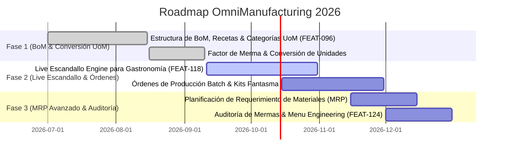

# ROADMAP EJECUTIVO OMNIMANUFACTURING & PRODUCCIÓN

> **Proyecto:** OrderFlow / OmniFlow → OmniManufacturing (MRP & Producción Industrial)  
> **Versión Baseline:** v1.25.0  
> **Fecha:** 18 de Septiembre de 2026  
> **Área:** Recetas/Escandallos (BoM), Órdenes de Producción, Conversión UoM, Merma & Costos

---

## 1. VISIÓN EJECUTIVA

**OmniManufacturing** gestiona los procesos de transformación de materia prima en producto terminado o insumo procesado. Ofrece recetas dinámicas (Bill of Materials - BoM), cálculo de mermas, órdenes de producción (MRP) y costeo atómico por lote.

---

## 2. HOJA DE RUTA Y ENTREGABLES

### Detalle por Fase

1. **Fase 1: Recetas & Conversión UoM (COMPLETED)**
   - Catálogo de insumos y materia prima con unidades de medida (kg, g, L, ml, unidad).
   - Definición de recetas base (BoM) y porcentaje de merma estándar.

2. **Fase 2: Live Escandallo & Órdenes Batch (IN_PROGRESS)**
   - Motor de explosión atómica de recetas en tiempo real con Redis caching (< 100 ms).
   - Generación automática de orden de descuento al despachar en cocina.

3. **Fase 3: MRP & Auditoría de Rendimientos (PLANNED)**
   - Cálculo automático de requerimientos de compras según ventas proyectadas.
   - Matriz de costo real vs costo teórico para detección de mermas e ineficiencias.
