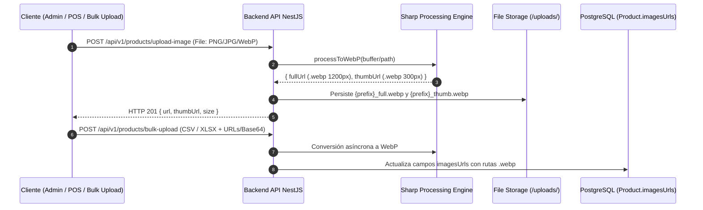

# 📐 Plan y Especificación de Endpoints: Optimización WebP y Gestión de Archivos Multimedia

> **Proyecto:** OmniFlow / OrderFlow  
> **Ubicación:** `docs/planes/PLAN_ENDPOINTS_WEBP_Y_GESTION_IMAGENES.md`  
> **Versión del Core:** v1.20.24  
> **Fecha:** 2026-08-25  

---

## 1. Resumen Ejecutivo

Este documento especifica la arquitectura de endpoints de la API REST de OmniFlow para el procesamiento, conversión nativa a **WebP**, generación automática de miniaturas (*thumbnails*), almacenamiento y purga de archivos multimedia multimedia en el ecosistema OmniFlow.

---

## 2. Diagrama del Flujo de Endpoints de Multimedia



---

## 3. Especificación Detallada de Endpoints

### 3.1 Subida e Ingesta de Imágenes con Conversión a WebP

#### `POST /api/v1/products/upload-image`
Subida individual de imágenes para fichas de producto. Realiza auto-orientación EXIF, compresión y generación de dos variantes WebP (`full.webp` y `thumb.webp`).

- **Headers:**  
  `Content-Type: multipart/form-data`  
  `Authorization: Bearer <token>`
- **Payload:**  
  `file`: Archivo binario (Formatos aceptados: `JPG`, `PNG`, `WebP`, `GIF`; Máx: 10MB).
- **Respuesta (HTTP 201 Created):**
  ```json
  {
    "url": "/uploads/products/tenant-123/1787680000_producto_full.webp",
    "thumbUrl": "/uploads/products/tenant-123/1787680000_producto_thumb.webp",
    "filename": "1787680000_producto_full.webp",
    "originalName": "foto_camisa.png",
    "size": 45120
  }
  ```

---

#### `POST /api/v1/admin/social-catalog/upload`
Subida de activos estáticos para el menú digital (Banners, Logos, Imágenes de fondo de categoría).

- **Headers:**  
  `Content-Type: multipart/form-data`
- **Payload:**  
  `file`: Archivo binario de imagen.
- **Respuesta (HTTP 201 Created):**
  ```json
  {
    "url": "/uploads/social-catalog/tenant-123/1787680000_banner_full.webp",
    "thumbUrl": "/uploads/social-catalog/tenant-123/1787680000_banner_thumb.webp",
    "filename": "1787680000_banner_full.webp",
    "originalName": "banner.jpg",
    "size": 68400
  }
  ```

---

### 3.2 Endpoints de Mantenimiento y Purga de Imágenes

#### `POST /api/v1/admin/media/clear-tenant-images`
Endpoint administrativo para purgar completamente las referencias de imágenes de productos y eliminar los archivos del sistema de archivos para un tenant específico.

- **Permissions:** `products:manage` (SuperAdmin / Tenant Admin)
- **Payload (JSON):**
  ```json
  {
    "tenantId": "provecchio-dimora-001",
    "wipeFilesystem": true
  }
  ```
- **Respuesta (HTTP 200 OK):**
  ```json
  {
    "success": true,
    "productsUpdated": 223,
    "filesRemoved": 446,
    "message": "Todas las imágenes del tenant fueron eliminadas correctamente."
  }
  ```

---

#### `POST /api/v1/admin/media/convert-legacy`
Script / Endpoint para migrar y reconvertir masivamente imágenes en formatos heredados (PNG/JPG) existentes en la base de datos a formato WebP.

- **Payload (JSON):**
  ```json
  {
    "tenantId": "provecchio-dimora-001",
    "forceReconvert": false
  }
  ```
- **Respuesta (HTTP 200 OK):**
  ```json
  {
    "processed": 150,
    "convertedToWebp": 150,
    "bytesSaved": 15420000,
    "compressionRatio": "68.5%"
  }
  ```

---

## 4. Estándar de Almacenamiento y Rutas en Disco

```
uploads/
├── products/
│   └── {tenantId}/
│       ├── {timestamp}_{sanitized}_full.webp   (Max 1200x1200px, Q:85)
│       └── {timestamp}_{sanitized}_thumb.webp  (300x300px Cover, Q:80)
└── social-catalog/
    └── {tenantId}/
        ├── {timestamp}_{sanitized}_full.webp
        └── {timestamp}_{sanitized}_thumb.webp
```

---

## 5. Próximos Pasos y Hoja de Ruta
1. **Fase 1 (Completado):** `ImageProcessingService` con Sharp, endpoints de upload en `ProductsController` y `SocialCatalogAdminController`.
2. **Fase 2 (En Progreso):** Reimportación limpia de imágenes en formato WebP para Provecchio.
3. **Fase 3:** Habilitación de compresión de compresión perimetral en Traefik v3 (`media-cache-headers`).

---

*Documento registrado en `docs/planes/PLAN_ENDPOINTS_WEBP_Y_GESTION_IMAGENES.md`.*
