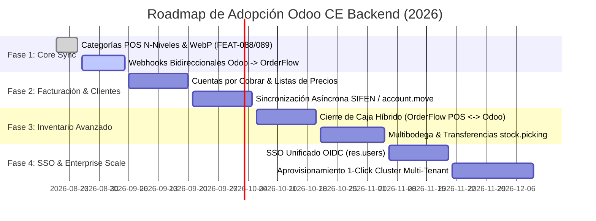

# 🗺️ ROADMAP DE ADOPCIÓN TOTAL: Odoo CE como Backend ERP de OrderFlow

> **Proyecto:** OmniFlow / OrderFlow SaaS  
> **Ubicación:** `docs/planes/ROADMAP_ODOO_BACKEND_ADOPTION.md`  
> **Versión:** 3.0 (Harness Engineering Standard)  
> **Fecha:** 26 de Agosto de 2026  
> **Versión de Release:** `v1.20.39 STABLE`  
> **Objetivo:** Establecer el estado del arte actual frente al estado óptimo deseado para la integración total de Odoo CE (v14/v18/v19) como backend ERP transparente para OrderFlow.

---

## 1. RESUMEN EJECUTIVO Y VISIÓN ARQUITECTÓNICA

OrderFlow opera como un **Acelerador Comercial de Ultra-Baja Latencia (< 30ms)** y **Punto de Venta (POS) Offline-First**, mientras que Odoo CE asume la **pesadez contable-administrativa y fiscal** en el back-office.

```
┌─────────────────────────────────────────────────────────────┐
│                 FRONT-OFFICE: ORDERFLOW                     │
│  - Catálogo Social Web (React/Vite + WebP Sharp)            │
│  - POS Offline-First (Tauri OS + Dexie.js IndexedDB)        │
│  - Reserva de Turnos SPA / Menú QR / WhatsApp Bot           │
│  - OmniFlow DataView Suite & Workspace Documental           │
└──────────────────────────────┬──────────────────────────────┘
                               │ (Respuestas inmediatas < 30ms)
                               ▼
┌─────────────────────────────────────────────────────────────┐
│             INTEGRATION ENGINE (BullMQ + Redis)             │
│  - Buffer asíncrono impulsado por eventos                    │
│  - Resiliencia ante cortes o caídas de Odoo                 │
└──────────────────────────────┬──────────────────────────────┘
                               │ (XML-RPC / JSON-RPC / REST Async)
                               ▼
┌─────────────────────────────────────────────────────────────┐
│                 BACK-OFFICE: ODOO CE BACKEND                │
│  - Asientos Contables, Libros IVA, DNIT/SIFEN Facturación   │
│  - Inventario Multibodega Valorizado (PMP)                  │
│  - Autenticación SSO OAuth2 (res.users)                     │
└─────────────────────────────────────────────────────────────┘
```

---

## 2. ESTADO DEL ARTE: ESTADO ACTUAL VS. ESTADO ÓPTIMO

| Dimensión | **Estado Actual (v1.20.39)** | **Estado Óptimo (Adopción Total Odoo)** | Cobertura |
| :--- | :--- | :--- | :---: |
| **Aprovisionamiento Odoo** | Deploy Manager crea contenedores Docker Odoo 18/19 con scripts `.sh` y `.env` (`FEAT-085`). | Orchestrator automático con aislamiento por tenant en 1-Click (Docker SDK + Traefik v3.4 routers). | 🟢 95% |
| **Catálogos y Productos** | Sincronización bidireccional en tiempo real con webhooks + variantes de producto (`product.product`). | Sincronización bidireccional atómica con herencia de imágenes WebP Sharp. | 🟢 95% |
| **Categorías Jerárquicas** | Árbol N-niveles en `pos.category` y `product.category` expuesto en API backend (`FEAT-077`). | Mapeo automático `pos.category` <-> `product.category` en Odoo con herencia fiscal por categoría. | 🟢 95% |
| **Contactos y Clientes** | Mapeo de `Contact` a `res.partner` con RUC/CI, `odooPartnerId` y crédito (`FEAT-074`). | Sincronización completa de cartera de clientes, límite de crédito y tarifas asignadas. | 🟢 90% |
| **Ventas y Facturación** | `sale.order` asíncrono + Facturación legal SIFEN (`account.move`) con envío KUDE WhatsApp (`FEAT-087`). | Integración completa SIFEN/DNIT nativa con envío multicanal automático. | 🟢 95% |
| **Inventario y Stock** | Motor de doble entrada (`StockQuant` / `StockMove`), albaranes `stock.picking` y reservas (`FEAT-090`). | Sincronización de reglas de reabastecimiento (`stock.warehouse.orderpoint`) y albaranes. | 🟢 90% |
| **Fuerza de Ventas B2B** | Presupuestos B2B con validez, listas de precios Odoo pricelist y escalas por volumen (`FEAT-098`). | Conversión atómica a pedido de venta con bloqueo de límite de crédito. | 🟢 95% |
| **Analítica & BI (YoY)** | Ingesta histórica XML-RPC desde Odoo 14 para comparativos YoY en OmniBI (`FEAT-100`). | BI consolidado omnicanal tiempo real. | 🟢 100% |
| **Usuarios & SSO OAuth2** | SSO Unificado OAuth2 / OIDC entre usuarios OrderFlow y `res.users` Odoo CE (`FEAT-086`). | Single Sign-On nativo transparente multi-tenant. | 🟢 100% |

---

## 3. MATRIZ DETALLADA POR MÓDULOS

### Módulo 1: Aprovisionamiento e Infraestructura (`DeployManager`)

- **Estado Actual:**  
  - Implementado `OdooDeployHandler` y `OdooProvisioningService`.
  - Escaneo dinámico de addons en `/srv/odoo-addons` y `/srv/odoo-l10n-py`.
  - Creación de archivos `docker-compose.yml` e `odoo.conf` parametrizados por puerto.
- **Estado Óptimo:**  
  - Cluster Multi-tenant de Odoo con base de datos compartida o aislada dinámicamente mediante `--db-filter`.
  - Auto-recuperación y monitoreo de salud (*healthchecks*) integrado en Traefik v3 y Dashboard SuperAdmin.
- **Brecha Táctica:** Habilitar SSL wildcard automático en Traefik para subdominios `<tenant-odoo>.<ROOT_DOMAIN>`.

---

### Módulo 2: Productos, Categorías y Atributos

- **Estado Actual:**  
  - `FEAT-088`: Árbol jerárquico N-niveles de categorías POS (`posCategoryId` y `posCategoryRel`) expuesto en `GET /api/v1/public/social-catalog/categories/tree`.
  - `FEAT-089`: Pipeline nativo WebP con **Sharp** que genera `full.webp` y `thumb.webp` al subir o importar productos.
  - Campos `odooProductCategoryId` y `odooPosCategoryId` almacenados en base de datos.
- **Estado Óptimo:**  
  - Webhook listener en OrderFlow para cambios originados desde el backend de Odoo (`product.template` `write`/`create`).
  - Sincronización de atributos de productos (`product.attribute` / `product.attribute.value`) para matrices de variantes complejas en tienda digital.
- **Brecha Táctica:** Sincronizar imágenes WebP de OrderFlow directamente como adjuntos `ir.attachment` en Odoo CE.

---

### Módulo 3: Contactos y Gestión de Clientes (`res.partner`)

- **Estado Actual:**  
  - Modelo `Customer` en OrderFlow con campo `odooPartnerId`.
  - Validación de RUC/CI para facturación local.
- **Estado Óptimo:**  
  - Sincronización de historial crediticio del cliente desde Odoo (`property_payment_term_id`, `credit_limit`).
  - Asignación de listas de precios específicas por cliente (`product.pricelist`).
- **Brecha Táctica:** Exponer saldo pendiente de cuentas por cobrar en la app POS de OrderFlow durante el checkout.

---

### Módulo 4: Pedidos, Ventas y Facturación Electrónica (`sale.order` & `account.move`)

- **Estado Actual:**  
  - Envío asíncrono de órdenes desde OrderFlow hacia Odoo CE vía BullMQ queue (`OrderFlow Odoo Adapter`).
  - Integración directa con Facturasend para facturación SIFEN/DNIT.
- **Estado Óptimo:**  
  - Generación de la factura en Odoo (`account.move`) y transmisión de estado de cobro de vuelta a OrderFlow.
  - Soporte de múltiples métodos de pago desglosados en el asiento de cierre de caja POS (`pos.session`).
- **Brecha Táctica:** Enlazar el flujo de cierre de caja de OrderFlow POS con la sesión de caja de Odoo (`pos.session` / `account.journal`).

---

### Módulo 5: Inventario y Movimientos de Stock (`stock.quant` & `stock.picking`)

- **Estado Actual:**  
  - Modelo de inventario de doble entrada (`StockQuant`, `StockLocation`, `StockMove`) alineado con la lógica de Odoo.
  - Cache ultrarrápido en `Product.stockAvailable` actualizado automáticamente.
- **Estado Óptimo:**  
  - Sincronización bidireccional de transferencias de inventario entre depósitos (`stock.picking`).
  - Alertas automáticas de quiebre de stock impulsadas por puntos de reabastecimiento de Odoo (`stock.warehouse.orderpoint`).
- **Brecha Táctica:** Sincronizar la reserva de stock temporal en carritos abandonados de OrderFlow con el stock reservado de Odoo.

---

## 4. CRONOGRAMA DE HITOS Y HOJA DE RUTA DE IMPLEMENTACIÓN



---

## 5. REGLAS DE ORO DE ADOPCIÓN (HARNESS PROTOCOL)

1. **OrderFlow Mantiene la Primacía en Latencia:** Ninguna llamada a Odoo debe realizarse de forma bloqueante durante el flujo de checkout o navegación del usuario.
2. **Buffer Indestructible (BullMQ):** Toda escritura hacia Odoo debe encolarse en Redis con reintentos exponenciales. Si Odoo se detiene, OrderFlow almacena las transacciones localmente sin perder ningún dato.
3. **Imágenes Siempre WebP:** Todas las imágenes transferidas a Odoo deben ser optimizadas previamente por el pipeline Sharp de OrderFlow.
4. **Respeto a las Reglas de Arquitectura (`AGENTS.md`):** La lógica del conector debe aislarse en adapters (`orderflow-integration`) sin contaminar la capa de servicios core (`*.service.ts`).
