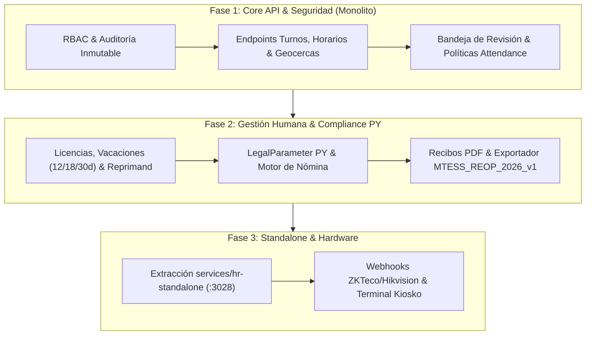

# INFORME TÉCNICO & ROADMAP — OmniCapitalHumano & OmniAsistencia (`hr-standalone`)

> **Documento de Diagnóstico, Cumplimiento y Hoja de Ruta de Desarrollo**  
> **Versión del Sistema:** `v1.27.10`  
> **Jurisdicción de Referencia:** Paraguay (Compliance-by-Design — Código del Trabajo, IPS, REOP/MTESS, Ley 1.682/2001)  
> **Ruta Standalone:** `services/hr-standalone` (`:3028` / `rrhh.<tenant>.<domain>`)  
> **Nombre Técnico en Código:** `hr` (asistencia y capital humano unificados en monolito / standalone)  

---

## 📌 1. Resumen Ejecutivo

El módulo unificado **`hr`** (marcas comerciales: *OmniCapitalHumano* y *OmniAsistencia*) tiene como propósito centralizar:
1. **Marcador de asistencia multi-método:** Aplicación móvil (con biometría en OS y geocercas Haversine dinámicas), integración NFC desacoplada (`nfc-standalone`), kioscos PIN/QR y terminales físicos dedicados (ZKTeco y Hikvision).
2. **Capital Humano y Cumplimiento Laboral:** Legajo digital del colaborador, matriz de turnos/horarios flexibles, calendario de feriados nacionales, flujo de vacaciones/ausencias, y motor de nómina parametrizable versionado (*compliance-by-design* para Paraguay).

Actualmente, el sistema cuenta con un **MVP inicial en `backend/src/hr/`** expuesto en el panel administrativo `/admin/hr`. Este documento audita el estado real del repositorio, identifica los gaps técnicos y regulatorios frente a las especificaciones aprobadas en `docs/plans/capital-humano/` (`PLAN_OMNICAPITALHUMANOv2.md`, `PLAN_OMNIASISTENCIAv2.md` y `AUDITORIA_HR_v1.21.01.md`), y establece el plan de fases para completar la API y extraer la suite a `services/hr-standalone` en el puerto `:3028`.

---

## 📊 2. Estado Actual de la Implementación (Auditoría Técnica)

| Componente | Estado | Cobertura Real vs. Plan Maestro |
|---|---|---|
| **Identidad Tripartita** | 🟡 **Parcial** | `Employee` existe en Prisma con cédula única por tenant, pero falta forzar la vinculación Odoo-style obligatoria (`Contact` ↔ `Employee` ↔ `User`). |
| **Modelos de Horarios & Feriados** | ✅ **Completado (DB)** | `ShiftTemplate`, `WorkSchedule`, `WorkScheduleDetail`, `WorkScheduleAssignment` y `Holiday` existen en schema; faltan sus endpoints de gestión en API. |
| **Marcación y Geocercas** | 🟡 **30% (MVP)** | `POST /api/v1/hr/attendance/scan` calcula distancia Haversine y marca `FLAGGED`. Falta aplicar `AttendancePolicy` dinámico (`STRICT`, `FLAG`, `NONE`) y el endpoint `PATCH .../review`. |
| **Biometría & Hardware** | 🔴 **Pendiente** | Campos previstos en base de datos (`biometricDeviceId`, `deviceEventRawId`), pero sin webhooks de ingesta push para ZKTeco (ADMS/iClock) ni Hikvision (ISAPI). |
| **Motor de Nómina & Liquidación** | 🔴 **Pendiente** | Falta migrar `PayrollConcept`, `PayrollRun`, `Payslip` y `CompensationPlanLine`. Solo existe `CompensationPlan.baseSalary` plano. |
| **Compliance Regulatorio** | 🟡 **Borrador** | `LegalParameter` presente en el schema; requiere seed de parámetros para Paraguay (IPS obrero 9%, patronal 16.5%, tramos de vacaciones de 12/18/30 días) en estado `DRAFT`. |
| **RBAC & Auditoría** | 🟡 **Parcial** | Falta aplicar `PermissionsGuard` y roles (`Colaborador`, `Jefe`, `RRHH`, `Nómina`, `Auditor`, `Admin`) sobre todos los endpoints de `hr`. `EmployeeAuditLog` solo audita cambios en `position`. |
| **Microservicio Standalone** | 🔴 **Fase 3** | Pendiente extracción a `services/hr-standalone` (`:3028`). |

---

## 🔍 3. Diagnóstico Detallado de Gaps

### 3.1 Seguridad, RBAC y Auditoría Inmutable
* **Falta de Guards en Endpoints de HR:** HrController debe aplicar `@UseGuards(PermissionsGuard)` y `@RequirePermissions(...)`. Un usuario autenticado no debe poder ver ni manipular legajos ajenos sin el permiso correspondiente.
* **Cobertura de `EmployeeAuditLog`:** Actualmente solo los cambios de cargo (`position`) disparan el log. Debe auditar obligatoriamente cambios en `status`, `managerId`, sucursal y ajustes salariales (`CompensationPlan`), preservando `previousValue`, `newValue`, `changedBy` y `reason`.

### 3.2 Geocercas y Circuito de Asistencia
* **`AttendancePolicy` no consultada:** Si el empleado marca fuera del radio de `Workplace`, el sistema hoy lo marca siempre como `FLAGGED`. Debe respetar la prioridad: `employeeId` > `role` > default del tenant (`FLAG`), permitiendo bloquear con `422` en modo `STRICT` o ignorar coordenadas en `NONE`.
* **Bandeja de Revisión Inexistente:** Los registros marcados quedan en `FLAGGED` indefinidamente. Se requiere el endpoint `PATCH /api/v1/hr/attendance/records/:id/review` con estados `REVIEWED_APPROVED` y `REVIEWED_REJECTED`.
* **EventOps (Vivento):** Si `Workplace.isEventBased = true`, las coordenadas de validación no deben ser estáticas, sino resolverse en tiempo real contra la geolocalización del evento activo en `EventOps`.

### 3.3 Ausencias, Vacaciones y Feriados
* Falta exponer la API para `LeaveRequest` (con flujo `REQUESTED` → `APPROVED` / `REJECTED` por `managerId`), cálculo de saldos vacacionales por antigüedad (`VacationBalance` con 12/18/30 días según Código del Trabajo PY) y `Holiday` para cálculo de jornales extraordinarios.

### 3.4 Motor de Nómina y Parámetros Legales (Compliance-by-Design)
* **Modelado de Liquidación:** Implementar `PayrollConcept` (conceptos imponibles vs. no imponibles para IPS), `CompensationPlan` (con doble aprobación `createdBy` y `approvedBy`), `PayrollRun` y `Payslip`.
* **`LegalParameter` Versionado:** Los porcentajes de IPS, salario mínimo y tramos de licencias deben residir en esta tabla versionada por fechas (`effectiveFrom`/`effectiveTo`). Toda nueva regla nace en `DRAFT` y su paso a `PUBLISHED` exige confirmación explícita de validación jurídica/contable local.

---

## 🗺️ 4. Hoja de Ruta de Implementación (Fases y Sprints)

### 🗓️ Fase 1: Core API, Seguridad y Marcación Robusta (Monolito)
* **Sprint 1.1 — RBAC & Auditoría:**
  - Proteger `HrController` con `PermissionsGuard`. Definir permisos para roles: Colaborador, Jefe, RRHH, Nómina, Auditor, Admin.
  - Extender `EmployeeAuditLog` para capturar cualquier mutación en legajo o salario.
* **Sprint 1.2 — Matriz de Horarios y Geocercas:**
  - Exponer CRUDs de `Workplace`, `ShiftTemplate`, `WorkSchedule` (con grilla de 7 días `WorkScheduleDetail`) y asignaciones (`WorkScheduleAssignment`).
  - CRUD de `Holiday` parametrizado por jurisdicción (PY).
* **Sprint 1.3 — Motor de Asistencia y Políticas Dinámicas:**
  - Evaluar `AttendancePolicy` (`STRICT`, `FLAG`, `NONE`) con cálculo Haversine server-side.
  - Habilitar `PATCH /api/v1/hr/attendance/records/:id/review` para que RRHH resuelva marcaciones observadas.
  - Resolver geocercas de eventos dinámicos cruzando con `EventOps`.

### 🗓️ Fase 2: Capital Humano, Ausencias y Liquidación (Compliance PY)
* **Sprint 2.1 — Vacaciones, Licencias y Amonestaciones:**
  - Endpoints para `LeaveRequest` (aprobaciones escalonadas por jefatura).
  - Motor de saldo de vacaciones (`VacationBalance`) con cálculo automático según antigüedad del colaborador (Ley 213/93: 12, 18 y 30 días corridos).
  - Registro de llamados de atención y sanciones (`Reprimand`), con vinculación opcional a marcaciones tardías observadas.
* **Sprint 2.2 — Parámetros Legales y Estructura Salarial:**
  - Semillar `LegalParameter` en estado `DRAFT` para Paraguay (IPS obrero 9%, patronal 16.5%, base mínima).
  - Implementar `PayrollConcept` y `CompensationPlan` (exigiendo `approvedBy != createdBy` para entrada en vigencia).
* **Sprint 2.3 — Motor de Nómina y Recibos:**
  - `PayrollRun` y cálculo de `Payslip` consumiendo horas reales de `AttendanceRecord` + `CompensationPlan` + `LegalParameter` vigente.
  - Generador de recibos de salarios en PDF.
  - Exportador base de planilla en formato de intercambio `MTESS_REOP_2026_v1` (preparado para carga en REOP).

### 🗓️ Fase 3: Desacoplamiento a Microservicio Standalone (`services/hr-standalone`)
* **Sprint 3.1 — Setup Standalone en Puerto `:3028`:**
  - Crear el microservicio `services/hr-standalone` estructurado con NestJS + Prisma multi-tenant.
  - Integrar `@orderflow/auth-shared` para validación de tokens y RBAC desacoplado.
  - Configurar `docker-compose.standalone.yml` mapeando el puerto `:3028` y reglas en Traefik v3.4 para subdominios `rrhh.<tenant>.<domain>`.
* **Sprint 3.2 — Integración de Hardware Biométrico:**
  - Implementar endpoint webhook push para terminales ZKTeco (`/api/v1/hr/attendance/webhooks/zkteco/:deviceToken` bajo protocolo ADMS/iClock).
  - Implementar listener push para terminales Hikvision (`/api/v1/hr/attendance/webhooks/hikvision/:deviceToken` vía ISAPI HTTP notifications).
  - Mapeo manual de identidades mediante `BiometricDeviceEnrollment` (`deviceUserId` ↔ `employeeId`).
* **Sprint 3.3 — Kiosko Fijo & OmniMobile:**
  - Marcador modo Kiosko PIN/QR para tablets compartidas en sucursales.
  - Consumo desde la app móvil React Native (`OmniMobile`) con biometría local OS y geolocalización.

---

## 📌 5. Recomendaciones Inmediatas

1. **Mantener la ruta administrativa unificada:** El panel de control en `https://<tenant-domain>/admin/hr` debe seguir consumiendo la API de `hr` sin duplicar interfaces.
2. **Priorizar Cierre de Gaps de API:** Antes de extraer el microservicio standalone, completar los endpoints de horarios, revisión de asistencia y ausencias en el monolito para estabilizar el contrato DTO que luego se migración a `:3028`.
3. **Validación Legal:** Recordar que ningún parámetro en `LegalParameter` debe ser promovido a `PUBLISHED` en producción sin la debida revisión de un asesor laboralista o tributario local.
