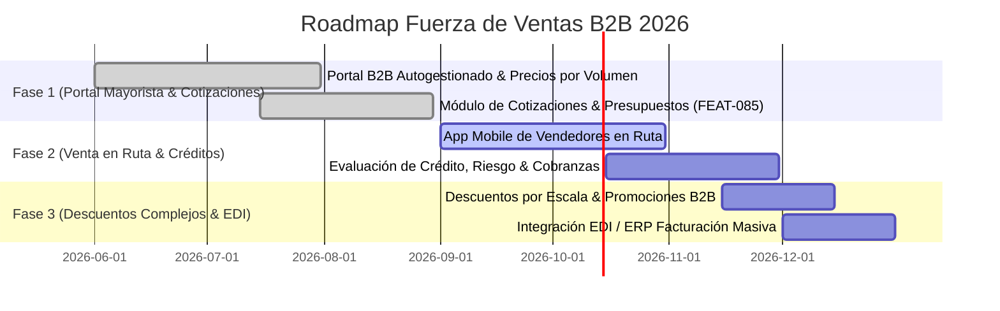

# ROADMAP EJECUTIVO FUERZA DE VENTAS B2B (B2B_SALES)

> **Proyecto:** OrderFlow / OmniFlow → B2B Sales & Venta Asistida  
> **Versión Baseline:** v1.25.0  
> **Fecha:** 18 de Septiembre de 2026  
> **Área:** Portal Mayorista, Cotizaciones, Rutas de Vendedores & Créditos B2B

---

## 1. VISIÓN EJECUTIVA

La vertical **Fuerza de Ventas B2B** optimiza la canalización de pedidos mayoristas y venta en ruta. Incluye un portal autogestionado para clientes distribuidores, catálogo con precios según volumen, gestión de límites de crédito y presupuestos con aprobación.

---

## 2. HOJA DE RUTA Y ENTREGABLES

### Detalle por Fase

1. **Fase 1: Portal Mayorista & Cotizaciones (COMPLETED)**
   - Autenticación B2B por empresa con catálogo personalizado.
   - Emisión de presupuestos con validez y conversión directa a pedido.

2. **Fase 2: Venta en Ruta & Gestión de Crédito (IN_PROGRESS)**
   - Aplicación para preventistas en ruta con toma de pedido offline.
   - Verificación de saldo disponible y bloqueo por mora.

3. **Fase 3: Promociones Avanzadas & EDI (PLANNED)**
   - Reglas comerciales avanzadas (bonificaciones por volumen, mix de productos).
   - Integración EDI para intercambio electrónico de documentos con cadenas mayoristas.
