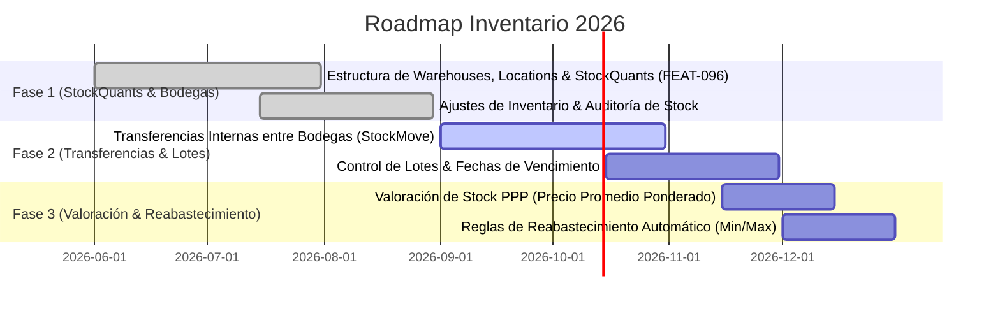

# ROADMAP EJECUTIVO INVENTARIO & MULTI-BODEGA (INVENTARIO)

> **Proyecto:** OrderFlow / OmniFlow → Inventario & Logística Multi-Sucursal  
> **Versión Baseline:** v1.25.0  
> **Fecha:** 18 de Septiembre de 2026  
> **Área:** Stock Quants, Bodegas, Ubicaciones internas, Transferencias & Valoración

---

## 1. VISIÓN EJECUTIVA

La vertical **Inventario** proporciona la trazabilidad atómica de existencias mediante el modelo `StockQuant` (Inspirado en Odoo stock.quant). Administra depósitos, pasillos, ubicaciones de stock, transferencias internas, recepción de compras y ajustes periódicos.

---

## 2. HOJA DE RUTA Y ENTREGABLES

### Detalle por Fase

1. **Fase 1: StockQuants & Bodegas (COMPLETED)**
   - Jerarquía de bodegas (`Warehouse`) y ubicaciones internas (`Location`).
   - Registro de existencias en tiempo real por ubicación (`StockQuant`).

2. **Fase 2: Transferencias Internas & Lotes (IN_PROGRESS)**
   - Movimientos de stock entre depósitos (`StockMove` origen/destino) con estado borrador/confirmado.
   - Seguimiento por número de lote y alertas de expiración.

3. **Fase 3: Valoración de Inventario & Reabastecimiento (PLANNED)**
   - Cálculo de costo promedio ponderado en entradas de stock.
   - Disparo automático de órdenes de compra/producción según stock mínimo.
