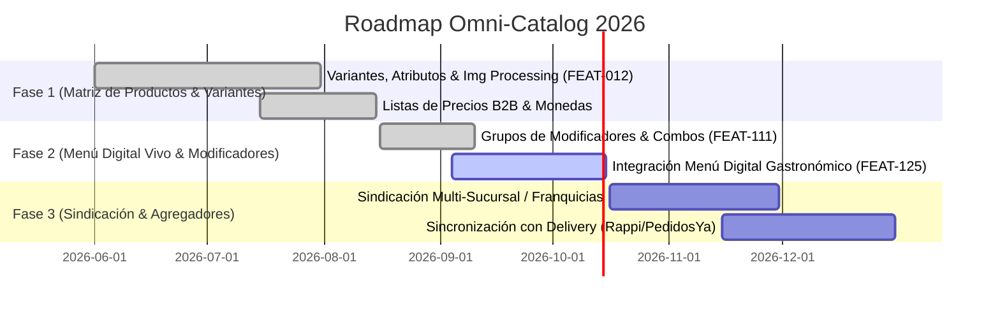

# ROADMAP EJECUTIVO OMNI-CATALOG & SOCIAL CATALOG

> **Proyecto:** OrderFlow / OmniFlow → Catálogo Omnicanal & Social Catalog  
> **Versión Baseline:** v1.25.0  
> **Fecha:** 18 de Septiembre de 2026  
> **Área:** Catálogo Unificado, Menú Digital, Precios B2B, Atributos & Modificadores

---

## 1. VISIÓN EJECUTIVA

**Omni-Catalog** centraliza la matriz de productos, variantes, atributos y precios multinivel (Retail, B2B, Gastronomía), alimentando tanto los canales internos (POS, KDS, Administración) como los externos (Social Catalog, Kiosk, Menú Vivo QR para comensales).

---

## 2. HOJA DE RUTA Y ENTREGABLES

### Detalle por Fase

1. **Fase 1: Matriz de Productos & Precios (COMPLETED)**
   - Catálogo unificado con variantes dinámicas, listas de precios por grupo de clientes y soporte multimoneda (PYG, USD, BRL, ARS).
   - Optimización automática de imágenes vía Sharp (< 100 KB por recurso).

2. **Fase 2: Menú Digital Vivo & Modificadores (IN_PROGRESS)**
   - Grupos de modificadores obligatorios/opcionales con límites min/max.
   - Reutilización de Social Catalog como Menú Vivo QR en mesa para comensales.

3. **Fase 3: Sindicación Multi-Sucursal & Agregadores (PLANNED)**
   - Herencia de catálogo central con anulaciones (*overrides*) de precios y stock por sucursal.
   - Conexión bi-direccional de catálogo con plataformas de delivery.
