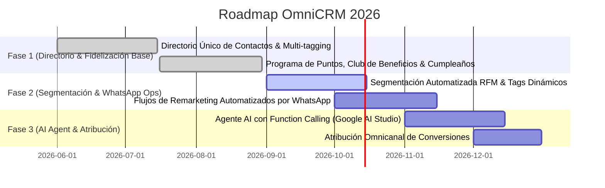

# ROADMAP EJECUTIVO OMNICRM & FIDELIZACIÓN

> **Proyecto:** OrderFlow / OmniFlow → OmniCRM & Customer Experience  
> **Versión Baseline:** v1.25.0  
> **Fecha:** 18 de Septiembre de 2026  
> **Área:** CRM, Fidelización, Segmentación RFM, Campañas & Chatbot AI

---

## 1. VISIÓN EJECUTIVA

**OmniCRM** administra el ciclo de vida del cliente, ofreciendo un motor de fidelización por puntos/cashback, segmentación automatizada RFM (Recencia, Frecuencia, Monto), campañas omnicanal por WhatsApp/SMS y asistentes inteligentes integrados con Google AI Studio.

---

## 2. HOJA DE RUTA Y ENTREGABLES

### Detalle por Fase

1. **Fase 1: Directorio & Fidelización Base (COMPLETED)**
   - Directorio de clientes unificado con historial transaccional cross-channel.
   - Puntos de lealtad, acumulación por compras y felicitación automática de cumpleaños por WhatsApp.

2. **Fase 2: Segmentación RFM & Campañas WhatsApp (IN_PROGRESS)**
   - Motor de análisis RFM que clasifica clientes en "VIP", "En Riesgo", "Leales" y "Nuevos".
   - Campañas masivas de remarketing vía OmniMessaging con plantilla interactiva de WhatsApp.

3. **Fase 3: Asistente AI & Atribución (PLANNED)**
   - Asistente virtual basado en Google AI Studio que consulta stock, toma reservas y registra pedidos.
   - Matriz de atribución omnicanal para evaluar el ROI de campañas por canal.
