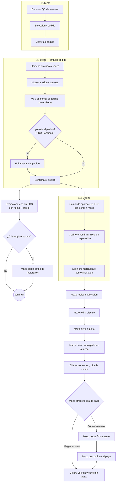

```mermaid
flowchart TD
    subgraph CLIENTE["📱 Cliente"]
        A1[Escanea QR de la mesa] --> A2[Selecciona pedido]
        A2 --> A3[Confirma pedido]
    end

    A3 --> B0[Llamado enviado al mozo]

    subgraph MOZO1["🧑‍🍳 Mozo - Toma de pedido"]
        B0 --> B1[Mozo se asigna la mesa]
        B1 --> B2[Va a confirmar el pedido con el cliente]
        B2 --> B3{"¿Ajusta el pedido?<br/>(CRUD opcional)"}
        B3 -->|Sí| B4[Edita items del pedido]
        B4 --> B5[Confirma el pedido]
        B3 -->|No| B5
    end

    B5 --> C1[Comanda aparece en KDS<br/>con items + mesa]
    B5 --> C2[Pedido aparece en POS<br/>con items + precio]
    C2 --> C3{"¿Cliente pide factura?"}
    C3 -->|Sí| C4[Mozo carga datos de facturación]
    C3 -->|No| C5((continúa))
    C4 --> C5

    subgraph COCINA["👨‍🍳 Cocina"]
        C1 --> D1[Cocinero confirma inicio de preparación]
        D1 --> D2[Cocinero marca plato como finalizado]
    end

    D2 --> E1[Mozo recibe notificación]
    E1 --> E2[Mozo retira el plato]
    E2 --> E3[Mozo sirve el plato]
    E3 --> E4[Marca como entregado en la mesa]

    E4 --> F1[Cliente consume y pide la cuenta]
    F1 --> F2{"Mozo ofrece forma de pago"}
    F2 -->|Cobrar en mesa| F3[Mozo cobra físicamente]
    F3 --> F4[Mozo preconfirma el pago]
    F2 -->|Pagar en caja| G1
    F4 --> G1[Cajero verifica y confirma pago]
```
