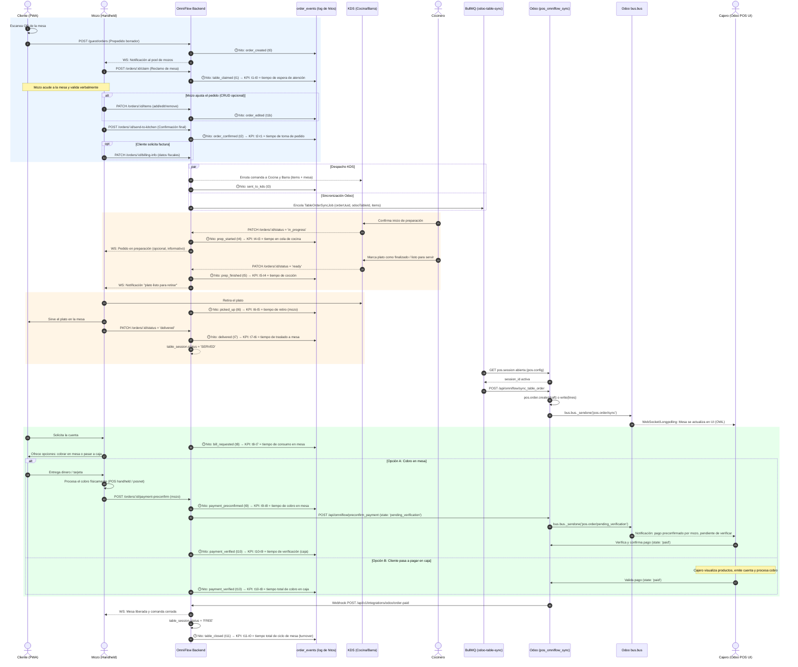

```mermaid
sequenceDiagram
    autonumber
    actor C as Cliente (PWA)
    actor M as Mozo (Handheld)
    participant Core as OmniFlow Backend
    participant Ev as order_events (log de hitos)
    participant KDS as KDS (Cocina/Barra)
    actor Cocinero as Cocinero
    participant Q as BullMQ (odoo-table-sync)
    participant OdooAPI as Odoo (pos_omniflow_sync)
    participant Bus as Odoo bus.bus
    actor Cajero as Cajero (Odoo POS UI)

    %% ========== 1. TOMA Y VALIDACIÓN EN SALÓN ==========
    rect rgb(235, 245, 255)
    C->>C: Escanea QR de la mesa
    C->>Core: POST /guest/orders (Prepedido borrador)
    Core->>Ev: 🕒 hito: order_created (t0)
    Core-->>M: WS: Notificación al pool de mozos
    M->>Core: POST /orders/:id/claim (Reclamo de mesa)
    Core->>Ev: 🕒 hito: table_claimed (t1) → KPI: t1-t0 = tiempo de espera de atención
    Note over M,C: Mozo acude a la mesa y valida verbalmente

    alt Mozo ajusta el pedido (CRUD opcional)
        M->>Core: PATCH /orders/:id/items (add/edit/remove)
        Core->>Ev: 🕒 hito: order_edited (t1b)
    end

    M->>Core: POST /orders/:id/send-to-kitchen (Confirmación final)
    Core->>Ev: 🕒 hito: order_confirmed (t2) → KPI: t2-t1 = tiempo de toma de pedido

    opt Cliente solicita factura
        M->>Core: PATCH /orders/:id/billing-info (datos fiscales)
    end
    end

    %% ========== 2. ENRUTAMIENTO KDS Y ENCOLAMIENTO A ODOO ==========
    par Despacho KDS
        Core-->>KDS: Enruta comanda a Cocina y Barra (items + mesa)
        Core->>Ev: 🕒 hito: sent_to_kds (t3)
    and Sincronización Odoo
        Core->>Q: Encola TableOrderSyncJob (orderUuid, odooTableId, items)
    end

    %% ========== 3. CICLO DE PREPARACIÓN EN COCINA ==========
    rect rgb(255, 245, 230)
    Cocinero->>KDS: Confirma inicio de preparación
    KDS-->>Core: PATCH /orders/:id/status = 'in_progress'
    Core->>Ev: 🕒 hito: prep_started (t4) → KPI: t4-t3 = tiempo en cola de cocina
    Core-->>M: WS: Pedido en preparación (opcional, informativo)

    Cocinero->>KDS: Marca plato como finalizado / listo para servir
    KDS-->>Core: PATCH /orders/:id/status = 'ready'
    Core->>Ev: 🕒 hito: prep_finished (t5) → KPI: t5-t4 = tiempo de cocción
    Core-->>M: WS: Notificación "plato listo para retirar"
    end

    %% ========== 4. RETIRO Y ENTREGA EN MESA ==========
    rect rgb(255, 245, 230)
    M->>KDS: Retira el plato
    Core->>Ev: 🕒 hito: picked_up (t6) → KPI: t6-t5 = tiempo de retiro (mozo)
    M->>C: Sirve el plato en la mesa
    M->>Core: PATCH /orders/:id/status = 'delivered'
    Core->>Ev: 🕒 hito: delivered (t7) → KPI: t7-t6 = tiempo de traslado a mesa
    Core-->>Core: table_session.status = 'SERVED'
    end

    %% ========== 5. INGESTA EN ODOO POS ==========
    Q->>OdooAPI: GET pos.session abierta (pos.config)
    OdooAPI-->>Q: session_id activa
    Q->>OdooAPI: POST /api/omniflow/sync_table_order
    OdooAPI->>OdooAPI: pos.order.create(draft) o write(lines)
    OdooAPI->>Bus: bus.bus._sendone('pos.order/sync')
    Bus-->>Cajero: WebSocket/Longpolling: Mesa se actualiza en UI (OWL)

    %% ========== 6. SOLICITUD DE CUENTA Y BIFURCACIÓN DE COBRO ==========
    rect rgb(230, 255, 235)
    C->>M: Solicita la cuenta
    Core->>Ev: 🕒 hito: bill_requested (t8) → KPI: t8-t7 = tiempo de consumo en mesa
    M->>C: Ofrece opciones: cobrar en mesa o pasar a caja

    alt Opción A: Cobro en mesa
        C->>M: Entrega dinero / tarjeta
        M->>M: Procesa el cobro físicamente (POS handheld / posnet)
        M->>Core: POST /orders/:id/payment-preconfirm (mozo)
        Core->>Ev: 🕒 hito: payment_preconfirmed (t9) → KPI: t9-t8 = tiempo de cobro en mesa
        Core->>OdooAPI: POST /api/omniflow/preconfirm_payment (state: 'pending_verification')
        OdooAPI->>Bus: bus.bus._sendone('pos.order/pending_verification')
        Bus-->>Cajero: Notificación: pago preconfirmado por mozo, pendiente de verificar
        Cajero->>OdooAPI: Verifica y confirma pago (state: 'paid')
        Core->>Ev: 🕒 hito: payment_verified (t10) → KPI: t10-t9 = tiempo de verificación (caja)
    else Opción B: Cliente pasa a pagar en caja
        Note over Cajero: Cajero visualiza productos, emite cuenta y procesa cobro
        Cajero->>OdooAPI: Valida pago (state: 'paid')
        Core->>Ev: 🕒 hito: payment_verified (t10) → KPI: t10-t8 = tiempo total de cobro en caja
    end
    end

    %% ========== 7. CIERRE DE MESA ==========
    OdooAPI->>Core: Webhook POST /api/v1/integrations/odoo/order-paid
    Core-->>M: WS: Mesa liberada y comanda cerrada
    Core->>Core: table_session.status = 'FREE'
    Core->>Ev: 🕒 hito: table_closed (t11) → KPI: t11-t0 = tiempo total de ciclo de mesa (turnover)
```
