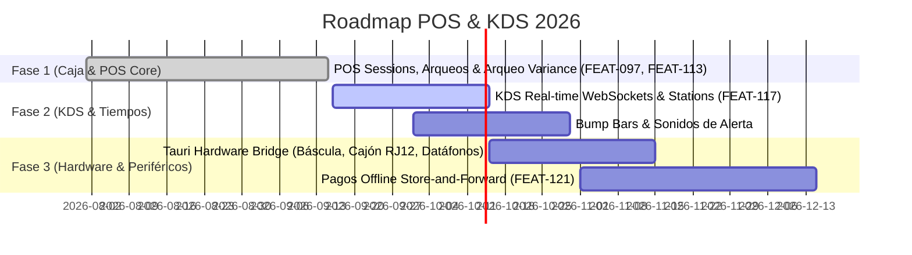

# ROADMAP EJECUTIVO POS & KDS (POS_KDS)

> **Proyecto:** OrderFlow / OmniFlow → Punto de Venta & Cocina (POS / KDS)  
> **Versión Baseline:** v1.25.0  
> **Fecha:** 18 de Septiembre de 2026  
> **Área:** Caja Retail, Comanderas, KDS Nativo y Conectividad Periféricos

---

## 1. VISIÓN EJECUTIVA

La vertical **POS & KDS** es el núcleo de captura de transacciones presenciales e interacción con cocina en tiempo real. Proporciona una arquitectura offline-first (IndexedDB + Dexie), sincronización reactiva vía WebSockets y un puente de hardware nativo (Tauri/Rust) para periféricos de caja.

---

## 2. FASES Y ROADMAP DE ENTREGABLES

### Detalle por Fase

1. **Fase 1: Caja & POS Core (COMPLETED)**
   - Sesiones POS reales (`OPENING_CONTROL`, `OPEN`, `CLOSING_CONTROL`, `CLOSED`).
   - Gestión de arqueo de caja con variaciones (`cashClosingDelta`).
   - Permisos de caja granularizados (`cash:open`, `cash:close`, `cash:movement`).

2. **Fase 2: KDS Nativo & Tiempos de Cocina (IN_PROGRESS)**
   - Pantalla KDS multiestación con tiempos de preparación y colores según urgencia.
   - Coursing por tiempos (Bebidas, Entradas, Principales, Postres).
   - Integración con dispositivos Bump Bar e impresión de comandas térmicas.

3. **Fase 3: Hardware Bridge & Operación Offline (PLANNED)**
   - Soporte nativo para básculas RS232, cajones RJ12 e impresoras ESC/POS mediante Tauri/Rust.
   - Algoritmo de pagos offline cifrado Store-and-Forward con re-intento automático.

---

## 3. KPIs DE NIVELES DE SERVICIO

| Métrica | Meta |
|---------|------|
| Latencia de actualización KDS | < 50 ms |
| Tiempo de apertura de pantalla POS | < 1,2 s |
| Sincronización de transacciones offline | 100% consistencia |
