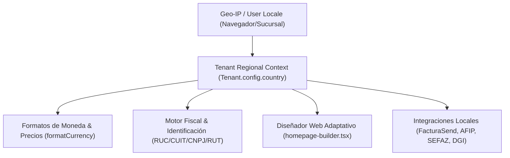

# 🌍 Plan Maestro de Secciones Regionales & Localización Multi-País (OrderFlow Suite)

> **Estado:** Documento Vivo de Arquitectura & Estrategia Regional  
> **Fecha:** 2026-09-09  
> **Alcance:** Multi-Moneda, Fiscalidad Regional, Contenido Adaptativo por Geolocalización IP y Sucursales

---

## 🎯 1. Objetivos de la Expansión Regional

Permitir que el ecosistema **OrderFlow / OmniFlow** se adapte sin fricción a empresas y marcas con presencia multi-país en LATAM y España:
- **Paraguay (PY):** Guaraníes (Gs / PYG), RUC, DNIT/FacturaSend (Facturación Electrónica SIFEN).
- **Argentina (AR):** Pesos Argentinos (ARS / $), CUIT/CUIL, AFIP (Factura Electrónica WSFE).
- **Brasil (BR):** Reales (BRL / R$), CNPJ/CPF, SEFAZ (NFe / NFC-e).
- **Uruguay (UY):** Pesos Uruguayos (UYU / $), RUT, DGI (CFE Facturación Electrónica).
- **Chile (CL):** Pesos Chilenos (CLP / $), RUT, SII.

---

## 🏗️ 2. Pilares de Arquitectura Regional



### 2.1 Configuración Tenant Regional (`Tenant.config.country`)
```json
{
  "country": "PY",
  "currency": "PYG",
  "currencySymbol": "Gs.",
  "locale": "es-PY",
  "taxIdName": "RUC",
  "timezone": "America/Asuncion",
  "deliveryZones": [
    { "zone": "Asunción & Gran Asunción", "cost": 20000 },
    { "zone": "Ciudad del Este", "cost": 35000 }
  ]
}
```

---

## 📋 3. Fases de Desarrollo

### 📍 Fase 1: Motor Multi-Moneda & Identificación Fiscal (Core)
- [ ] Mapeo automático de símbolos y decimales según moneda (`formatCurrency(val, currency)`).
- [ ] Selector dinámico de Tipo de Documento en formularios (`RUC`, `CUIT`, `CNPJ`, `RUT`, `DNI`, `Pasaporte`).

### 🎨 Fase 2: Contenidos Regionales en Homepage Builder (`homepage-builder.tsx`)
- [ ] Filtro por País/Región en bloques visuales (Banners, Promociones y Categorías exclusivas por país).
- [ ] Detección inteligente por IP para pre-seleccionar el catálogo/sucursal regional del visitante.

### 🏛️ Fase 3: Conectores de Facturación Electrónica por País
- [x] **FacturaSend / SIFEN (Paraguay):** Operativo (`facturasend.service.ts`).
- [ ] **AFIP (Argentina):** Conector WSFE v1 para emisión de comprobantes A, B y C.
- [ ] **SEFAZ (Brasil):** Integración NFe/NFC-e para emisión y firmas digitales.
- [ ] **DGI (Uruguay):** Comprobantes Fiscales Electrónicos (CFE).

### 🚚 Fase 4: Zonas de Envío y Sucursales Regionales
- [ ] Moneda y tarifa de envío configurable por sucursal/tienda física.

---

## 📑 Referencia de Archivos Vinculados
- Configuración de Catálogo Social: [social-catalog.tsx](file:///opt/orderflow/frontend/src/pages/admin/social-catalog.tsx)
- Portada Adaptativa: [homepage-builder.tsx](file:///opt/orderflow/frontend/src/pages/admin/homepage-builder.tsx)
- Facturación Electrónica Paraguay: [facturasend.controller.ts](file:///opt/orderflow/backend/src/integrations/facturasend/facturasend.controller.ts)
