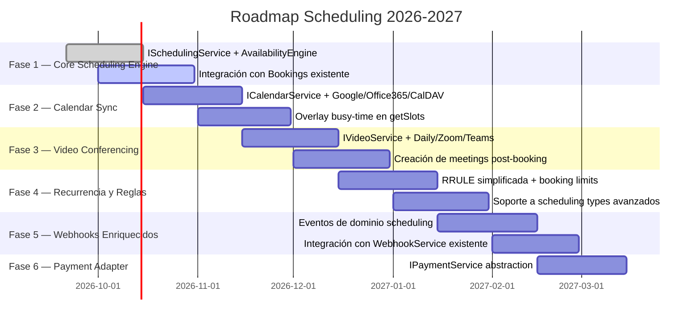

# ROADMAP EJECUTIVO — SCHEDULING (Feature Granular cal.diy)

> **Proyecto:** OrderFlow / OmniFlow → Scheduling Core  
> **Versión Baseline:** v1.35.0  
> **Fecha:** 2026-09-21  
> **Área:** Motor de scheduling/availability multi-tenant, calendar sync, video conferencing, webhooks

---

## 1. Visión Ejecutiva

El módulo **Scheduling** es una **feature granular core** de OmniFlow, extraída selectivamente de cal.diy. No es un microservicio standalone, sino un **servicio NestJS reutilizable** dentro del core que provee lógica de scheduling a cualquier módulo del ecosistema:

- **Bookings** — disponibilidad doble, slots, bloqueos
- **OmniCRM** — programación de seguimientos, recordatorios, reglas de retención
- **HR / Attendance** — turnos laborales, disponibilidad de empleados
- **POS / KDS** — disponibilidad de mesas, estaciones de cocina

Su valor diferencial es la **lógica pura de availability** sin acoplamiento a frameworks externos, manteniendo el modelo multi-tenant `tenantId` de OmniFlow.

---

## 2. Hoja de Ruta

---

## 3. Fases Detalladas

### Fase 1 — ISchedulingService Core (FEAT-141)
**Estado:** 🚧 En planificación  
**Milestone:** v1.36.0  
**Dependencias:** Ninguna

**Objetivo:** Extraer el motor de disponibilidad como servicio core reutilizable.

**Entregables:**
- `backend/src/scheduling/scheduling.service.ts` — Implementación de `ISchedulingService`.
- `backend/src/scheduling/engines/availability.engine.ts` — Lógica pura de cálculo de slots.
- `backend/src/scheduling/engines/busy-times.engine.ts` — Overlay de busy-time desde recursos y excepciones.
- DTOs: `GetSlotsDto`, `CheckAvailabilityDto`, `CreateScheduleDto`.
- Tests unitarios con cobertura > 90%.

**Consumidores:**
- `bookings` — `getAvailability` delega a `ISchedulingService`.
- `customers` — Programar seguimientos en ventanas disponibles.
- `follow-up` — Calcular ventanas de envío sin conflictos.

**Criterios de aceptación:**
- [ ] `ISchedulingService.getSlots()` retorna slots disponibles respetando buffers y excepciones.
- [ ] `ISchedulingService.checkAvailability()` valida doble recurso (profesional + físico).
- [ ] Cache Redis opcional funcional.
- [ ] Tests unitarios > 90% coverage.
- [ ] Integración en `bookings.service.ts` sin romper comportamiento existente.

---

### Fase 2 — Calendar Sync Providers (FEAT-142)
**Estado:** 📋 Planificada  
**Milestone:** v1.37.0  
**Dependencias:** FEAT-141

**Objetivo:** Sincronización bidireccional con Google Calendar, Office 365, CalDAV.

**Entregables:**
- `ICalendarService` interface.
- `GoogleCalendarProvider`, `Office365Provider`, `CalDAVProvider`.
- Modelo `SelectedCalendar` en Prisma.
- Endpoint `POST /api/v1/bookings/:id/calendar/sync`.
- Overlay de busy-time desde calendarios externos en `getSlots`.

**Criterios de aceptación:**
- [ ] Crear booking genera evento en Google Calendar.
- [ ] Cancelar booking elimina evento en Google Calendar.
- [ ] Busy-time de Google Calendar se refleja en `getSlots`.
- [ ] Tests de integración con mocks.

---

### Fase 3 — Video Conferencing Providers (FEAT-143)
**Estado:** 📋 Planificada  
**Milestone:** v1.38.0  
**Dependencias:** FEAT-141

**Objetivo:** Crear meetings en Daily, Zoom, Teams al confirmar scheduling.

**Entregables:**
- `IVideoService` interface.
- `DailyProvider`, `ZoomProvider`, `TeamsProvider`.
- Endpoint `POST /api/v1/bookings/:id/video/create`.
- Guardado de `videoMeetingId` y `videoMeetingUrl` en `AppointmentAssignment`.

**Criterios de aceptación:**
- [ ] Crear booking genera link de video (si está configurado).
- [ ] Actualizar booking actualiza meeting.
- [ ] Cancelar booking elimina meeting.
- [ ] Tests de integración con mocks.

---

### Fase 4 — Recurrencia y Reglas (FEAT-144)
**Estado:** 📋 Planificada  
**Milestone:** v1.39.0  
**Dependencias:** FEAT-141

**Objetivo:** Soporte para eventos recurrentes y reglas de negocio avanzadas.

**Entregables:**
- Motor de recurrencia simplificada (RRULE básico: DAILY, WEEKLY, MONTHLY).
- Validación de `minAdvanceHours`, `maxAdvanceDays`.
- Límites de booking por usuario/tenant.
- Soporte a `schedulingType`: INDIVIDUAL, COLLECTIVE, ROUND_ROBIN, SEATS.

**Criterios de aceptación:**
- [ ] Crear booking recurrente genera múltiples `AppointmentAssignment`.
- [ ] Respetar límites de anticipación.
- [ ] Validar disponibilidad en toda la serie.

---

### Fase 5 — Webhooks Enriquecidos (FEAT-145)
**Estado:** 📋 Planificada  
**Milestone:** v1.40.0  
**Dependencias:** FEAT-141, FEAT-142, FEAT-143, FEAT-144

**Objetivo:** Ampliar el sistema de webhooks existente con eventos de scheduling.

**Entregables:**
- Eventos nuevos: `scheduling.slot.available`, `scheduling.slot.booked`, `scheduling.slot.cancelled`, `scheduling.calendar.synced`, `scheduling.video.created`.
- Reutilizar `WebhookService` y `webhook-queue.producer.ts` existentes.
- DTO `SchedulingWebhookEventDto`.

**Criterios de aceptación:**
- [ ] Webhook de `scheduling.slot.booked` llega al endpoint configurado.
- [ ] Payload estandarizado con `tenantId`, `slotId`, `resourceId`, `timestamp`.
- [ ] Retry automático en caso de fallo.

---

### Fase 6 — Payment Adapter (FEAT-146)
**Estado:** 📋 Planificada  
**Milestone:** v1.41.0  
**Dependencias:** FEAT-142

**Objetivo:** Abstraer pagos para soportar Stripe, Mercado Pago, Pagopar.

**Entregables:**
- `IPaymentService` interface.
- Reutilizar lógica existente en `backend/src/billing/`.
- No portar schema de cal.diy.

**Criterios de aceptación:**
- [ ] Crear booking con pago genera `PaymentIntent`.
- [ ] Capturar pago al confirmar booking.
- [ ] Reembolso al cancelar booking.

---

## 4. Matriz de Madurez

| Componente | Madurez | Estado | Target |
|-----------|---------|--------|--------|
| **ISchedulingService Core** | 0% | 📋 Planificado | v1.36.0 |
| **Calendar Sync** | 0% | 📋 Planificado | v1.37.0 |
| **Video Conferencing** | 0% | 📋 Planificado | v1.38.0 |
| **Recurrencia y Reglas** | 0% | 📋 Planificado | v1.39.0 |
| **Webhooks Enriquecidos** | 0% | 📋 Planificado | v1.40.0 |
| **Payment Adapter** | 0% | 📋 Planificado | v1.41.0 |

---

## 5. Dependencias Externas

| Componente | Riesgo | Mitigación |
|-----------|--------|-----------|
| Google Calendar API | Rate limits, OAuth tokens | Refresh tokens + cache de credenciales. |
| Zoom API | Cambios en endpoints v2 | Fijar versión de API en config. |
| Daily.co | Dependencia externa | Proveer fallback a "sin video". |
| Stripe | Webhooks duplicados | Verificar `idempotency_key` antes de procesar. |

---

## 6. Sincronización

Este roadmap se sincroniza con:
- `/opt/orderflow/docs/plans/scheduling/PLAN_MAESTRO_CALDIY_INTEGRATION.md` — Plan maestro detallado.
- `/opt/orderflow/ROADMAP.md` — Roadmap general del proyecto.
- `/opt/orderflow/featurelist.json` — Features FEAT-141 a FEAT-146.
- `/opt/wiki/orderflow/docs/plans/scheduling/ROADMAP_SCHEDULING.md` — Wiki oficial.
