# Línea de Tiempo y Evolución de OmniFlow

**Última actualización:** 2026-08-13  
**Versión actual:** `v1.20.10`  
**Documento fuente:** `CHANGELOG.md`, `ROADMAP.md`, `featurelist.json`

---

## 📜 Línea de Tiempo

```mermaid
timeline
    title Evolución de OmniFlow / OrderFlow (v0.1.0 → v1.20.6)
    2026-06-15 : v0.1.0 MVP inicial
                  : Multi-tenant API key, Giveaways, WhatsApp catalog
                  : NestJS + Prisma + React + Docker
    2026-06-22 : v0.2.0 Mobile + CI/CD
                  : React Native offline, SQL migrations, GitHub Actions
    2026-07-06 : v0.3.0 Swagger 100% + Staging
                  : 65 endpoints documentados, staging Hetzner operativo
    2026-07-12 : v0.3.1 Gestión Tenants
                  : disable/enable/delete, rol ADMIN
    2026-07-14 : v0.4.0 POS + KDS + Loyalty
                  : POS WebSocket, KDS tiempo real, Loyalty tiers
    2026-07-15 : v0.4.1 Fixes producción + Dominio configurable
    2026-07-15 : v0.4.2 Tauri Desktop POS + Observabilidad
                  : Sentry, Prometheus, dominio configurable
    2026-07-16 : v0.4.3 Testing Expansion (298 tests / 39 suites)
    2026-07-18 : v0.5.0 Traefik v3.3 + App Store
                  : HTTPS automático, Cloudflare DNS, manifiestos Docker
    2026-07-19 : v0.5.1 Observabilidad + RBAC + E2E
                  : API Key rotation, 14 tests Playwright
    2026-07-25 : v0.6.0-v0.7.0 Multi-Tier + Billing + Marketplace
                  : DB dedicada por tenant, 3 microservicios standalone
                  : Stripe/Mercado Pago, TenantThrottlerGuard, k6 CI
    2026-07-25 : v0.8.0 Marketplace SDK + White-Label + Billing
                  : MIDA/SAP, i18n ES/EN/PT, portal suscripciones
    2026-07-25 : v1.0.0 🏆 Commercial Release
                  : Billing SaaS completo, Marketplace, White-label
                  : RBAC 21/33 controllers, 349 tests, Helm charts K8s
    2026-07-26 : v1.1.0 Standalone Suite + Soft-Delete + Redis WS
                  : Redis IoAdapter, soft-delete tenants, App Store search
    2026-07-27 : v1.1.1-v1.1.3 WhatsApp Catalog + File Store
                  : Uploads por tenant, backups comprimidos
    2026-07-30 : v1.1.7 QA E2E Playwright Suite + Subdomain Fixes
    2026-07-31 : v1.1.8-v1.1.9 Homepage Builder + Navegación unificada
    2026-08-01 : v1.3.0-v1.5.0 Cotizaciones + FacturaSend + Enterprise Tenant
                  : ExchangeRate providers (BCP, Chaco, Bonanza)
                  : FacturaSend (SIFEN), fixes producción Traefik
    2026-08-02 : v1.5.1 Responsive Backoffice + Traefik v3.4
    2026-08-03 : v1.5.2-v1.9.0 UX/UI Mobile + Desktop + Testing + Pagopar
                  : Sticky Action Bar, Bottom Sheets, AdaptiveTable
                  : Cobertura tests backend, Pagopar Paraguay
    2026-08-06 : v1.12.0-v1.16.3 Facturación Odoo + Design Tokens
                  : FacturaSend completo, Odoo 19 CE adapter
                  : Design tokens CSS, dark mode contrast fix
    2026-08-09 : v1.17.0-v1.18.0 Follow-Up + Seller Attribution
                  : Cola BullMQ follow-up, sellerId/trafficSource
                  : 523/523 tests, E2E QA ampliada
    2026-08-10 : v1.19.0 ♻️ Rebranding Parcial OmniFlow
                  : Marca pública OmniFlow, capa técnica OrderFlow
                  : Hito histórico de identidad corporativa
    2026-08-15 : v1.20.0
                  : Infrastructure Deploy Manager
    2026-08-12 : v1.20.1
                  : Deploy-manager multi-sistema + Manuales Playwright
                  : Separación deploy OrderFlow vs Odoo desde /admin/deploy
    2026-08-13 : v1.20.2
                  : Mobile admin drawer navigation + Topbar compacto
                  : Bottom nav respeta safe-area, sin duplicación de menú
    2026-08-13 : v1.20.3
                  : Orders debug: state machine, cancel reversals, confirm idempotent
                  : 578 tests, E2E QA clean
    2026-08-13 : v1.20.4
                  : Schema decoupling: Giveaways standalone + Social Catalog/Bio-Links
                  : PostgreSQL schema giveaways created and migrated
    2026-08-13 : v1.20.5
                  : Social Catalog Standalone Extraction
                  : MessagingChannel + CatalogChannelConfig extraídos a standalone
                  : Adapters desacoplados, proxy HTTP en core, 580 tests OK
```

---

## 📊 Matriz de Avance por Componente

### Core & Multi-Tenant Engine

| Componente | Estado | Versión | Notas |
|------------|--------|---------|-------|
| Multi-tenant API Key + JWT Auth | ✅ Completo | v0.1.0 | Aislamiento por `tenantId` |
| Subdominios dinámicos Traefik/Cloudflare | ✅ Completo | v0.5.0 | DNS automático por tenant |
| Multi-Tier Isolation (Shared/Dedicated DB) | ✅ Completo | v0.7.0 | `@TenantPrisma()` + provisioning script |
| Row Level Security (RLS) Base | ✅ Completo | v1.16.1 | Scripts SQL listos para aplicar |
| Tenant Image Isolation | ✅ Completo | v1.16.1 | UploadsController por tenant |
| Soft-Delete Tenants | ✅ Completo | v1.1.0 | Retención 30 días + restore |

### Módulos de Negocio

| Componente | Estado | Versión | Notas |
|------------|--------|---------|-------|
| Catálogo WhatsApp / Social Catalog | ✅ Completo | v1.15.0 | Strategy Pattern multicanal |
| POS Web Offline-First | ✅ Completo | v0.4.0 | Dexie.js + Zustand sync queue |
| KDS (Cocina) en tiempo real | ✅ Completo | v0.4.0 | WebSocket rooms por tenant |
| Loyalty / Fidelización | ✅ Completo | v0.4.0 | Tiers BRONZE→PLATINUM |
| Tauri Desktop Wrapper | ✅ Completo | v0.4.2 | POS nativo + ESC/POS |
| Bio-Links | ✅ Completo | v0.5.0-alpha | Drag & Drop, Fast Checkout |
| Giveaways / Sorteos | ✅ Completo | v0.1.0 | Landing page, Google OAuth |
| Bookings & Agendas | ✅ Completo | v1.9.0 | WhatsApp + Google Calendar sync |
| Follow-Up Omnicanal | ✅ Completo | v1.18.0 | Cola BullMQ, cooldown, adapters |
| Seller Attribution Engine | ✅ Completo | v1.18.0 | sellerId, trafficSource |
| Facturación Electrónica (FacturaSend) | ✅ Completo | v1.4.0 | SIFEN, multi-moneda, IVA 5/10% |
| Cotizaciones Automáticas (PY) | ✅ Completo | v1.3.0 | BCP, Chaco, Bonanza, DólarApi |
| Pagopar (Pasarela PY) | ✅ Completo | v1.9.0 | Webhook, DTOs, módulo dedicado |
| Homepage Builder | ✅ Completo | v1.1.8 | Templates por rubro, bloques dinámicos |
| Mobile App Expo | 🔄 En progreso | v1.12.0 | Client-First + Terminal POS |
| Infrastructure Deploy Manager | 📋 Planificado | v1.10.0 | Multi-sistema desde Super Admin |

### Integraciones & DevOps

| Componente | Estado | Versión | Notas |
|------------|--------|---------|-------|
| Odoo Integration (webhooks + addon) | ✅ Completo | v0.8.0 | Push + pull, addon nativo Odoo 19 CE |
| Odoo 19 CE Adapter | ✅ Completo | v1.17.0 | JSON-RPC + XML-RPC, invoice sync |
| Tango ERP Integration | ✅ Completo | v0.8.0 | Sincronización bidireccional |
| MIDA / SAP Connectors | ✅ Completo | v0.8.0 | Pruebas de conectividad + webhooks |
| Stripe / Mercado Pago Billing | ✅ Completo | v0.8.0 | Webhooks, MRR/ARR, suspensión |
| Traefik v3.4 | ✅ Completo | v1.5.1 | SSL automático, DNS-01 Cloudflare |
| CI/CD GitHub Actions | ✅ Completo | v0.2.0 | Tests, build, deploy automático |
| k6 Load Tests en CI | ✅ Completo | v0.7.0 | Smoke tests continuos |
| Sentry + Prometheus + Grafana | ✅ Completo | v0.4.2 | Observabilidad completa |
| Backup Automatizado | ✅ Completo | v1.1.3 | DB + uploads, verificación integridad |
| Kubernetes Helm Charts | 📋 Estructura Lista | v1.0.0 | `k8s/helm/` preparado para v3.0.0 |

---

## 🛠️ Troubleshooting Histórico

### Despliegue & Infraestructura

| # | Síntoma | Causa raíz | Solución aplicada |
|---|---------|------------|-------------------|
| 1 | Traefik 502 en producción | Servicio no registrado / misma red Docker | Verificar registro en Traefik y conectividad de red |
| 2 | Migraciones inconsistentes en Producción | Baseline migration + duplicados en historial | Baseline migration + limpieza + check preventivo en deploy |
| 3 | DOCKER_API_VERSION too old | Cliente Docker desactualizado en CI/CD | Configurar `DOCKER_API_VERSION=1.55` y endpoint TCP |
| 4 | Login loop por Prisma P1000 | `POSTGRES_PASSWORD` con placeholder | Sincronizar `.env.prod` con credenciales reales |
| 5 | Frontend login no redirigía | Backend en restart loop | Fix de DB password + verificación health check |
| 6 | Nginx no proxyeaba `/api/*` | Configuración Nginx incompleta | Migración completa a Traefik v3.3/v3.4 |
| 7 | Manifiestos módulos no encontrados | `/app/src` ausente en Alpine multi-stage | Algoritmo candidate paths en `ModulesRegistry` |
| 8 | SSL no renovaba | Cloudflare API token sin permisos DNS | Token con permiso `Zone:Read` + `DNS:Edit` |
| 9 | Backup corrupto | Falta de verificación de integridad | Script `verify-backups.sh` + tamaño mínimo |
| 10 | Uploads rotos por tenant | Rutas hardcodeadas sin `tenantId` | UploadsController + paths `/uploads/{tenantId}/{module}/` |

### Multi-Tenant & DNS

| # | Síntoma | Causa raíz | Solución aplicada |
|---|---------|------------|-------------------|
| 11 | Subdominio no resuelve | DNS Cloudflare no propagado | Verificar registro CNAME + TTL |
| 12 | Tenant duplicado en DB | `tenantId` no unique constraint | Agregar índice unique + validación backend |
| 13 | API Key expirada sin aviso | Sin scheduler de rotación | Rotación automática 90 días + auditoría |
| 14 | Sesiones compartidas entre tenants | Redis sin namespace por tenant | Prefijo `sessions:{tenantId}:` en Redis |

### Testing & QA

| # | Síntoma | Causa raíz | Solución aplicada |
|---|---------|------------|-------------------|
| 15 | Tests fallan en CI pero pasan local | Diferente versión Node/OS | Matrix CI con Node 20/22 + Ubuntu |
| 16 | E2E flaky tests | Timing issues en WebSockets | WaitForState + timeouts configurables |
| 17 | Build frontend con chunks corruptos | Cache Vite stale | `vite build --force` + limpia cache |
| 18 | 404 en `/admin/orders` | Routing desactualizado post-refactor | Actualizar `AdminApp.tsx` rutas |

---

## 📈 Métricas de Evolución

| Período | Versiones | Tests | Módulos | Infra |
|---------|-----------|-------|---------|-------|
| Jun 2026 | v0.1.0 → v0.2.0 | 4 → 7 | 3 → 5 | Docker básico |
| Jul 2026 (inicio) | v0.3.0 → v0.5.0 | 7 → 298 | 5 → 12 | Nginx → Traefik v3.3 |
| Jul 2026 (mitad) | v0.5.1 → v1.1.0 | 298 → 349 | 12 → 18 | Traefik v3.3, Cloudflare DNS |
| Jul-Ago 2026 | v1.1.1 → v1.5.2 | 349 → 498 | 18 → 22 | Traefik v3.4, backups |
| Ago 2026 | v1.6.0 → v1.20.0 | 498 → 523+ | 22 → 28 | Deploy Manager planificado |

---

## 🎯 Hitos Clave

| Hito | Fecha | Versión | Impacto |
|------|-------|---------|---------|
| MVP funcional | 2026-06-15 | v0.1.0 | Base técnica NestJS + Prisma |
| Staging productivo | 2026-07-06 | v0.3.0 | Primer deploy real Hetzner |
| POS + KDS + Loyalty | 2026-07-14 | v0.4.0 | Módulos core operativos |
| Traefik v3.3 + DNS automático | 2026-07-18 | v0.5.0 | Infraestructura moderna |
| **Commercial Release** | **2026-07-25** | **v1.0.0** | 🏆 Plataforma SaaS lista para clientes |
| Multi-Tier + Standalone | 2026-07-25 | v0.7.0 | Aislamiento enterprise + microservicios |
| FacturaSend (SIFEN) | 2026-08-01 | v1.4.0 | Facturación electrónica PY |
| **Rebranding OmniFlow** | **2026-08-10** | **v1.19.0** | ♻️ Hito histórico de identidad corporativa |
| Deploy Manager (plan) | 2026-08-11 | v1.10.0 | OmniFlow como plataforma de infraestructura |

---

## 📚 Documentos Relacionados

- [CHANGELOG.md](../CHANGELOG.md)
- [ROADMAP.md](../ROADMAP.md)
- [ROADMAP_MICROSERVICES.md](./ROADMAP_MICROSERVICES.md)
- [featurelist.json](../featurelist.json)
- [Análisis Estado del Arte](./estado_del_arte_analisis.md)
- [Wiki Oficial](https://wiki.marcelompz.github.io/orderflow/)
