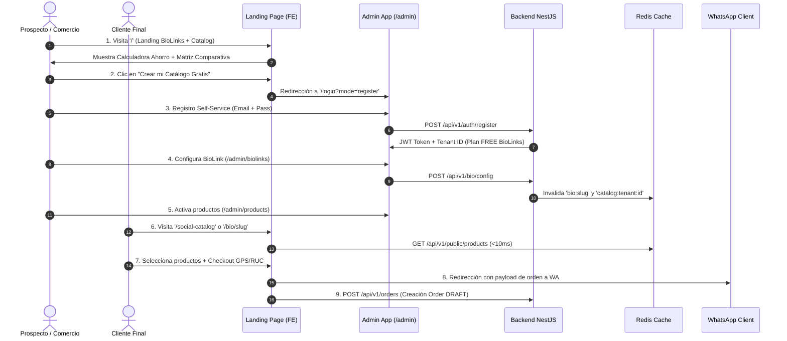

# Guía Técnica & Protocolo E2E de Prueba del Flujo Comercial OmniFlow

> **Caso de Uso:** Recorrido E2E completo desde la Landing Page comercial hasta la primera venta realizada por WhatsApp / Social Catalog en el Plan FREE.  
> **Última Actualización:** 2026-08-13  
> **Versión del Sistema:** `v1.20.6`  

---

## 📐 1. Arquitectura Técnica del Caso de Uso

El flujo comercial de OmniFlow está diseñado bajo una arquitectura de **baja fricción y alta conversión**. Combina enrutamiento dinámico en el Frontend (React/Vite), autenticación multi-tenant atómica (JWT/API Keys), caché perimetral ultra-rápida (Redis Event-Driven) y comunicación omnicanal a WhatsApp:



---

## 🛠️ 2. Fases del Flujo Comercial y Comportamiento del Sistema

### Fase 1: Adquisición en Landing Page Comercial (`/` o `/landing`)
* **Endpoint / Vista:** `LandingBioLinksCatalog.tsx`.
* **Comportamiento del Sistema:**
  * Renderiza de forma incondicional la portada comercial en el dominio raíz (`/`).
  * Ejecuta en el navegador del prospecto la *Calculadora Interactiva de Ahorro* en React (simulando comisiones del 12% vs. 0% de OmniFlow).
  * El CTA *"Crear mi Catálogo Gratis en 3 Minutos"* dirige a `/login?mode=register&ref=fase0`.

### Fase 2: Onboarding Self-Service y Provisioning (`/login`)
* **Endpoint / Backend:** `POST /api/v1/tenants` & `POST /api/v1/auth/login`.
* **Comportamiento del Sistema:**
  * Al registrarse el nuevo comercio, el backend genera un `Tenant` con su respectiva `apiKeySecret` (`sk_...`).
  * Asigna por defecto el módulo `biolinks` activo en la tabla `ModuleInstallation`.
  * Genera el token JWT de sesión con claims de `tenantId` e inyecta la API Key en `localStorage`.

### Fase 3: Configuración de BioLinks y Píxeles (`/admin/biolinks`)
* **Endpoint / Backend:** `GET /api/v1/bio/config` & `POST /api/v1/bio/config`.
* **Comportamiento del Sistema:**
  * El usuario define su `slug` (ejemplo: `/bio/mi-tienda`), avatar, colores, enlaces de redes sociales y píxeles de seguimiento (Meta Pixel ID, Google Analytics, TikTok Pixel).
  * Al guardar los cambios, el backend ejecuta la invalidación de caché atómica en Redis del `BioLinksService`:
    ```typescript
    await this.redisService.del(`cache:biolink:${slug}`);
    await this.redisService.del(`bio:${slug}`);
    await this.redisService.del(`catalog:tenant:${tenantId}`);
    ```

### Fase 4: Carga del Catálogo Social (`/admin/products`)
* **Endpoint / Backend:** `POST /api/v1/products`.
* **Comportamiento del Sistema:**
  * El comerciante sube productos con título, precio en moneda local (₲ PYG / USD), imágenes y modificadores/variaciones.
  * Los productos quedan expuestos inmediatamente a través del endpoint público perimetral `GET /api/v1/public/products`.

### Fase 5: Compra del Cliente Final y Notificación WhatsApp (`/social-checkout`)
* **Endpoint / Backend:** `POST /api/v1/public/orders`.
* **Comportamiento del Sistema:**
  * El cliente final explora el catálogo desde su teléfono móvil.
  * El checkout calcula el costo de entrega según la zona o la geolocalización GPS, captura los datos fiscales obligatorios (RUC / Cédula) e inyecta la atribución de vendedor/canal (`trafficSource: "whatsapp"`).
  * El frontend genera el deep-link hacia la API de WhatsApp con el resumen de la compra e inserta la orden con estado `DRAFT` en la base de datos de OmniFlow, visible al instante en `/admin/orders` y en la pantalla de cocina / POS.

---

## 🎭 3. Protocolo de Ejecución de la Prueba E2E (Automatizada)

El sistema cuenta con un script de prueba automatizada en Playwright que simula este caso de uso de forma headless y genera capturas de pantalla de evidencia.

### Ejecución de la Prueba Automatizada:

```bash
# 1. Ejecutar el flujo comercial E2E automatizado
python3 scripts/generate_user_manual.py --flow commercial_flow --markdown --html

# 2. Verificar la salida de las pruebas y capturas generadas en:
# - docs/manual/screenshots/commercial_flow/
# - docs/manual/commercial_flow.md
```

### Script de Prueba Integrado (`scripts/manual_flows/commercial_flow.py`):
El script ejecuta los 8 pasos críticos del recorrido:
1. `01_landing_page_hero`: Carga de la Landing Page Comercial con la calculadora de ahorro.
2. `02_click_crear_bio_gratis`: Clic en CTA de registro.
3. `03_onboarding_signup_form`: Verificación del formulario de onboarding.
4. `04_admin_biolinks_setup`: Acceso al panel de configuración BioLinks.
5. `05_admin_social_catalog_products`: Carga y verificación de productos en catálogo.
6. `06_public_biolink_view`: Renderizado público de la bio/catálogo para el cliente final.
7. `07_public_checkout_whatsapp`: Verificación del checkout express con GPS/RUC.
8. `08_admin_orders_received`: Confirmación de la orden recibida en la lista de pedidos del panel admin.

---

## 🛠️ 4. Barrera de Calidad & Asertividad

Para dar por aprobada la prueba E2E comercial en cualquier entorno (Local, Staging o Producción), se exige cumplir la barrera `./scripts/init.sh`:

- [x] **0 Errores HTTP 500/502** en los endpoints de auth, catálogo y órdenes.
- [x] **0 Excepciones JS en consola** durante el recorrido del cliente final.
- [x] **0 Imágenes rotas** en la vista pública de BioLinks y Catálogo Social (`naturalWidth > 0`).
- [x] **Invalidación en Redis < 10ms** al actualizar el catálogo o BioLinks desde el admin.
