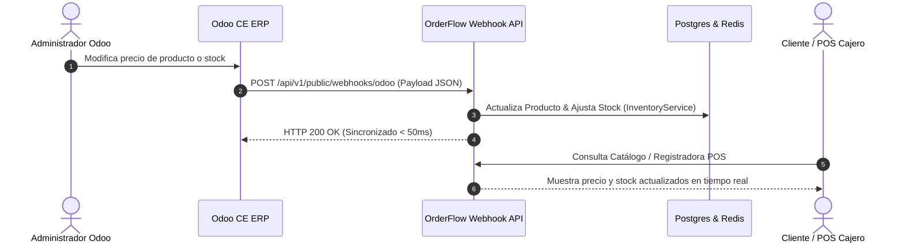

# 📘 Manual de Usuario: Sincronización Bidireccional de Webhooks Odoo ➔ OrderFlow en Tiempo Real (`FEAT-090`)

> **Módulo:** Integraciones / Odoo Sync  
> **Ubicación del Documento:** `docs/user-manuals/11-manual-sincronizacion-webhooks-odoo.md`  
> **Versión de OrderFlow:** v1.20.25+  
> **Versión de Odoo Soportada:** Odoo CE / Enterprise (v16, v17, v18, v19)  
> **Fecha:** 25 de Agosto de 2026

---

## 1. INTRODUCCIÓN Y PROPÓSITO

Este manual guía paso a paso en la activación y uso de la **Sincronización en Tiempo Real mediante Webhooks** entre **Odoo CE** y el acelerador comercial **OrderFlow**.

Con esta característica (`FEAT-090`), cualquier alta, modificación o eliminación de **Productos**, **Categorías Jerárquicas** o **Clientes** realizada en Odoo se impacta **instantáneamente (< 100ms)** en el catálogo social web, bot de WhatsApp y cajas registradoras POS de OrderFlow, sin necesidad de ejecutar sincronizaciones manuales o tareas por lotes.

---

## 2. REQUISITOS PREVIOS

1. Instancia activa de **OrderFlow (v1.20.25+)**.
2. Instancia activa de **Odoo CE/Enterprise** en contenedor Docker o servidor independiente (ej. `/opt/odoo-deploy/19/` o `/srv/odoo-deploy`).
3. Credenciales de administrador en Odoo para instalar aplicaciones o configurar acciones automatizadas.
4. El `tenantId` del comercio en OrderFlow (ej. `provecchio-dimora-001`).

---

## 3. INSTALACIÓN Y CONFIGURACIÓN EN ODOO

Existen dos opciones de activación: el **Addon Oficial `orderflow_integration`** (Recomendado) o **Acciones Automatizadas Nativas (`base_automation`)**.

### 🔹 Opción A: Instalación del Addon Oficial `orderflow_integration` (Recomendado)

#### Paso 1: Copiar el Addon al Directorio de Addons de Odoo
El addon se encuentra disponible en el repositorio de OrderFlow. Cópielo al directorio compartido de addons de Odoo en su servidor:

```bash
cp -r /opt/orderflow/odoo-addons/orderflow_integration /srv/odoo-addons/
```

#### Paso 2: Instalar el Módulo en la Interfaz de Odoo
1. Inicie sesión en Odoo como Administrador.
2. Ingrese a **Ajustes (Settings)** y active el **Modo Desarrollador (Developer Mode)** al final de la página.
3. Vaya al menú **Aplicaciones (Apps)**.
4. Haga clic en **Actualizar Lista de Aplicaciones (Update Apps List)** en la barra superior.
5. En la barra de búsqueda, elimine el filtro *"Aplicaciones"* y busque `OrderFlow Integration`.
6. Haga clic en **Instalar (Install)**.

#### Paso 3: Configurar los Parámetros de Conexión
1. Vaya a **Ajustes ➔ Técnico ➔ OrderFlow Integration Config** (o busque `orderflow.config`).
2. Cree un nuevo registro con los siguientes campos:
   - **OrderFlow API URL:** `https://midominio.com` (o la URL de su servidor OrderFlow).
   - **Tenant ID:** Su ID de comercio (ej. `provecchio-dimora-001`).
   - **API Key:** Su clave secreta de API de OrderFlow.
   - **Activo (Active):** `Marcado`.
3. Guarde los cambios.

---

### 🔹 Opción B: Configuración mediante Acciones Automatizadas Nativas (`base_automation`)

Si prefiere no copiar el módulo a la carpeta addons, puede usar las reglas nativas de Odoo:

1. En Odoo, instale el módulo **Acciones Automatizadas** (`base_automation`).
2. Vaya a **Ajustes ➔ Técnico ➔ Acciones Automatizadas**.
3. Cree una nueva regla:
   - **Nombre:** `OrderFlow - Sync Producto en Tiempo Real`
   - **Modelo:** `Producto (product.template)`
   - **Disparador:** *Al crear o actualizar*
4. En **Acción a realizar**, seleccione **Código Python** y pegue el siguiente fragmento:

```python
import requests, json

url = "https://midominio.com/api/v1/public/webhooks/odoo"
payload = {
    "tenantId": "provecchio-dimora-001",
    "model": "product.template",
    "event": "write" if record.create_date != record.write_date else "create",
    "odooId": record.id,
    "data": {
        "name": record.name,
        "default_code": record.default_code,
        "list_price": record.list_price,
        "standard_price": record.standard_price,
        "qty_available": record.qty_available,
        "category_id": record.categ_id.name
    }
}
try:
    requests.post(url, json=payload, timeout=3)
except Exception as e:
    pass
```

---

## 4. FUNCIONAMIENTO Y CASOS DE USO EN TIEMPO REAL

Una vez configurado, OrderFlow procesará automáticamente los siguientes eventos:



### 📦 A. Productos (`product.template` / `product.product`)
- **Modificación de Precio/Nombre:** Al cambiar el precio o nombre de un producto en Odoo, la tienda web, catálogo social y POS reflejan el nuevo valor al instante.
- **Ajuste de Stock:** Al registrar un inventario o movimiento en Odoo, el campo `qty_available` invoca internamente `InventoryService.adjustStock()` manteniendo alineado el stock disponible en caja.

### 📂 B. Categorías Jerárquicas (`product.category` / `pos.category`)
- Al crear una nueva categoría o cambiar su categoría padre en Odoo, OrderFlow actualiza la jerarquía N-niveles (`parentId`, `slug`, `odooProductCategoryId`) inmediatamente.

### 👥 C. Clientes (`res.partner`)
- Al dar de alta un cliente con su RUC/CI en Odoo, se crea o actualiza en la base de clientes de OrderFlow (`Customer`), vinculando su `odooPartnerId`.

---

## 5. DIAGNÓSTICO Y RESOLUCIÓN DE PROBLEMAS (TROUBLESHOOTING)

### ❓ El webhook no se refleja en OrderFlow
1. **Verificar logs del backend de OrderFlow:**
   ```bash
   docker logs --tail 100 1a35637687cb_orderflow-backend-prod | grep OdooWebhook
   ```
   *Respuesta esperada:* `[OdooWebhook] Procesando evento 'write' del modelo 'product.template' (ID: 42)`

2. **Verificar conectividad desde el contenedor de Odoo:**
   Ejecute un test `curl` desde el contenedor de Odoo hacia OrderFlow:
   ```bash
   curl -X POST https://midominio.com/api/v1/public/webhooks/odoo \
     -H "Content-Type: application/json" \
     -d '{"tenantId":"provecchio-dimora-001","model":"product.template","event":"write","odooId":99,"data":{"name":"Test Conectividad"}}'
   ```

3. **Verificar `tenantId` correcto:**
   Asegúrese de que el `tenantId` configurado en `orderflow.config` en Odoo coincida exactamente con el subdominio o ID registrado en OrderFlow.

---

## 6. CONCLUSIÓN

La sincronización bidireccional en tiempo real garantiza la **velocidad extrema en ventas (Front-Office)** mientras Odoo conserva el **rigor administrativo (Back-Office)**, brindando una experiencia omnicanal integrada de clase mundial.
