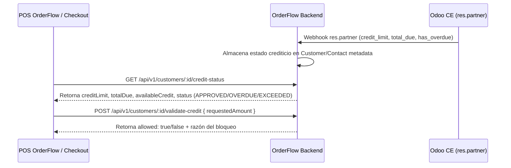

# 📘 Manual de Usuario: Cartera de Clientes, Cuentas por Cobrar y Límite de Crédito Odoo (`FEAT-091`)

> **Módulo:** Integraciones / Clientes & Crédito Odoo  
> **Ubicación del Documento:** `docs/user-manuals/12-manual-cartera-clientes-limite-credito-odoo.md`  
> **Versión de OrderFlow:** v1.20.26+  
> **Versión de Odoo Soportada:** Odoo CE (v14, v18, v19)  
> **Fecha:** 25 de Agosto de 2026

---

## 1. INTRODUCCIÓN Y PROPÓSITO

Este manual instruye sobre la consulta y control en tiempo real de la **cartera de clientes, saldos pendientes y límites de crédito** asignados en **Odoo CE (`res.partner.credit_limit`)** desde la app POS y el checkout de OrderFlow (`FEAT-091`).

Con esta funcionalidad, el operador de caja o la tienda web puede validar instantáneamente antes de otorgar una venta a crédito:
1. Si el cliente posee facturas vencidas impagas en Odoo (`hasOverdueInvoices`).
2. Si el monto solicitado supera el crédito disponible asignado en Odoo (`availableCredit`).

---

## 2. FLUJO DE FUNCIONAMIENTO



---

## 3. CONSULTA Y VALIDACIÓN EN LA API DE ORDERFLOW

### 🔹 Endpoint 1: Consulta del Estado Crediticio (`GET /api/v1/customers/:id/credit-status`)

**Respuesta de Ejemplo:**
```json
{
  "customerId": "cust-1002",
  "name": "Comercial Asunción SRL",
  "taxId": "80012345-6",
  "creditLimit": 10000000,
  "totalDue": 2500000,
  "availableCredit": 7500000,
  "hasOverdueInvoices": false,
  "status": "APPROVED",
  "pricelistId": 2
}
```

### 🔹 Endpoint 2: Validación Pre-Venta a Crédito (`POST /api/v1/customers/:id/validate-credit`)

**Cuerpo de la Solicitud:**
```json
{
  "requestedAmount": 3000000
}
```

**Respuesta (Aprobado):**
```json
{
  "allowed": true,
  "availableCredit": 7500000,
  "requestedAmount": 3000000,
  "remainingCreditAfter": 4500000,
  "message": "Venta a crédito aprobada"
}
```

**Respuesta (Bloqueado por Facturas Vencidas):**
```json
{
  "allowed": false,
  "reason": "OVERDUE_INVOICES",
  "message": "El cliente posee facturas vencidas impagas en Odoo CE"
}
```

---

## 4. CASOS DE USO Y ALERTAS EN EL POS

1. **Cliente al día dentro de su límite:** La venta a crédito se procesa normalmente.
2. **Cliente con Facturas Vencidas:** La app POS muestra una alerta roja impidiendo seleccionar la modalidad de pago *"Venta a Crédito"*, solicitando cobro al contado o regularización en Odoo.
3. **Exceso de Límite:** Si el monto de la compra suma un saldo mayor al crédito disponible, el sistema sugiere realizar un pago parcial al contado.
