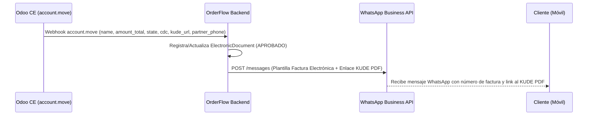

# 📘 Manual de Usuario: Facturación Legal `account.move` y Notificación SIFEN por WhatsApp (`FEAT-092`)

> **Módulo:** Integraciones / Facturación Legal & WhatsApp  
> **Ubicación del Documento:** `docs/user-manuals/13-manual-facturacion-legal-notificacion-sifen-whatsapp.md`  
> **Versión de OrderFlow:** v1.20.27+  
> **Versión de Odoo Soportada:** Odoo CE (v14, v18, v19)  
> **Fecha:** 25 de Agosto de 2026

---

## 1. INTRODUCCIÓN Y PROPÓSITO

Este manual detalla el proceso de **sincronización asíncrona de comprobantes fiscales legales (`account.move`)** desde Odoo CE / Facturasend y el **envío automático del comprobante electrónico (KUDE PDF)** al teléfono WhatsApp del cliente (`FEAT-092`).

Al emitirse o confirmarse una factura en Odoo CE o Facturasend:
1. Se registra el comprobante en OrderFlow con su estado tributario (`posted` / `APROBADO`) y CDC (Código de Control Documental).
2. Se despacha instantáneamente una notificación por WhatsApp al cliente con el enlace de descarga del KUDE PDF.

---

## 2. FLUJO DE FACTURACIÓN Y NOTIFICACIÓN

---

## 3. FORMATO DEL MENSAJE WHATSAPP AL CLIENTE

Cuando una factura se emite exitosamente, el cliente recibe un mensaje formateado como el siguiente:

> 📩 **WhatsApp al Cliente:**  
> *"Hola Juan Pérez, tu Factura Electrónica #INV/2026/0001 por PYG 150.000 ha sido emitida y aprobada por la DNIT/SET. Puedes consultar y descargar tu KUDE PDF en: https://sifen.set.gov.py/kude/0180055123456789"*

---

## 4. REGISTRO EN EL PANEL ADMINISTRATIVO

1. Ingrese a **Administración ➔ Facturación / Documentos Electrónicos** (`/admin/electronic-documents`).
2. Se visualiza la lista de facturas emitidas con su estado SIFEN (`APROBADO`, `PENDIENTE`, `RECHAZADO`), el CDC asignado y los enlaces directos al archivo XML firmado y KUDE PDF.
