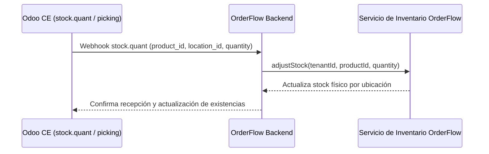

# 📘 Manual de Usuario: Sincronización Multibodega y Albaranes de Entrega Odoo (`FEAT-094`)

> **Módulo:** Inventario / Multibodega & Albaranes  
> **Ubicación del Documento:** `docs/user-manuals/15-manual-inventario-multibodega-albaranes-odoo.md`  
> **Versión de OrderFlow:** v1.20.29+  
> **Versión de Odoo Soportada:** Odoo CE (v14, v18, v19)  
> **Fecha:** 25 de Agosto de 2026

---

## 1. INTRODUCCIÓN Y PROPÓSITO

Este manual describe el funcionamiento de la **Sincronización Multibodega y Albaranes de Entrega (`stock.quant` / `stock.picking`)** entre Odoo CE y OrderFlow (`FEAT-094`).

Permite mantener el stock físico actualizado por depósito/ubicación en tiempo real y registrar los albaranes de salida/despacho cuando se confirman entregas en la plataforma commercial.

---

## 2. FLUJO DE MOVIMIENTOS Y ALBARANES

---

## 3. GESTIÓN MULTIBODEGA EN ORDERFLOW

1. En el panel de administración **Inventario ➔ Depósitos y Ubicaciones** (`/admin/inventory`), se vinculan los identificadores de bodegas de Odoo (`WH/Stock`, `WH/Output`, etc.).
2. Cada ajuste o transferencia física en Odoo actualiza la disponibilidad del producto en las tiendas web y cajas registradoras POS de OrderFlow asignadas a dicha bodega.
