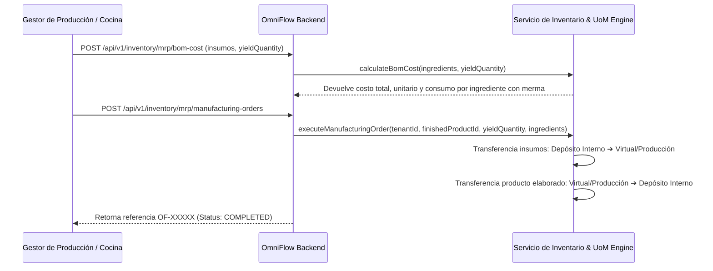

# 📘 Manual de Usuario: OmniManufacturing MRP, Escandallos BoM y Conversión UoM (`FEAT-096`)

> **Módulo:** Manufactura / MRP, Escandallos & Unidades de Medida  
> **Ubicación del Documento:** `docs/user-manuals/17-manual-manufactura-mrp-escandallos-uom.md`  
> **Versión de OrderFlow / OmniFlow:** v1.20.31+  
> **Versión de Odoo Soportada:** Odoo CE (v14, v18, v19)  
> **Fecha:** 25 de Agosto de 2026

---

## 1. INTRODUCCIÓN Y PROPÓSITO


Este manual guía en la operación del módulo **OmniManufacturing MRP (`FEAT-096`)** para la gestión de producción por lotes, costeo de escandallos gastronómicos y conversión entre Unidades de Medida (UoM).

Con esta funcionalidad, la cocina, panadería o centro de manufactura puede:
1. Comprar insumos a granel (ej. bolsas de 50 Kg) y consumirlos en gramos ($g$) en recetas sin desfasar el inventario ni los costos.
2. Calcular el costo teórico y real por porción/unidad producida incluyendo el porcentaje de merma ($scrap$).
3. Ejecutar órdenes de fabricación que descuentan automáticamente las materias primas e incrementan el producto elaborado.

---

## 2. FLUJO DE FABRICACIÓN Y COSTEO



---

## 3. USO DE ENDPOINTS DE LA API MRP

### 🔹 Endpoint 1: Conversión de Unidades de Medida (`POST /api/v1/inventory/mrp/convert-uom`)

**Cuerpo de la Solicitud (Convertir 50 Kg a gramos):**
```json
{
  "amount": 50,
  "fromRatio": 1000,
  "toRatio": 1
}
```

**Respuesta:**
```json
{
  "amount": 50,
  "converted": 50000
}
```

### 🔹 Endpoint 2: Análisis de Costo de Escandallo (`POST /api/v1/inventory/mrp/bom-cost`)

**Cuerpo de la Solicitud:**
```json
{
  "yieldQuantity": 200,
  "ingredients": [
    { "productId": "insumo-harina", "quantity": 10, "unitCost": 4500, "scrapPercentage": 0 },
    { "productId": "insumo-levadura", "quantity": 0.2, "unitCost": 20000, "scrapPercentage": 5 }
  ]
}
```

**Respuesta:**
```json
{
  "totalMaterialCost": 49200,
  "unitCost": 246,
  "yieldQuantity": 200,
  "ingredients": [
    { "productId": "insumo-harina", "quantity": 10, "unitCost": 4500, "effectiveQuantity": 10, "lineCost": 45000 },
    { "productId": "insumo-levadura", "quantity": 0.2, "unitCost": 20000, "effectiveQuantity": 0.21, "lineCost": 4200 }
  ]
}
```

### 🔹 Endpoint 3: Ejecución de Orden de Fabricación (`POST /api/v1/inventory/mrp/manufacturing-orders`)

**Cuerpo de la Solicitud:**
```json
{
  "finishedProductId": "prod-pan-frances",
  "yieldQuantity": 200,
  "reference": "OF-PAN-2026-001",
  "ingredients": [
    { "productId": "insumo-harina", "quantity": 10, "unitCost": 4500 },
    { "productId": "insumo-levadura", "quantity": 0.2, "unitCost": 20000, "scrapPercentage": 5 }
  ]
}
```

**Respuesta:**
```json
{
  "success": true,
  "reference": "OF-PAN-2026-001",
  "finishedProductId": "prod-pan-frances",
  "yieldQuantity": 200,
  "status": "COMPLETED"
}
```
