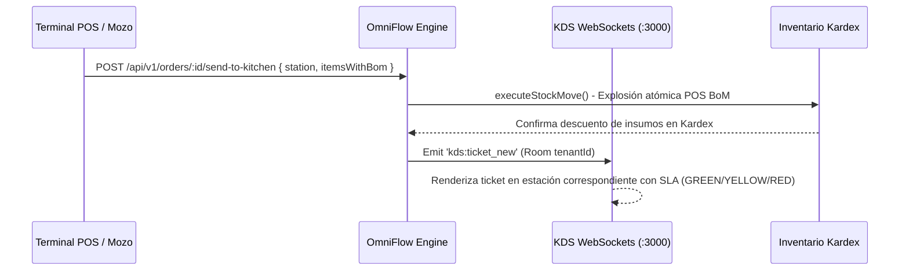

# 📘 Manual de Usuario: OmniPOS & KDS Multi-Estación con Explosión Atómica de Recetas (`FEAT-097`)

> **Módulo:** POS / KDS Cocina & Explosión de Recetas (POS BoM)  
> **Ubicación del Documento:** `docs/user-manuals/18-manual-omnipos-kds-recetas-bom.md`  
> **Versión de OrderFlow / OmniFlow:** v1.20.32+  
> **Versión de Odoo Soportada:** Odoo CE (v14, v18, v19)  
> **Fecha:** 25 de Agosto de 2026

---

## 1. INTRODUCCIÓN Y PROPÓSITO


Este manual detalla el uso del sistema **OmniPOS & KDS Multi-Estación (`FEAT-097`)** para el despacho de pedidos en cocina, enrutamiento por estaciones de trabajo (`PreparationStation`), control de SLA por semáforo de tiempos y explosión atómica de recetas (POS BoM).

Al enviar una comanda desde la registradora POS o terminal de mozo:
1. Se genera y enruta el ticket de despacho hacia la pantalla de cocina correspondiente (`GRILL`, `PASTRY`, `BAR`, `KITCHEN`).
2. Se descuentan automáticamente en tiempo real las materias primas del Kardex según la receta del producto formulada.
3. Se actualiza el estado del pedido en la pantalla KDS con su color semáforo SLA de atención (`GREEN`, `YELLOW`, `RED`).

---

## 2. FLUJO DE TRABAJO Y ENRUTAMIENTO



---

## 3. SEMÁFORO SLA DE PREPARACIÓN EN KDS

| Color Semáforo SLA | Tiempo Transcurrido | Significado Operativo | Acción Recomendada |
| :---: | :---: | :--- | :--- |
| 🟢 **GREEN** | **0 a 8 minutos** | Comanda a tiempo y en preparación normal | Elaboración regular en estación |
| 🟡 **YELLOW** | **9 a 15 minutos** | Tiempo cercano al límite de servicio | Priorizar atención |
| 🔴 **RED** | **> 15 minutos** | Comanda demorada (Alerta visual parpadeante) | Atención prioritaria inmediata |

---

## 4. ENDPOINTS DE LA API POS & KDS

### 🔹 Endpoint 1: Enviar Pedido a Cocina con Explosión BoM (`POST /api/v1/orders/:id/send-to-kitchen`)

**Cuerpo de la Solicitud:**
```json
{
  "station": "GRILL",
  "tableNumber": "MESA 5",
  "itemsWithBom": [
    {
      "productId": "prod-hamburguesa-doble",
      "quantity": 2,
      "ingredients": [
        { "productId": "insumo-medallon-carne", "quantity": 0.4 },
        { "productId": "insumo-queso-cheddar", "quantity": 0.04 }
      ]
    }
  ]
}
```

### 🔹 Endpoint 2: Obtener Tickets Activos en KDS (`GET /api/v1/orders/kds/tickets?station=GRILL`)

**Respuesta de Ejemplo:**
```json
[
  {
    "orderId": "ord-1043",
    "tenantId": "provecchio-dimora-001",
    "channel": "pos",
    "status": "PREPARING",
    "createdAt": "2026-08-25T23:10:00.000Z",
    "elapsedMinutes": 12,
    "sla": "YELLOW",
    "station": "GRILL",
    "lines": [
      { "productId": "prod-hamburguesa-doble", "quantity": 2 }
    ]
  }
]
```
