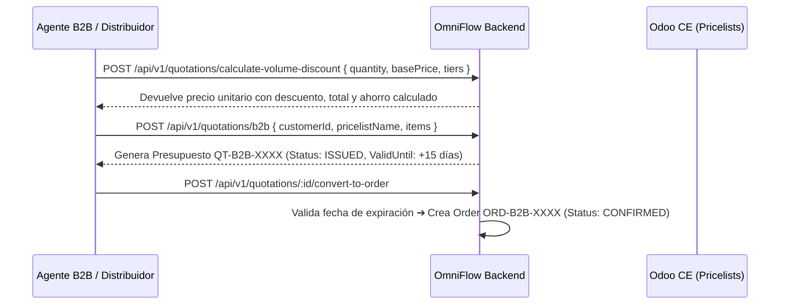

# 📘 Manual de Usuario: Fuerza de Ventas B2B — Presupuestos, Listas de Precios Mayoristas y Descuentos por Volumen (`FEAT-098`)

> **Módulo:** Ventas B2B / Presupuestos & Listas de Precios  
> **Ubicación del Documento:** `docs/user-manuals/19-manual-fuerza-de-ventas-b2b-presupuestos.md`  
> **Versión de OrderFlow / OmniFlow:** v1.20.33+  
> **Versión de Odoo Soportada:** Odoo CE (v14, v18, v19)  
> **Fecha:** 26 de Agosto de 2026

---

## 1. INTRODUCCIÓN Y PROPÓSITO


Este manual instruye sobre el funcionamiento de la **Suite de Fuerza de Ventas B2B (`FEAT-098`)** para la formulación de cotizaciones mayoristas, listas de precios diferenciadas por cliente (`res.partner.property_product_pricelist` en Odoo) y cálculo automático de descuentos por escalas de cantidad/volumen.

Con esta funcionalidad, el equipo comercial B2B o los distribuidores pueden:
1. Crear presupuestos vinculados a listas de precios mayoristas con fecha límite de validez.
2. Aplicar descuentos porcentuales automáticos al alcanzar tramos de cantidad (ej. 10+ unidades 5%, 50+ unidades 12%, 100+ unidades 20%).
3. Convertir presupuestos vigentes directamente en pedidos confirmados para su preparación e invoice.

---

## 2. FLUJO DE TRABAJO B2B



---

## 3. ENDPOINTS DE LA API B2B

### 🔹 Endpoint 1: Calcular Descuento por Volumen (`POST /api/v1/quotations/calculate-volume-discount`)

**Cuerpo de la Solicitud:**
```json
{
  "quantity": 60,
  "basePrice": 100000,
  "tiers": [
    { "minQuantity": 10, "discountPercent": 5 },
    { "minQuantity": 50, "discountPercent": 12 },
    { "minQuantity": 100, "discountPercent": 20 }
  ]
}
```

**Respuesta:**
```json
{
  "quantity": 60,
  "basePrice": 100000,
  "discountPercent": 12,
  "unitPriceAfterDiscount": 88000,
  "totalPrice": 5280000,
  "totalSavings": 720000
}
```

### 🔹 Endpoint 2: Crear Presupuesto B2B (`POST /api/v1/quotations/b2b`)

**Cuerpo de la Solicitud:**
```json
{
  "customerId": "cust-b2b-corporate",
  "pricelistName": "Distribuidor Mayorista Tier 3",
  "validityDays": 30,
  "items": [
    {
      "productId": "prod-servidor-x100",
      "quantity": 60,
      "unitPrice": 100000,
      "volumeTiers": [
        { "minQuantity": 10, "discountPercent": 5 },
        { "minQuantity": 50, "discountPercent": 12 }
      ]
    }
  ]
}
```

### 🔹 Endpoint 3: Convertir Presupuesto a Pedido (`POST /api/v1/quotations/:id/convert-to-order`)

**Respuesta:**
```json
{
  "id": "ord-b2b-987654",
  "tenantId": "provecchio-dimora-001",
  "channel": "pos",
  "totalAmount": 5280000,
  "notes": "Convertido desde Presupuesto B2B QT-B2B-PROV-17876",
  "lines": [
    { "productId": "prod-servidor-x100", "quantity": 60, "priceAtSale": 88000, "subtotal": 5280000 }
  ]
}
```
