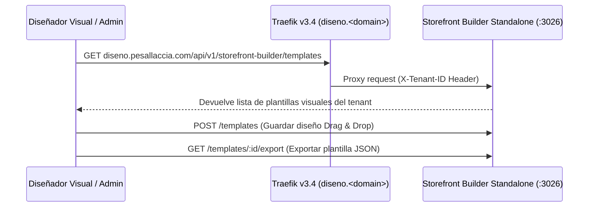

# 📘 Manual de Usuario: Storefront & Web Builder Standalone (`FEAT-099`)

> **Módulo:** Microservicios Standalone / Diseñador Visual Drag & Drop  
> **Ubicación del Documento:** `docs/user-manuals/20-manual-storefront-builder-standalone.md`  
> **Versión de OrderFlow / OmniFlow:** v1.20.34+  
> **Puerto & Routing Traefik:** `:3026` / `diseno.<domain>`  
> **Fecha:** 26 de Agosto de 2026

---

## 1. INTRODUCCIÓN Y PROPÓSITO


Este manual instruye sobre la operación del microservicio desacoplado **Storefront & Web Builder Standalone (`FEAT-099`)** para el diseño visual Drag & Drop de tiendas sociales, Landing Pages, Catálogos WhatsApp y Bio-Links.

Con esta aplicación independiente, los administradores y diseñadores pueden:
1. Construir interfaces visuales seleccionando componentes prediseñados (`HERO`, `CATALOG_GRID`, `PROMO_BANNER`, `TESTIMONIALS`).
2. Personalizar paletas de colores, tipografías y banners sin escribir código.
3. Exportar e importar plantillas en formato JSON por tenant.

---

## 2. FLUJO DE ARQUITECTURA DESACOPLADA



---

## 3. COMPONENTES DISPONIBLES EN EL DISEÑADOR

| Bloque | Tipo de Componente | Uso Recomendado |
| :--- | :---: | :--- |
| **`HERO`** | Banner Principal | Banner promocional con título, subtítulo e imagen de portada |
| **`CATALOG_GRID`** | Grilla de Productos | Despliegue de productos destacados en cuadrícula o lista |
| **`PROMO_BANNER`** | Franja Promocional | Anuncios de ofertas, códigos de descuento o envíos gratis |
| **`TESTIMONIALS`** | Reseñas de Clientes | Testimonios y valoraciones de compradores |
| **`CONTACT_MAP`** | Ubicación & Contacto | Mapa de geolocalización, dirección y botón de WhatsApp |

---

## 4. ENDPOINTS DE LA API STANDALONE (`:3026`)

### 🔹 Endpoint 1: Guardar Plantilla Visual (`POST /api/v1/storefront-builder/templates`)

**Cuerpo de la Solicitud:**
```json
{
  "name": "Plantilla Gastronomía Verano",
  "category": "GASTRONOMY",
  "themeConfig": {
    "primaryColor": "#007bff",
    "secondaryColor": "#17a2b8",
    "fontFamily": "Poppins"
  },
  "blocks": [
    { "id": "b-1", "type": "HERO", "title": "OFERTAS DE VERANO" },
    { "id": "b-2", "type": "CATALOG_GRID", "title": "Menú Destacado" }
  ]
}
```

### 🔹 Endpoint 2: Exportar Plantilla JSON (`GET /api/v1/storefront-builder/templates/:id/export`)

**Respuesta:**
```json
{
  "exporter": "OmniFlow Storefront Builder Standalone v1.20.34",
  "tenantId": "provecchio-dimora-001",
  "exportedAt": "2026-08-26T01:15:00.000Z",
  "template": {
    "id": "tpl-1787719",
    "name": "Plantilla Gastronomía Verano",
    "themeConfig": { "primaryColor": "#007bff" }
  }
}
```
