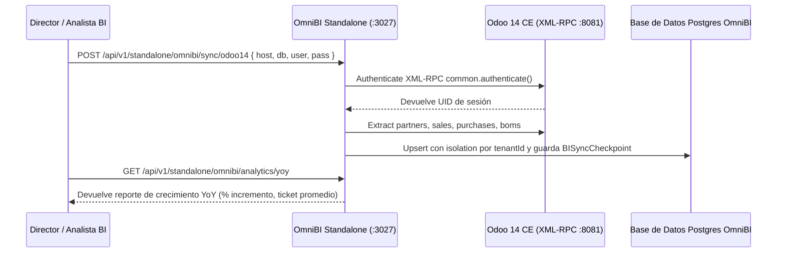

# 📘 Manual de Usuario: OmniBI Analytics Standalone — Ingesta YoY y BI de Rentabilidad (`FEAT-100`)

> **Módulo:** Microservicios Standalone / Inteligencia de Negocio & Analítica YoY  
> **Ubicación del Documento:** `docs/user-manuals/21-manual-omnibi-analytics-yoy.md`  
> **Versión de OrderFlow / OmniFlow:** v1.20.35+  
> **Puerto & Routing Traefik:** `:3027` / `bi.<domain>`  
> **Fecha:** 26 de Agosto de 2026

---

## 1. INTRODUCCIÓN Y PROPÓSITO


Este manual instructivo detalla el funcionamiento del microservicio **OmniBI Analytics Standalone (`FEAT-100`)**, el motor de Business Intelligence para la ingesta histórica read-only de Odoo 14 CE (vía XML-RPC) y la consolidación de analítica comparativa Año contra Año (YoY - Year-over-Year) de ventas omnicanal.

Mediante este módulo desacoplado, los directores financieros y gerentes de operaciones pueden:
1. Sincronizar de forma no destructiva la historia completa de ventas (`sale.order`), compras (`purchase.order`), contactos (`res.partner`) y listas de materiales (`mrp.bom`) desde instancias de Odoo 14 CE.
2. Comparar el desempeño comercial en vivo de OmniFlow POS & Tiendas contra los períodos históricos pasados.
3. Monitorear puntos de control de sincronización (`BISyncCheckpoint`) garantizando aislamiento multi-tenant estricto.

---

## 2. FLUJO DE ARQUITECTURA DE INGESTA HISTÓRICA



---

## 3. ENDPOINTS DE LA API OMNIBI (`:3027`)

### 🔹 Endpoint 1: Ejecutar Ingesta Histórica Odoo 14 (`POST /api/v1/standalone/omnibi/sync/odoo14`)

**Cuerpo de la Solicitud:**
```json
{
  "host": "localhost",
  "port": 8081,
  "db": "db_provecchio_legacy",
  "user": "admin",
  "pass": "admin",
  "tenantId": "provecchio-dimora-001"
}
```

**Respuesta:**
```json
{
  "success": true,
  "message": "Ingesta histórica completada exitosamente",
  "extractedContactsCount": 150,
  "extractedSalesCount": 1200,
  "extractedPurchasesCount": 80
}
```

### 🔹 Endpoint 2: Comparativo Analítico YoY (`GET /api/v1/standalone/omnibi/analytics/yoy`)

**Respuesta:**
```json
{
  "tenantId": "provecchio-dimora-001",
  "period": "Year-over-Year (YoY)",
  "totalSales": 57780000,
  "salesGrowth": 28.4,
  "totalOrders": 1464,
  "avgTicket": 39467.21,
  "activeCustomers": 150,
  "historicalData": {
    "source": "Odoo 14 Legacy (Provecchio)",
    "totalSales": 45000000,
    "ordersCount": 1200
  },
  "currentData": {
    "source": "Odoo 18 CE + OmniFlow POS",
    "totalSales": 57780000,
    "ordersCount": 1464
  },
  "growthPercentage": 28.4
}
```
