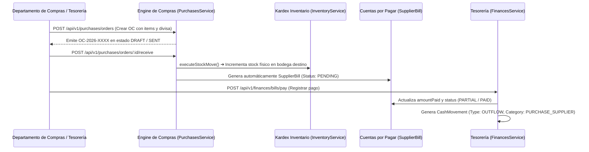

# 📘 Manual de Usuario: Compras (Purchases) y Finanzas Operativas Multi-Moneda (`FEAT-104`)

> **Módulo:** Core Compras & Tesorería Operativa  
> **Ubicación del Documento:** `docs/user-manuals/23-manual-compras-y-finanzas-multimoneda.md`  
> **Versión de OrderFlow / OmniFlow:** v1.20.38+  
> **Integración Multi-Moneda:** `CurrencyService` (PYG, USD, BRL, ARS)  
> **Fecha:** 26 de Agosto de 2026

---

## 1. INTRODUCCIÓN Y PROPÓSITO


Este manual instructivo describe el funcionamiento de los módulos de **Compras (Purchases) y Finanzas Operativas / Tesorería (`FEAT-104`)**, diseñados para gestionar el ciclo completo de abastecimiento, cuentas por pagar (AP) y flujo de caja consolidado (Cash Flow) en múltiples divisas.

El sistema permite a los departamentos de compras y tesorería:
1. Gestionar catálogo de Proveedores (`Supplier`) con plazos de crédito y divisa predeterminada.
2. Emitir Órdenes de Compra (`PurchaseOrder`) congelando la tasa de cambio del momento vía `CurrencyService`.
3. Recibir órdenes de compra con impacto atómico e inmediato en el Kardex (`InventoryService.executeStockMove`).
4. Generar automáticamente Facturas de Proveedor (`SupplierBill`) e integrar pagos parciales o totales que impactan en el flujo de caja (`CashMovement`).

---

## 2. FLUJO OPERATIVO INTEGRADO (COMPRAS ➔ KARDEX ➔ AP ➔ TESORERÍA)



---

## 3. ENDPOINTS DE LAS APIS DE COMPRAS Y FINANZAS

### 🔹 Endpoint 1: Crear Orden de Compra (`POST /api/v1/purchases/orders`)

**Cuerpo de la Solicitud:**
```json
{
  "supplierId": "sup-distribuidora-001",
  "currency": "USD",
  "notes": "Compra mayorista de insumos de cocina",
  "items": [
    {
      "productId": "prod-harina-000",
      "quantityOrdered": 10,
      "unitCost": 15.5
    }
  ]
}
```

### 🔹 Endpoint 2: Recibir Orden de Compra & Generar Factura (`POST /api/v1/purchases/orders/:id/receive`)

**Respuesta:**
```json
{
  "purchaseOrder": {
    "id": "po-1787",
    "orderNumber": "OC-2026-0001",
    "status": "RECEIVED",
    "receivedAt": "2026-08-26T10:00:00.000Z"
  },
  "generatedBill": {
    "id": "bill-987",
    "billNumber": "FAC-OC-2026-0001",
    "amount": 155.00,
    "status": "PENDING"
  }
}
```

### 🔹 Endpoint 3: Registrar Pago de Factura (`POST /api/v1/finances/bills/pay`)

**Cuerpo de la Solicitud:**
```json
{
  "supplierBillId": "bill-987",
  "amount": 155.00,
  "currency": "USD",
  "paymentMethod": "TRANSFER"
}
```

### 🔹 Endpoint 4: Resumen de Flujo de Caja (`GET /api/v1/finances/cash-flow/summary`)

**Respuesta:**
```json
{
  "tenantId": "provecchio-dimora-001",
  "totalInflow": 109500000.00,
  "totalOutflow": 62050000.00,
  "netBalance": 47450000.00,
  "totalMovementsCount": 24
}
```
