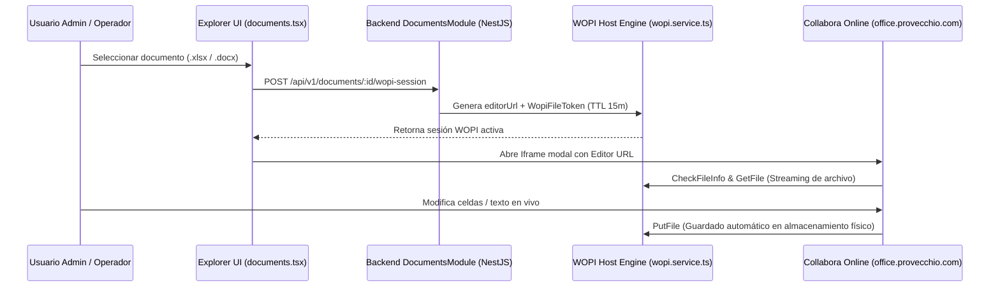

# 📘 Manual de Usuario: OmniFlow Workspace Documental & Edición Collabora Online (`FEAT-083`)

> **Módulo:** Workspace Documental & Edición Colaborativa  
> **Ubicación del Documento:** `docs/user-manuals/24-manual-workspace-documental-collabora.md`  
> **Versión de OrderFlow / OmniFlow:** v1.20.38+  
> **Integración Engine:** Protocolo WOPI Host + Collabora Online CODE (`office.provecchio.com`)  
> **Fecha:** 26 de Agosto de 2026

---

## 1. INTRODUCCIÓN Y PROPÓSITO


Este manual instructivo describe el funcionamiento del **Workspace Documental de OmniFlow (`FEAT-083`)**, una solución empresarial multi-tenant integrada con **Collabora Online (CODE)** vía el protocolo **WOPI**.

Con este módulo, los administradores y usuarios pueden:
1. Organizar archivos y documentos de oficina (`.xlsx`, `.docx`, `.pptx`, `.ods`, `.odt`) en un explorador de carpetas por tenant.
2. Editar interactivamente en tiempo real documentos sin necesidad de instalar suites ofimáticas locales.
3. Previsualizar reportes analíticos de OmniBI en modales incrustados con autenticación segura por tokens JWT.
4. Trabajar de forma concurrente con bloqueos automáticos (`WOPI Lock`) para prevenir sobrescritura accidentales.

---

## 2. FLUJO DE NAVEGACIÓN Y EDICIÓN WOPI



---

## 3. ENDPOINTS PRINCIPALES DE LA API DE DOCUMENTOS

### 🔹 Endpoint 1: Explorador de Carpetas (`GET /api/v1/documents/explorer`)

Retorna la lista de subcarpetas y documentos alojados dentro del espacio de trabajo del tenant.

**Respuesta:**
```json
{
  "folderId": "root-folder-tenant-001",
  "folders": [
    {
      "id": "f-101",
      "name": "Reportes Financieros",
      "isRoot": false
    }
  ],
  "documents": [
    {
      "id": "doc-505",
      "name": "Presupuesto_2026.xlsx",
      "mimeType": "application/vnd.openxmlformats-officedocument.spreadsheetml.sheet",
      "sizeBytes": 142850
    }
  ]
}
```

### 🔹 Endpoint 2: Subir Documento (`POST /api/v1/documents/upload`)

Permite cargar cualquier archivo de oficina en el directorio del tenant.

### 🔹 Endpoint 3: Generar Sesión de Edición Collabora (`POST /api/v1/documents/:id/wopi-session`)

Retorna el token WOPI y la URL para renderizar el editor Collabora dentro de la aplicación.

**Respuesta:**
```json
{
  "document": {
    "id": "doc-505",
    "name": "Presupuesto_2026.xlsx"
  },
  "editorUrl": "https://office.provecchio.com/browser/cool.html?WOPISrc=https%3A%2F%2Fprovecchio.com%2Fapi%2Fv1%2Fdocuments%2Fwopi%2Ffiles%2Fjwt-token-123",
  "fileToken": "jwt-token-123"
}
```

---

## 4. MEDIDAS DE SEGURIDAD Y RESILIENCIA

1. **Aislamiento Multi-Tenant:** Toda carpeta y documento está indexado estrictamente por `tenantId`.
2. **Tokens JWT Efímeros:** Las URL de edición caducan automáticamente después de 15 minutos de inactividad.
3. **Resiliencia & Fallback:** En caso de que el servidor Collabora esté fuera de servicio, la interfaz conmuta instantáneamente a **descarga directa del archivo**.
