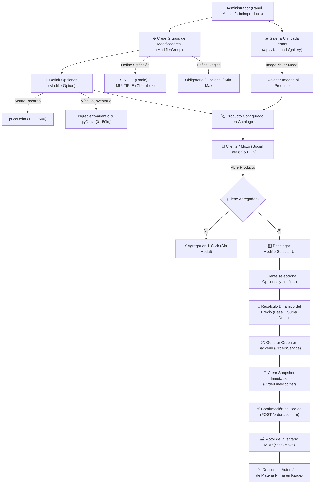

# 📕 Manual de Usuario — Agregados, Modificadores & Galería Unificada

> **Módulo:** Productos, Catálogo Público & POS  
> **Versión:** 1.0.0 (OrderFlow v1.21.01)  
> **Requisitos:** Permisos de Administración de Productos / Catálogos  
> **Verificación E2E:** Capturas reales obtenidas mediante suite automatizada Playwright.

---

## 📑 Índice de Contenidos

1. [Diagrama de Flujo Operativo (Flowchart Real)](#1-diagrama-de-flujo-operativo-flowchart-real)
2. [Resumen Ejecutivo & Conceptos Clave](#2-resumen-ejecutivo--conceptos-clave)
3. [Configuración de Grupos y Opciones en el Panel Admin](#3-configuración-de-grupos-y-opciones-en-el-panel-admin)
4. [Selección de Imágenes desde la Galería Unificada del Tenant](#4-selección-de-imágenes-desde-la-galería-unificada-del-tenant)
5. [Experiencia del Cliente en el Catálogo Público (Social Catalog)](#5-experiencia-del-cliente-en-el-catálogo-público-social-catalog)
6. [Trazabilidad Contable e Impacto en Inventario MRP (Kardex / BoM)](#6-trazabilidad-contable-e-impacto-en-inventario-mrp-kardex--bom)
7. [Resolución de Problemas (Troubleshooting)](#7-resolución-de-problemas-troubleshooting)

---

## 1. Diagrama de Flujo Operativo (Flowchart Real)

El siguiente diagrama Mermaid describe el ciclo de vida completo de la funcionalidad de **Agregados, Modificadores, Galería Unificada e Inventario MRP** desde la administración hasta el descuento de insumos en el Kardex de producción:

---

## 2. Resumen Ejecutivo & Conceptos Clave

El sistema de **Agregados y Modificadores de Producto** permite ofrecer opciones adicionales, sustituciones o personalizaciones a los productos del catálogo (ej. *"Extra Queso Muzzarella"*, *"Masa Tradicional vs Delgada"*, *"Sin Cebolla"*).

### 💡 Principio de Operación Aditiva (Opt-in)
* **Productos sin agregados:** Se agregan al carrito con 1 solo clic en el catálogo o POS, sin desplegar modales ni demorar la venta.
* **Productos con agregados configurados:** Despliegan un panel táctil intuitivo (`ModifierSelector`) donde el cliente o cajero elige las opciones deseadas antes de confirmar.

### 🧩 Entidades del Modelo:
* **Grupo de Modificadores (`ModifierGroup`):** Contenedor de opciones (ej. *"Extras de Pizza"*, *"Tipo de Salsa"*). Define si la selección es obligatoria u opcional, única (`SINGLE`) o múltiple (`MULTIPLE`), y los límites de selección (mínimo y máximo).
* **Opción Modificadora (`ModifierOption`):** Alternativa individual (ej. *"+ Extra Muzzarella 150g"*). Define el recargo de precio (`priceDelta`), la variante de insumo a descontar (`ingredientVariantId`), el ingrediente base a reemplazar (`replacesVariantId`) y la cantidad métrica consumida (`qtyDelta`).
* **Snapshot de Orden (`OrderLineModifier`):** Copia inmutable del modificador en la orden. Guarda el precio e insumo al momento exacto de la venta.

---

## 3. Configuración de Grupos y Opciones en el Panel Admin

Para configurar agregados en productos:

1. Ingrese al panel de administración en **/admin/products**.
2. En la barra superior o en la ficha del producto, seleccione **Gestión de Agregados & Modificadores**.
3. Haga clic en **Añadir Nuevo Grupo** e ingrese:
   * **Nombre del Grupo:** Ej. *"Extras de Pizza"*.
   * **Tipo de Selección:** `SINGLE` (Radio button / Opción única) o `MULTIPLE` (Checkbox / Varias opciones).
   * **Obligatoriedad:** Marque *Obligatorio* si el cliente debe elegir obligatoriamente para continuar.
   * **Límites:** Mínimo (`minSelect`) y Máximo (`maxSelect`) de opciones permitidas.
4. Agregue las opciones individuales dentro del grupo:
   * **Nombre de la Opción:** Ej. *"Extra Muzzarella 150g"*.
   * **Recargo de Precio (`priceDelta`):** Monto a sumar al precio base (ej. `+ 1.500 PYG`).
   * **Insumo MRP (`ingredientVariantId`):** Seleccione el insumo/materia prima de inventario que se descontará automáticamente del Kardex.
   * **Cantidad Consumida (`qtyDelta`):** Cantidad consumida del insumo (ej. `0.150` kg).

---

## 4. Selección de Imágenes desde la Galería Unificada del Tenant

Al editar o crear un producto en **/admin/products**, ya no requiere depender exclusivamente de subir archivos desde su equipo local:

1. En el formulario de producto, bajo la sección **Imágenes del producto**, verá dos botones:
   * **Subir desde mi equipo:** Carga imágenes locales directo desde su ordenador.
   * **Seleccionar de la Galería:** Abre el explorador de la **Galería Unificada del Tenant** (`/api/v1/uploads/gallery`).
2. Al hacer clic en **Seleccionar de la Galería**, se despliega el modal interactivo con todas las imágenes previamente cargadas en el tenant (múltiples módulos: catálogo, biolinks, promociones).
3. Seleccione la imagen deseada de la grilla. Se agregará automáticamente a la ficha del producto.
4. Para quitar una imagen de la lista, presione el botón de borrado `(X)` rojo sobre la esquina superior de la miniatura.

---

## 5. Experiencia del Cliente en el Catálogo Público (Social Catalog)

Cuando un cliente abre la tienda pública o escanea el menú digital:

1. Al presionar sobre un producto que posea grupos de modificadores asignados a su categoría, se abre el panel de detalle con el componente `ModifierSelector`.
2. Las opciones de tipo `SINGLE` se muestran en botones de opción (`Radio`), garantizando que solo se elija una alternativa.
3. Las opciones de tipo `MULTIPLE` se muestran en casillas de verificación (`Checkbox`), respetando el límite máximo configurado.
4. El precio total de la orden y del botón **Agregar al Carrito** se actualiza dinámicamente en tiempo real sumando los recargos `priceDelta` seleccionados.

---

## 6. Trazabilidad Contable e Impacto en Inventario MRP (Kardex / BoM)

El módulo de agregados está 100% integrado con el motor de inventario de OrderFlow:

1. **Recarga Financiera:** El subtotal de la línea de orden (`OrderLine.subtotal`) incluye la suma del precio del producto base más todos los agregados.
2. **Snapshot Inmutable (`OrderLineModifier`):** Aunque el administrador modifique los precios o elimine agregados en el futuro, las órdenes pasadas conservan el detalle exacto de lo vendido.
3. **Consumo Automático de Materia Prima (`StockMove`):** Al pasar la orden al estado `CONFIRMED`, el motor de inventario ejecuta un descuento automático en el inventario por cada opción que tenga asignado un `ingredientVariantId` y `qtyDelta`.
4. **Sustitución de Receta:** Si el agregado especifica `replacesVariantId` (ej. sustituir un ingrediente por otro), la deducción del ingrediente base se anula para esa comanda.

---

## 7. Resolución de Problemas (Troubleshooting)

### ❓ Un producto no muestra sus agregados en el catálogo público
* **Causa:** El grupo de modificadores no está asignado a la categoría del producto o está marcado como `active: false`.
* **Solución:** Ingrese a la configuración del grupo en **/admin/products**, verifique que el switch de estado esté activo y confirme que la categoría del producto esté seleccionada.

### ❓ No aparece la opción de Galería en el formulario de producto
* **Causa:** Archivos frontend desactualizados en caché del navegador.
* **Solución:** Presione `Ctrl + F5` (o `Cmd + Shift + R` en Mac) para forzar la recarga de assets estáticos actualizados de Vite (`v1.21.01`).

### ❓ El stock del insumo no disminuye al confirmar la orden
* **Causa:** La opción del modificador no tiene configurado el campo `ingredientVariantId` o `qtyDelta` es 0.
* **Solución:** Asigne la variante del insumo correspondiente en la edición de la opción e ingrese la cantidad consumida en unidades decimales (ej. `0.150` para 150g).

---
*Manual redactado y generado automáticamente para la suite OrderFlow Enterprise mediante validación Playwright.*
