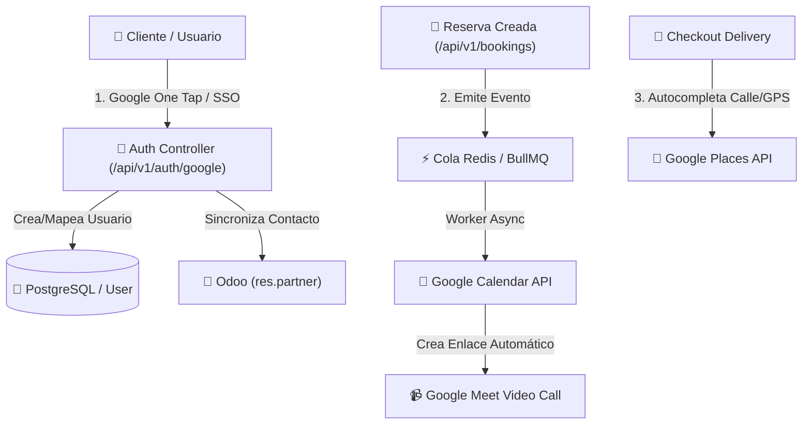

# 🔑 30. Manual de Configuración de Google Auth, Sincronización de Calendario & Google Places

> **Módulos / Área:** Autenticación / Integraciones / Turnos & Agendamiento (`Bookings`) / Marketplace  
> **Versión:** 1.24.02  
> **Fecha de Actualización:** 2026-09-02  
> **Compatibilidad:** Web SPA (React / Refine), App Móvil (Expo React Native), Backend NestJS, Odoo 18  

---

## 📑 Índice de Contenidos

1. [Visión General & Arquitectura de la Integración](#1-visión-general--arquitectura-de-la-integración)
2. [Paso 1: Configuración en Google Cloud Console](#paso-1-configuración-en-google-cloud-console)
3. [Paso 2: Configuración de Variables de Entorno en OmniFlow](#paso-2-configuración-de-variables-de-entorno-en-omniflow)
4. [Paso 3: Autenticación SSO & Google One Tap](#paso-3-autenticación-sso--google-one-tap)
5. [Paso 4: Sincronización Bidireccional con Google Calendar & Google Meet](#paso-4-sincronización-bidireccional-con-google-calendar--google-meet)
6. [Paso 5: Autocompletado de Direcciones & Geolocalización (Google Places API)](#paso-5-autocompletado-de-direcciones--geolocalización-google-places-api)
7. [Paso 6: Solución de Problemas (Troubleshooting)](#paso-6-solución-de-problemas-troubleshooting)

---

## 1. Visión General & Arquitectura de la Integración

La integración de **Google en OmniFlow** unifica tres pilares clave para la experiencia del cliente y del administrador:



---

## Paso 1: Configuración en Google Cloud Console

Para conectar OmniFlow con Google, el Administrador del Sistema debe crear y configurar las credenciales en la plataforma oficial de desarrolladores.

### 1.1 Crear el Proyecto en Google Cloud
1. Ingresar a [Google Cloud Console](https://console.cloud.google.com/).
2. En la barra superior, seleccionar la lista desplegable de proyectos y hacer clic en **Proyecto Nuevo**.
3. Asignar el nombre: `OmniFlow SaaS Integration` y seleccionar la organización (si aplica).
4. Hacer clic en **Crear**.

---

### 1.2 Habilitar las APIs Necesarias
En el menú lateral izquierdo, navegar a **APIs y servicios > Biblioteca** y habilitar las siguientes APIs:
1. **Google Calendar API** (Sincronización de citas y reuniones de Google Meet).
2. **Google Identity Services API / People API** (Inicio de sesión SSO de usuarios).
3. **Google Places API Web Service** (Autocompletado de direcciones en checkout de delivery).
4. **Distance Matrix API** *(opcional)* (Cálculo dinámico de tarifa de envío).

---

### 1.3 Configurar la Pantalla de Consentimiento OAuth (*OAuth Consent Screen*)
1. Navegar a **APIs y servicios > Pantalla de consentimiento de OAuth**.
2. **Tipo de usuario:** Seleccionar **Externo** (para permitir el logueo de cualquier cliente con cuenta Google) y hacer clic en **Crear**.
3. **Información de la aplicación:**
   - **Nombre de la app:** `OmniFlow`
   - **Correo de soporte:** `soporte@pesallaccia.com` (o el correo corporativo del tenant).
   - **Logo de la aplicación:** Subir el logo oficial de la marca (`logo.png`).
   - **Dominios autorizados:** Agregar `pesallaccia.com` y `provecchio.com`.
4. **Permisos (*Scopes*):** Agregar los siguientes permisos indispensables:
   - `.../auth/userinfo.email`
   - `.../auth/userinfo.profile`
   - `openid`
   - `https://www.googleapis.com/auth/calendar.events` (para la gestión de citas).

---

### 1.4 Crear las Credenciales OAuth 2.0
1. Navegar a **APIs y servicios > Credenciales**.
2. Hacer clic en **+ Crear credenciales > ID de cliente de OAuth**.
3. **Tipo de aplicación:** Seleccionar **Aplicación web**.
4. **Nombre:** `OmniFlow Web Client`
5. **Orígenes autorizados de JavaScript:**
   - `https://pesallaccia.com`
   - `https://provecchio.com`
   - `https://*.pesallaccia.com`
   - `http://localhost:5173` *(para desarrollo local)*
6. **URIs de redirección autorizadas:**
   - `https://pesallaccia.com/api/v1/auth/google/callback`
   - `https://provecchio.com/api/v1/auth/google/callback`
   - `http://localhost:3010/api/v1/auth/google/callback` *(para desarrollo local)*
7. Hacer clic en **Crear** y guardar de forma segura el **Client ID** y el **Client Secret**.

---

## Paso 2: Configuración de Variables de Entorno en OmniFlow

Una vez obtenidas las credenciales, deben inyectarse en los archivos de configuración del servidor.

### 2.1 Backend (`/srv/orderflow/backend/.env.production`)

```env
# =============================================================================
# GOOGLE ECOSYSTEM INTEGRATION
# =============================================================================
GOOGLE_CLIENT_ID="XXXXX-xxxxxxxxxxxxxxxxxxxxxxxx.apps.googleusercontent.com"
GOOGLE_CLIENT_SECRET="GOCSPX-xxxxxxxxxxxxxxxxxxxxxxxx"
GOOGLE_REDIRECT_URI="https://pesallaccia.com/api/v1/auth/google/callback"

# Clave API para Google Places y Geolocalización (Maps)
GOOGLE_MAPS_API_KEY="AIzaSyXXXXXXXXXXXXXXXXXXXXXXXXXXXXX"

# Opcional: Cuenta de servicio para tareas background globales de Calendar
GOOGLE_SERVICE_ACCOUNT_EMAIL="omniflow-sync@omniflow-saas.iam.gserviceaccount.com"
GOOGLE_SERVICE_ACCOUNT_KEY='{"type": "service_account", ...}'
```

### 2.2 Frontend (`/srv/orderflow/frontend/.env.production`)

```env
# Google Auth Client ID expuesto al navegador para Google One Tap
VITE_GOOGLE_CLIENT_ID="XXXXX-xxxxxxxxxxxxxxxxxxxxxxxx.apps.googleusercontent.com"
VITE_GOOGLE_MAPS_API_KEY="AIzaSyXXXXXXXXXXXXXXXXXXXXXXXXXXXXX"
```

---

## Paso 3: Autenticación SSO & Google One Tap

OmniFlow soporta inicio de sesión sin contraseñas a través de la cuenta corporativa o personal de Google del usuario.

### 3.1 Flujo de Logueo en 1-Clic
1. Al acceder a `https://<subdomain>.pesallaccia.com/login` o `https://pesallaccia.com/login`, el frontend despliega la ventana flotante **Google One Tap** o el botón **"Continuar con Google"**.
2. El usuario selecciona su cuenta de Google.
3. El frontend recibe un `id_token` firmado criptográficamente por Google y lo envía al endpoint:
   `POST /api/v1/auth/google`
   ```json
   {
     "idToken": "eyJhbGciOiJSUzI1NiIs..."
   }
   ```
4. **Procesamiento defensivo en el Backend:**
   - Valida el token con `google-auth-library` (`OAuth2Client.verifyIdToken`).
   - Busca el usuario en PostgreSQL por email.
   - **Si no existe:** Registra el nuevo usuario, crea el contacto `res.partner` en Odoo y le asigna el rol inicial `CUSTOMER` / `VIEWER`.
   - **Si ya existe:** Retorna el par de tokens JWT propios de OmniFlow (`accessToken`, `refreshToken`) e inicia sesión de inmediato.

---

## Paso 4: Sincronización Bidireccional con Google Calendar & Google Meet

El motor de turnos y agendamiento (`BookingsModule`) de OmniFlow se sincroniza en tiempo real con Google Calendar.

```
+------------------+         +-----------------------+         +------------------------+
|  Reserva Creada  |  ---->  | Cola Redis / BullMQ   |  ---->  |  Google Calendar API   |
| (WhatsApp / Web) |         | (async worker retry)  |         | (Genera enlace Meet)   |
+------------------+         +-----------------------+         +------------------------+
```

### 4.1 Exportación de Turnos a Google Calendar (`OrderFlow ➔ Google`)
1. Cuando un cliente o profesional agenda una cita en `/admin/bookings` o desde el catálogo web:
2. El servicio emite un evento asincrónico a la cola de BullMQ para evitar demoras en la respuesta HTTP.
3. El worker invoca a [`GoogleCalendarService`](file:///opt/orderflow/backend/src/integrations/google-calendar/google-calendar.service.ts) creando el evento mediante `calendar.events.insert`:
   - **Resumen:** `Cita: [Nombre Cliente] - [Servicio]`
   - **Fecha/Hora:** Convertidos automáticamente a la zona horaria del tenant.
   - **Google Meet Automático:** Si el servicio está configurado como consulta remota, incluye `conferenceDataVersion: 1`, creando la sala virtual de videollamada.
   - **Invitados:** Incluye el email del cliente y del profesional en `attendees` con `sendUpdates: 'all'`, enviando la invitación oficial a sus calendarios.

### 4.2 Webhook Inverso (`Google ➔ OrderFlow`)
1. El backend suscribe el endpoint `POST /api/v1/webhooks/google-calendar` usando la API `calendar.events.watch`.
2. Si un profesional bloquea horas personales en su Google Calendar (ej. cita médica), Google notifica a OmniFlow.
3. OmniFlow bloquea automáticamente esos bloques horarios en la agenda en línea, evitando sobre-reservas (*overbooking*).

---

## Paso 5: Autocompletado de Direcciones & Geolocalización (Google Places API)

Para agilizar las entregas y el cálculo de tarifas de envío (*delivery*):

1. **En la Web (React / Refine.dev):**
   - El formulario de pago/checkout integra la barra de búsqueda de direcciones con Google Places.
   - Al tipear la calle, despliega sugerencias oficiales con formato normalizado.
   - Guarda automáticamente las coordenadas GPS (`latitude`, `longitude`) en la orden de compra.

2. **En la App Móvil (Expo React Native):**
   - Utiliza la API nativa de ubicación y autocompletado para fijar el pin de entrega directamente en el mapa.

---

## Paso 6: Solución de Problemas (Troubleshooting)

### ❌ Error 1: `redirect_uri_mismatch` al intentar loguearse
- **Sintoma:** Google devuelve el error `Error 400: redirect_uri_mismatch`.
- **Causa:** La URL desde la que se intenta el login no está registrada exactamente en Google Cloud Console.
- **Solución:** Verificar que tanto `https://pesallaccia.com` como el subdominio exacto del tenant y el callback `/api/v1/auth/google/callback` estén dados de alta en la sección **URIs de redirección autorizadas**.

---

### ❌ Error 2: `401 Unauthorized` en Sincronización de Calendar
- **Síntoma:** Los turnos se crean en OmniFlow pero no aparecen en Google Calendar.
- **Causa:** El token OAuth del especialista o la Service Account ha expirado o le faltan permisos.
- **Solución:** Re-vincular la cuenta del especialista desde el panel `/admin/users` o verificar que la variable `GOOGLE_CLIENT_SECRET` sea válida.

---

### ❌ Error 3: No se generan salas de Google Meet
- **Síntoma:** El evento en Google Calendar se crea sin el botón "Unirse con Google Meet".
- **Causa:** El parámetro `conferenceDataVersion` no fue enviado como `1` en la llamada a la API.
- **Solución:** Verificar que en `google-calendar.service.ts` se incluya `conferenceData: { createRequest: { requestId: uuid() } }`.

---

**Referencias Cruzadas:**
- Manual de Gestión de Turnos & Spa: [`03-manual-turnos-spa.md`](file:///opt/orderflow/docs/user-manuals/03-manual-turnos-spa.md)
- Especificación Prompt de Google Integration: [`google_integration.md`](file:///opt/orderflow/docs/prompts/google_integration.md)
