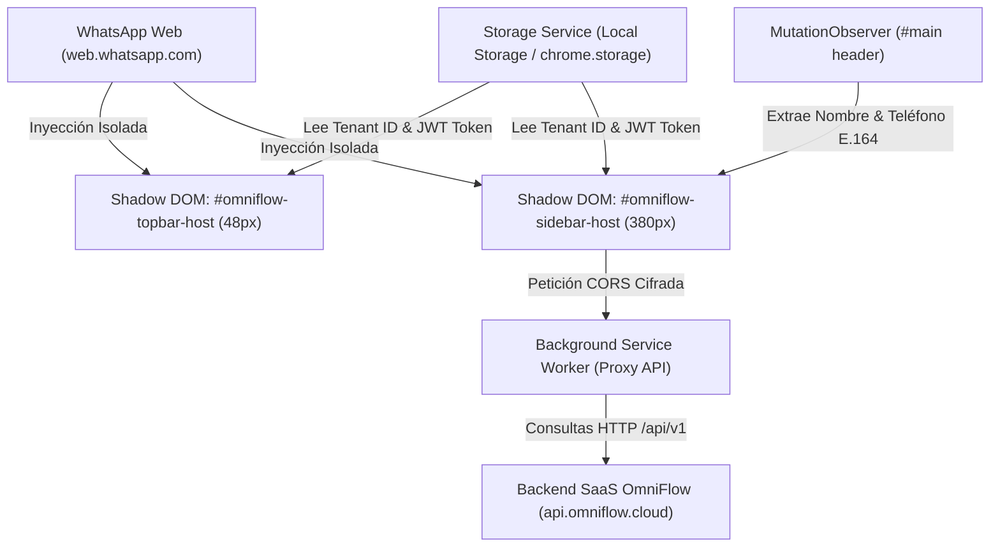

# 📘 Manual de Usuario: Hub de Mensajería Omnicanal, Extensión Web & OmniBot (`v1.27.10`)

> **Módulo:** Hub de Mensajería Omnicanal (`OmniMessaging`), Extensión Web Manifest V3 (`OmniFlow Web Extension`), OmniBot AI & App Store WhatsApp Web QR  
> **Ubicación del Documento:** `docs/user-manuals/31-manual-omnimessaging-hub-y-omnibot.md`  
> **Versión de OrderFlow / OmniFlow:** v1.27.10+  
> **Fecha:** 07 de Septiembre de 2026  

---

## 1. INTRODUCCIÓN Y PROPÓSITO

El **Hub de Mensajería Omnicanal (`OmniMessaging`)** integra los canales de atención al cliente (WhatsApp Cloud API, Telegram Bot API, WhatsApp Web QR de sesión directa y la **Extensión Web Manifest V3 de OmniFlow**) dentro de un único ecosistema operativo centralizado.

Esta extensión permite incrustar la consola operativa de **OmniFlow** directamente sobre el cliente web de WhatsApp Web (`web.whatsapp.com`), dotando al operador de herramientas de atención como:
- **OmniBot Copilot**: Respuestas sugeridas y automatización con IA (Ollama Local o Cloud AI).
- **Ficha 360° del Cliente**: Detección dinámica del contacto en formato E.164 y consulta del historial.
- **Catálogo & POS / Venta Directa**: Generación e inserción de cotizaciones, enlaces UTM y emisión de comanda.
- **Agenda & Reservas**: Asignación de turnos y profesionales.
- **Fidelización & Mercadotecnia**: Consulta de puntos de lealtad y distribución de enlaces de cupones.

---

## 2. ARQUITECTURA DEL HUB Y EXTENSIÓN WEB (MANIFEST V3)



---

## 3. INSTALACIÓN Y CONFIGURACIÓN DE LA EXTENSIÓN WEB

### 3.1 Directorio del Código Fuente y Rutas de Compilación
- **Código Fuente de la Extensión:** `/opt/omnimessaging` (Proyecto Standalone React + Vite + WXT/MV3)
- **Script de Compilación Cross-Browser:** `npm run build` en `/opt/omnimessaging` (ejecuta `scripts/build-crossbrowser.ts`).

### 3.2 Rutas de Distribución y Descargas Locales (`~/Downloads/`)
Los paquetes para cada navegador se generan automáticamente y se copian en el directorio de descargas del usuario:
- **Google Chrome / Brave / Edge (Descomprimido):** `/home/marcelompz/Downloads/omnibot-chrome`
- **Mozilla Firefox (Empaquetado `.zip`):** `/home/marcelompz/Downloads/omnibot-firefox.zip`
- **Mozilla Firefox (Descomprimido):** `/home/marcelompz/Downloads/omnibot-firefox`
- **Servidor Web / Descargas Públicas:** `/opt/orderflow/frontend/public/downloads/omnibot-chrome.zip` y `omnibot-firefox.zip`

### 3.3 Instalación en Google Chrome / Chromium
1. Ingresa a `chrome://extensions/` en la barra de navegación.
2. Activa el **Modo de desarrollador** en la esquina superior derecha.
3. Haz clic en **Cargar descomprimida** (Load unpacked) y selecciona la carpeta `/home/marcelompz/Downloads/omnibot-chrome`.
4. Abre `https://web.whatsapp.com/` y recarga la página (`F5`).

### 3.4 Instalación en Mozilla Firefox
1. Ingresa a `about:debugging#/runtime/this-firefox` en Firefox.
2. Haz clic en **Cargar complemento temporal...** (Load Temporary Add-on...).
3. Selecciona el archivo `/home/marcelompz/Downloads/omnibot-firefox.zip` (o el archivo `manifest.json` dentro de `/home/marcelompz/Downloads/omnibot-firefox/`).
4. Abre `https://web.whatsapp.com/` y recarga la página (`F5`).

### 3.4 Vinculación de Sesión y Multi-Tenant (Modal ⚙️)
La extensión no requiere credenciales estáticas o hardcodeadas. Para vincular la extensión con tu cuenta real:
1. Haz clic en el icono de **Configuración ⚙️** ubicado a la derecha en la barra superior verde de OmniFlow (o abre el popup del navegador).
2. Ingresa la **URL Base de tu Instancia** (ej: `https://api.omniflow.cloud`), tu **Tenant ID** (ej: `tenant_restaurante_01`) y tu **Token de Operador / JWT**.
3. Haz clic en **Guardar Configuración**. Los datos de la barra superior cambiarán automáticamente de `Sin tenant` al estado autenticado **🟢**.

---

## 4. BASE DE CONOCIMIENTOS Y ENTRENAMIENTO DE IA LOCAL

### 4.1 Catálogo de Productos Dinámico
La IA Local consulta automáticamente el menú del tenant mediante `CatalogToolsService`. No requiere reentrenamiento manual para productos:
- Búsqueda de platos por palabras clave.
- Precios y variantes en tiempo real.
- Generación de links de compra directa con UTMs.

### 4.2 Reglas de Negocio, FAQs y Tiempos de Entrega
Desde **`/admin/messaging`** -> **Configuración del Bot**:

1. **System Prompt / Instrucciones Personalizadas:**
   Escribe en lenguaje natural las reglas operativas de tu establecimiento:
   ```text
   - Tiempos de preparación: 20-35 minutos en salón, 35-50 minutos en delivery.
   - Costo de envío: Gratis en zona centro, 15.000 PYG fuera de zona.
   - Agregados disponibles: Queso extra (+5.000 PYG), Salsa especial (+3.000 PYG).
   ```

2. **Base de Conocimientos (Knowledge Base JSON / FAQs):**
   Estructura preguntas frecuentes y datos estáticos específicos:
   ```json
   {
     "faqs": [
       {
         "keywords": ["envio", "delivery", "cobertura"],
         "answer": "Realizamos envíos dentro de un radio de 5km de 11:30 a 23:00 hs."
       },
       {
         "keywords": ["demora", "tiempo", "tarda"],
         "answer": "El tiempo promedio de preparación para delivery es de 40 minutos."
       }
     ]
   }
   ```

---

## 5. PANEL DE CONTROL DE MENSAJERÍA (`/admin/messaging`)

El panel incluye:
- **Vista Multicanal de Conversaciones:** Filtra chats activos por canal (WhatsApp QR, WhatsApp Cloud, Telegram).
- **Intervención Humana (Human Takeover):** Botón para pausar el bot en un chat específico y tomar el control manual de la conversación.
- **Inyección Idempotente de Pedidos:** Confirmación y creación de pedidos directamente desde el chat asignándoles un `orderUuid`.
- **Métricas de Rendimiento:** Total de mensajes procesados, tasa de conversión del bot y consumo de cuotas.

---

## 6. GUÍA DE OPERACIÓN DIARIA & CASOS DE USO

### 6.1 Atención Automatizada con Inteligencia Artificial
1. Cuando un cliente ingresa un mensaje por WhatsApp o Telegram, el sistema evalúa su `tenantId` y verifica si el bot está activado.
2. La IA responde dudas sobre el menú, ingredientes, precios, tiempos de espera y políticas de envío.
3. Si el cliente solicita armar un pedido, la IA genera el resumen del carrito con el desglose de productos y la URL directa para completar el pago/confirmación.

### 6.2 Tomar Control Manual de una Conversación (Human Takeover)
1. Ingrese a **`/admin/messaging`**.
2. En la lista de chats a la izquierda, seleccione la conversación activa.
3. En el encabezado del chat, presione el botón **"Tomar Control Manual"** (Human Takeover).
4. El estado del chat pasará a `HUMAN_TAKEOVER`, pausando las respuestas automáticas de OmniBot en ese hilo para evitar interrupciones mientras el operador conversa con el cliente.
5. Una vez resuelta la duda del cliente, presione **"Reactivar OmniBot"** para devolver la atención automatizada al canal.

### 6.3 Inyección Directa e Idempotente de Pedidos (`OrderInjectorService`)
Cuando un cliente confirma la compra a través del chat:
1. OmniBot invoca la herramienta `OrderInjectorService`.
2. Se genera un `orderUuid` único e idempotente para evitar duplicación de comanda ante reintentos de red.
3. El pedido se registra automáticamente en estado `CONFIRMED` dentro del módulo de ventas y cocina (POS / KDS) asociado al tenant.

---

## 7. RESOLUCIÓN DE PROBLEMAS (TROUBLESHOOTING)

| Síntoma | Causa Posible | Solución Sugerida |
| :--- | :--- | :--- |
| **Error 502 / Caída de respuestas en IA Local** | El servicio Ollama local no está respondiendo en `http://localhost:11434`. | Ejecute `ollama serve` en el servidor o verifique con `curl http://localhost:11434/api/tags`. |
| **Desconexión de WhatsApp Web QR** | La sesión del dispositivo vinculado caducó o el celular perdió conexión. | Ingrese a `/admin/modules`, seleccione **WhatsApp Web QR** y escanee nuevamente el código QR generado. |
| **La IA ofrece productos agotados o desactualizados** | La caché local de catálogo o sincronización de productos necesita actualizarse. | Verifique que el estado del producto en `/admin/products` esté como `disponible` y refresque el menú. |
| **El bot responde en un chat en intervención humana** | El estado de la conversación no cambió a `HUMAN_TAKEOVER`. | Verifique que en `/admin/messaging` el toggle de intervención humana figure como **Pausado/Manual**. |

---

## 8. SEGURIDAD Y CONTROL DE CUOTAS (`QuotaPlanGuardService`)

- **Cifrado de Credenciales:** Todas las claves API (tokens de WhatsApp Cloud y Telegram) se almacenan encriptadas con algoritmos **AES-256-GCM** e **HKDF** a través de `CredentialsVaultService`.
- **Aislamiento Multi-Tenant:** La ejecución de herramientas y consultas a la base de datos están estrictamente delimitadas por `tenantId`, imposibilitando el cruce de datos entre comercios.
- **Guardia de Cuotas:** Cada plan asigna una cuota mensual de mensajes. El bot responde informando amablemente al cliente o derivando a un humano si el tenant alcanza el 100% de su cuota contratada.
