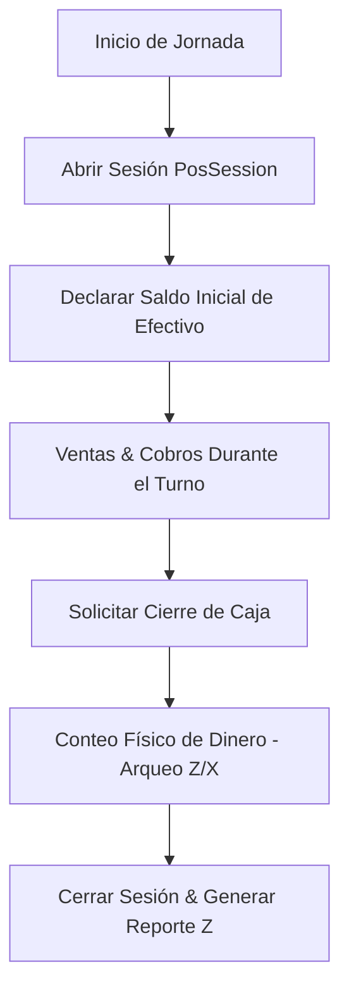

# 🖥️ Manual de Usuario — POS Universal Odoo / OmniGastro (`v1.29.0`)

> **Guía de Configuración, Selección de Modo (Retail vs. Restaurante), Apertura/Cierre de Caja y Operación Táctil (NumPad)**  
> **Rol:** Administrador / Cajero / Encargado de Salón  
> **Versión:** 1.29.0  
> **Última Actualización:** 2026-09-10  

---

## 📌 1. Visión General del Nuevo POS Odoo

El sistema POS de OrderFlow / OmniGastro ha sido estandarizado bajo la arquitectura inspirada en Odoo POS (`point_of_sale` + `pos_restaurant`). Esta arquitectura ofrece:
- **POS Base Universal:** Operación hiperveloz para retail, mostradores y tiendas sin mesas.
- **Módulo Gastronómico Desacoplado (`isRestaurant`):** Activación flexible por caja/terminal para habilitar el selector de salones, mapa de mesas, número de comensales y mozos.
- **Teclado Táctil Integrado (NumPad):** Permite cambiar rápidamente entre cantidad (`Qty`), porcentaje de descuento (`Disc %`) y precio unitario (`Price`).

---

## ⚙️ 2. Configuración de Cajas Terminales (`PosConfig`)

Cada sucursal o tienda puede tener múltiples terminales de caja configuradas.

### Atributos Principales de una Caja (`PosConfig`):
- **Nombre de la Terminal:** Identificador único (ej: `Caja Principal Mostrador`, `Caja Terraza Salón`).
- **Modo Restaurante (`isRestaurant`):**
  - **`false` (Retail / Mostrador):** Interfaz limpia enfocada en venta directa de mostrador, búsqueda rápida en catálogo y cobro directo.
  - **`true` (Restaurante / Bar):** Activa el selector superior de Salones (`RestaurantFloor`) y Mesas (`RestaurantTable`), mozo asignado y conteo de comensales.
- **Arqueo y Control de Efectivo (`ifaceCashControl`):** Exige declarar el saldo inicial de apertura y realizar el desglose/arqueo en el cierre de caja (Reportes Z/X).
- **Categorías Permitidas:** Restricción de categorías visibles en el catálogo táctil de la caja.

---

## 🔓 3. Control de Sesiones y Arqueo (Apertura / Cierre de Caja)

El control de caja se gestiona mediante sesiones explícitas (`PosSession`) para evitar descuadres de efectivo.

### Pasos para Apertura:
1. Al ingresar a `/admin/pos`, si no existe una sesión abierta para la caja seleccionada, el sistema solicitará **Abrir Caja**.
2. Ingresar el **Saldo Inicial en Efectivo** disponible en el cajón de dinero.
3. Hacer clic en **Confirmar Apertura**.

### Pasos para Cierre de Caja (Reporte Z):
1. Hacer clic en el botón **Cerrar Caja** en el encabezado del POS.
2. Ingresar el total en efectivo contado físicamente en la caja.
3. El sistema comparará el monto contado con el total teórico (Monto Inicial + Ventas en Efectivo) e indicará si existe diferencia/descuadre.
4. Confirmar el cierre para finalizar la sesión e imprimir el resumen de arqueo Z.

---

## 🧮 4. Operación del Punto de Venta (Interfaz NumPad & Catálogo)

La interfaz se divide en 3 secciones principales:

### A. Encabezado y Cambio de Modo
- **Filtro de Cajas:** Permite alternar entre terminales configuradas (`Caja Mostrador`, `Caja Restaurante`).
- **Navegación de Salón (Solo en `isRestaurant = true`):** Botones directos para alternar entre el mapa de salón/mesas y la pantalla del POS.

### B. Panel Izquierdo (Ticket & NumPad Táctil)
- **Lista de Ítems del Ticket:** Muestra los productos añadidos a la orden activa, cantidades, precios unitarios y subtotal.
- **Teclado NumPad:**
  - **`Qty` (Cantidad):** Al hacer clic en un ítem del ticket y pulsar `Qty`, los números ingresados modificarán la cantidad del ítem seleccionado.
  - **`Disc %` (Descuento):** Aplica un porcentaje de descuento global o por ítem.
  - **`Price` (Precio):** Permite sobreescribir el precio unitario del producto (sujeto a permisos de usuario).
  - **`⌫` (Backspace):** Elimina el último dígito ingresado o remueve el producto del ticket si el valor llega a cero.

### C. Catálogo de Productos y Búsqueda Directa
- Grilla táctil con imágenes de productos organizados por categorías.
- Búsqueda por código de barras o texto predictivo en tiempo real.

---

## 💳 5. Procesamiento de Cobro y Transferencia a Mesa

Al presionar el botón verde **Pagar / Cobrar**, se despliega el modal de cobro:

1. **Métodos de Pago:** Selección entre Efectivo (con cálculo de vuelto), Tarjeta de Débito/Crédito, QR (Bancard / PIX) o Cuenta Corriente / Crédito Cliente.
2. **Transferir a Mesa (Solo Restaurante):** Si la caja tiene `isRestaurant = true`, el cajero puede transferir el ticket activo directamente a una mesa desocupada del salón enviando la comanda a cocina/bar (KDS).
